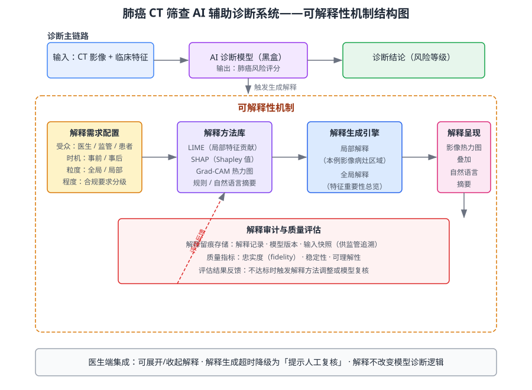

某三甲医院拟部署一套用于肺癌 CT 影像筛查的 AI 辅助诊断系统。模型在测试集上准确率较高，但属于"黑盒"模型，临床医生因无法理解诊断依据而拒绝采信；同时监管机构要求对涉及重大诊断结论的自动化决策给出可追溯的解释。请综合运用 AI 可解释性相关知识，为该 AI 辅助诊断系统设计一套可解释性机制，明确回答以下三点：调用并说明所依据的知识点；给出从需求到方案的推理步骤；给出最终方案（含可解释性机制结构图与解释方法对比表）。

---

答案：

**1. 知识点调用**

本题综合运用 AI 可解释性相关的多个知识点：AI 可解释性（可解释性的类型：全局/局部、事前/事后，解释受众的区分）、AI 质量保证与 AI 可靠性（解释的忠实度与可信度是 AI 质量的重要组成部分）、软件需求分析（将解释需求显式化为需求条目）、软件质量度量（解释质量的量化评估指标）、AI 安全与伦理（医疗高风险场景的责任归属与风险控制）。"医生不采信、监管要求可追溯"两个约束分别驱动临床可理解性与审计可追溯性两类需求。

**2. 分步推理**

- （1）明确解释需求：按受众与粒度分解——医生需要"本病例为何判为高风险"（局部、事后、面向临床决策）；监管需要"模型整体依赖哪些特征、决策过程可追溯"（全局、事后、面向审计）；开发与模型治理需要"模型内部机制是否合理"（全局/局部、事前、面向开发者）。
- （2）选择解释方法：局部解释用 LIME/SHAP 给出单例特征贡献，影像类输入用 Grad-CAM 生成病灶热力图；全局解释用特征重要性排序与 SHAP 总览；为提升可读性补充自然语言摘要。各方法适用性与取舍见下表。
- （3）设计机制结构：解释生成引擎按"解释需求配置"动态选择方法；解释呈现模块将热力图叠加到 CT 影像并生成自然语言摘要与置信度区间；解释审计模块持久化解释记录、模型版本与输入快照，供监管追溯。机制结构见图 1。
- （4）解释质量评估：以忠实度（解释是否反映模型真实决策依据）、稳定性（相近输入解释相近）、可理解性（医生能否快速理解）为核心指标，纳入 AI 质量保证流程；指标不达标时触发解释方法调整或模型复核。
- （5）与临床流程集成：解释在医生端可展开/收起，不打断诊断主流程；解释生成超时或不可用时降级为"提示人工复核"，不改变模型诊断逻辑，确保解释增强不影响医疗可用性。

**3. 结论/方案**

可解释性机制采用"诊断主链路 + 可解释性机制并行"的结构：解释由模型输出触发，按受众与粒度生成，经呈现与审计两个出口交付，最终以评估反馈闭环。方案同时满足医生临床采信与监管可追溯两大目标。

图 1 可解释性机制结构图

| 方法 | 解释类型 | 适用受众 | 优点 | 局限 |
|---|---|---|---|---|
| LIME | 局部、事后 | 医生/患者 | 与模型无关、可解释单例决策 | 扰动近似、稳定性欠佳 |
| SHAP | 局部+全局、事后 | 医生/监管 | 有博弈论保证、归因一致 | 计算开销大 |
| Grad-CAM | 局部、事后 | 医生 | 影像病灶区域可视化直观 | 仅适用于可微分卷积模型 |
| 规则/自然语言摘要 | 局部+全局、事后 | 医生/监管/患者 | 可读性最好 | 覆盖有限、生成成本高 |

---

评分标准：（满分 10 分）
- 要点 1（2 分）：准确调用知识点（AI 可解释性类型、AI 质量保证、需求分析、质量度量、AI 安全伦理）并说明其与医疗场景的对应关系；知识点调用不全或与场景脱节酌情扣分。
- 要点 2（4 分）：分步推理完整、逻辑自洽（解释需求分解 → 方法选型 → 机制结构 → 质量评估 → 临床流程集成）；缺少关键步骤每处扣 1 分。
- 要点 3（3 分）：方案可行，给出可解释性机制结构图与解释方法对比表，能说明面向不同受众（医生/监管）的解释差异；缺结构图扣 2 分、缺对比表扣 1 分。
- 要点 4（1 分）：结论/方案表述清晰，解释的可追溯性与降级策略等落地细节论证充分。

---

解析：本题以医疗高风险场景为背景，考查学生对 AI 可解释性"面向谁、解释什么、如何解释、如何评估"的综合设计能力。评分重点是区分局部与全局、医生与监管的不同解释需求，并将解释质量纳入 AI 质量保证闭环；结构图与对比表构成可核验的方案产出。
