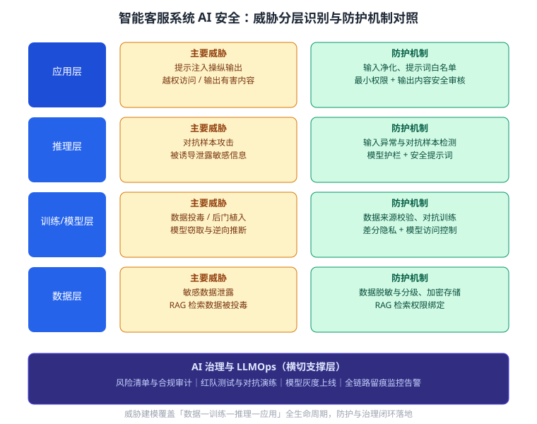

某金融机构上线了一款基于大语言模型（LLM）的智能客服系统：可回答客户关于账户、理财产品、费用政策等业务的咨询，对话涉及客户姓名、证件号、账户余额等个人敏感信息，并接入了内部业务数据的检索增强生成（RAG）能力。安全团队发现系统面临提示注入、对抗样本、数据投毒、模型窃取等多种潜在威胁。下图给出了威胁分层与防护机制的对照结构（）。请从软件工程护航 AI 的角度，对智能客服系统进行 AI 安全威胁建模：按「数据—训练—推理—应用」各环节识别主要威胁及其危害，给出对应的防护机制，并设计支撑上述工作的治理与运营（LLMOps）机制。

---

答案：
1. 调用的知识点：AI 安全（威胁建模与防护）、AI 隐私、AI 治理、MLOps/LLMOps。分析思路是「按生命周期分层建模威胁 → 逐层映射防护机制 → 以治理与运营机制兜底闭环」，而非把威胁孤立看待。
2. 威胁建模（分层识别威胁与危害）：
   - 数据层：客服对话与检索数据含个人敏感信息，收集、存储环节可能泄露；攻击者可向训练或检索数据注入恶意样本实施数据投毒，污染模型与检索结果；
   - 训练/模型层：模型可能被植入后门，上线后触发异常行为；对外暴露的推理接口可能被用于模型窃取与逆向，间接推断训练数据，侵害客户隐私；
   - 推理层：对抗样本通过微小扰动误导模型产生错误答复；提示词中的恶意指令若缺乏护栏，可能诱导模型泄露内部信息；
   - 应用层：提示注入操纵模型输出越权信息；越权访问与 RAG 注入可能诱导模型返回本应受限的内部数据；未审核的输出可能传播有害或错误内容。
3. 逐层防护机制：
   - 数据层：敏感数据脱敏与分级，训练与检索数据做来源、权限校验，数据投毒检测与白名单过滤；
   - 训练/模型层：差分隐私降低训练数据被推断的风险，模型加签名并实施访问控制，接口限流与调用审计防窃取，对抗训练提升模型鲁棒性；
   - 推理层：输入净化与异常检测识别对抗扰动，提示词白名单与注入检测拦截恶意指令，RAG 检索结果过滤并与用户权限绑定；
   - 应用层：输出内容安全审核与敏感信息过滤，最小权限与角色隔离限制越权，全链路操作留痕便于审计追溯。
4. 治理与运营（LLMOps）机制：建立 AI 治理制度，明确职责分工、风险清单与安全红线，对模型与数据开展合规评估和定期审计；通过 LLMOps 实现提示词版本管理、模型灰度上线、红队测试（对抗演练）与线上监控告警，持续评估安全指标并迭代防护策略，使安全能力随系统演进保持有效。
5. 结论：以「威胁建模—分层防护—治理运营」闭环为框架，既保护客服系统自身不被攻击利用，又避免 AI 输出成为泄露敏感信息、危害客户的通道，完整体现软件工程护航 AI 安全的设计思想。

---

评分标准：（满分 10 分）
- 要点 1（1 分）：正确调用 AI 安全威胁建模、AI 隐私、AI 治理与 LLMOps 等知识点，并说明「按生命周期分层建模→逐层映射防护→治理运营兜底」的分析思路，给 1 分；仅罗列术语而无思路，酌情扣分。
- 要点 2（3 分）：按「数据—训练—推理—应用」四环节逐层识别主要威胁并说明危害，每答对一层给 0.75 分，合计 3 分；缺层或只列威胁不谈危害，酌情扣分。
- 要点 3（3 分）：威胁与防护机制逐层对应，数据、训练/模型、推理、应用四层各给出防护手段，每答对一层给 0.75 分，合计 3 分；防护与威胁不对应或表述不清，酌情扣分。
- 要点 4（2 分）：提出 AI 治理制度与 LLMOps 机制（提示词版本管理、灰度上线、红队测试、监控告警等）并说明其持续运营作用，答全给 2 分；只列治理或只列运营，酌情扣分。
- 要点 5（1 分）：给出「威胁建模—分层防护—治理运营」闭环结论，完整体现软件工程护航 AI 安全的设计思想，给 1 分。

---

解析：本题把 AI 安全放到真实客服系统场景中综合考察。要点有三：一是按生命周期分层做威胁建模，覆盖数据投毒、模型窃取、对抗样本、提示注入等典型威胁；二是每一层威胁都要有对应防护机制，形成映射而不是罗列；三是补充治理与 LLMOps 机制，说明安全不是一次性加固而是持续运营。图示即「威胁—防护」的对照抽象，答题时应先引图分层、再设计闭环。
