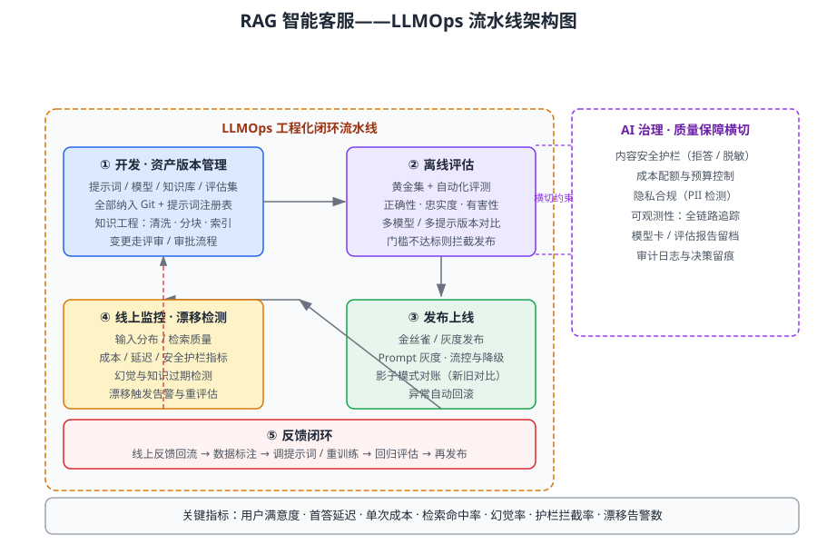

某企业基于大语言模型构建 RAG 智能客服，上线半年后问题集中爆发：提示词版本混乱、靠人工改提示词救火；没有离线评估，模型或提示词升级全靠直觉；知识库更新滞后导致大量"幻觉"回答；线上回答质量漂移、成本与延迟失控，还出现过一次隐私信息泄露。管理层要求建立可持续运营的 LLMOps 体系。请综合运用「LLMOps」「MLOps」「AI 质量保证」「持续交付」「AI 治理」知识，设计完整的 LLMOps 流水线：先说明调用到的知识点，再给出分步推理，最后给出包含流水线架构图、各环节关键指标与反馈闭环的最终方案。

---

答案：（分步综合分析）

一、知识点调用

调用「LLMOps」的提示词/模型/知识库版本管理、离线评估、灰度发布、线上监控与漂移检测、反馈闭环等工程化实践；调用「MLOps」的数据集与模型流水线、持续训练思想，将其扩展到"提示词即代码、知识库即数据"；调用「AI 质量保证」设计正确性、忠实度、有害性等评估维度；调用「持续交付」的金丝雀发布、灰度、自动回滚与可观测性；调用「AI 治理」落实内容安全护栏、隐私合规、成本控制与审计留痕。五个知识点协同，把"靠人救火的 LLM 应用"转化为"开发—评估—发布—监控—反馈"的工程化闭环。

二、分步推理

1. 资产与版本管理（LLMOps 基础）：将提示词、模型、知识库、评估集全部纳入版本控制——提示词用「提示词注册表」登记版本、变更走评审；知识库数据建立清洗、分块、索引与刷新策略，杜绝"知识过期导致幻觉"。
2. 离线评估（AI 质量保证）：构建黄金评估集，用自动化评测覆盖正确性（答案是否准确）、忠实度（回答是否有知识库依据）、有害性（是否输出有害内容）三个维度；对多个模型/提示词版本做对比评测，设定发布门槛，不达标即拦截，把"靠直觉升级"改为"靠指标升级"。
3. 发布上线（持续交付）：采用金丝雀/灰度发布，先小流量放量再逐步扩大；Prompt 变更可独立灰度；设置流控、超时与降级策略；异常自动回滚。发布策略复用传统持续交付方法论。
4. 线上监控与漂移检测（LLMOps 核心）：监控输入分布变化、检索质量（命中率、上下文相关性）、回答质量（用户点赞/差评、转人工率）、成本与延迟、安全护栏拦截率；检测提示词/知识库漂移，漂移超阈值触发告警并自动重评估。
5. 反馈闭环（LLMOps 关键）：线上反馈（用户评价、纠错、人工修改）回流 → 标注与治理 → 更新知识库或调整提示词 → 回归评估 → 再发布，形成持续改进的工程闭环。
6. 治理横切（AI 治理）：内容安全护栏（敏感内容拒答/脱敏）、PII 检测防隐私泄露、成本配额预算、全链路追踪与审计日志留痕，满足合规与可追溯要求。

三、结论/方案

最终采用「开发版本管理 → 离线评估 → 灰度发布 → 线上监控漂移 → 反馈闭环」的 LLMOps 流水线（架构见图 1），以内容安全、隐私、成本、可观测性作为横切治理约束。各环节关键指标见表 1。该体系把"提示词即代码、知识库即数据、评估即门禁"落到实处，实现从"靠人救火"到"指标驱动、闭环演进"的转变。

图 1 LLMOps 流水线架构图

| 流水线环节 | 关键活动 | 关键指标 | 对应知识 |
|---|---|---|---|
| ① 开发与版本管理 | 提示词/模型/知识库入版本控制，知识工程清洗分块 | 变更评审通过率、知识库刷新时效 | LLMOps、MLOps |
| ② 离线评估 | 黄金集自动化评测，多版本对比 | 正确率、忠实度、有害性得分 | AI 质量保证 |
| ③ 发布上线 | 金丝雀/灰度、流控降级、自动回滚 | 灰度故障率、回滚次数 | 持续交付 |
| ④ 线上监控 | 漂移检测、质量/成本/延迟监控 | 检索命中率、漂移告警数、幻觉率 | LLMOps |
| ⑤ 反馈闭环 | 反馈回流、标注、再评估、再发布 | 反馈处理周期、质量回升幅度 | MLOps 持续训练思想 |

---

评分标准：（满分 10 分）
- 要点 1（2 分）：准确调用 LLMOps、MLOps、AI 质量保证、持续交付、AI 治理知识点并建立联系，缺一类扣 1 分。
- 要点 2（4 分）：分步推理完整、逻辑自洽（版本管理 → 离线评估 → 发布 → 监控漂移 → 反馈闭环，并含治理横切），缺关键环节每处扣 1 分。
- 要点 3（3 分）：方案可行，给出 LLMOps 流水线架构图与各环节关键指标表，能体现"评估即门禁、反馈即闭环"；缺架构图扣 2 分、缺指标表扣 1 分。
- 要点 4（1 分）：结论/方案表述清晰，安全护栏、成本控制与隐私合规等治理细节论证充分。

---

解析：本题考查的是"LLM 应用为什么不能当普通脚本运营"。判断要点是：把提示词、知识库当代码与数据纳入版本管理，用离线评估做发布门禁，用漂移检测与反馈闭环代替"人工救火"，并把安全、隐私、成本治理横切到全流程。架构图与指标表构成可核验的方案产出。答题宜围绕"开发—评估—发布—监控—反馈"闭环展开，同时点明与传统持续交付的异同，体现 LLMOps 作为"护航 AI"工程化方法的价值。
