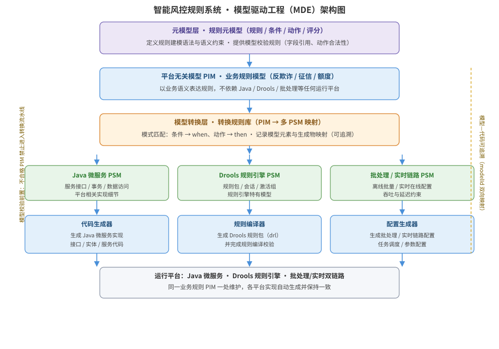

某银行要建设「智能风控规则系统」：业务规则种类多、变更频繁，需快速响应监管要求（如征信、反欺诈、额度管控规则），且同一套规则必须部署到不同运行平台（Java 微服务、Drools 规则引擎、批处理与实时两条链路），希望规则以模型形式统一维护、由平台自动生成实现，减少手工编码与平台绑定。请为该系统的建设设计基于模型驱动工程（MDE）的方案：问题域分析与建模、平台无关模型 PIM 与平台相关模型 PSM 设计、模型转换与代码生成流程、MDE 架构结构图，并给出关键接口/伪代码说明及关键设计决策。

---

答案：设计方案（设计目标 → MDE 架构结构图 → 模型层次与职责表 → 关键接口/伪代码说明 → 关键设计决策）

一、设计目标

1. 以模型为一等制品：业务规则用平台无关模型（PIM）表达，屏蔽技术平台差异，规则变更通过修改模型而非修改代码完成；
2. 通过「模型转换 + 代码生成」流水线，把 PIM 自动转换到面向不同运行平台的 PSM 并生成可执行代码或规则配置，保证各平台实现一致；
3. 建立元模型与模型校验、模型-代码可追溯机制，保证模型正确、可转换、可追溯，提升规则变更响应速度并降低人工翻译风险。

二、MDE 架构结构图



说明：顶层为元模型层（规则元模型定义规则建模语法与约束），其下为模型层——平台无关模型 PIM 以业务语义描述规则，经模型转换层映射为面向 Java 微服务、Drools、批处理/实时链路的平台相关模型 PSM；底层为生成与运行层，代码生成器、规则编译器、配置生成器由 PSM 生成可执行代码与规则配置并部署到各运行平台。模型校验前置保证不合格 PIM 不进入转换流水线，可追溯性（modelId 双向映射）贯穿 PIM → 转换 → 生成物全过程。

三、模型层次与职责表

| 层次 | 组成 | 职责 | 关键产物 |
|------|------|------|----------|
| 元模型层 | 规则元模型（规则、条件、动作、评分） | 定义规则建模语法与语义约束，提供校验规则 | 元模型定义（含语法与约束） |
| 平台无关模型 PIM | 业务规则模型（反欺诈、征信、额度管控） | 用业务语义描述规则，不依赖具体平台 | PIM 模型文件 + 模型校验报告 |
| 模型转换层 | 转换规则库（PIM→PSM 映射） | 把 PIM 映射为各平台 PSM，记录可追溯关系 | PSM 模型（Java/Drools/批处理·实时） |
| 平台相关模型 PSM | 面向 Java、Drools、批处理/实时的模型 | 表达各运行平台的实现细节 | PSM 模型 |
| 生成与运行层 | 代码生成器、规则编译器、配置生成器、部署 | 由 PSM 生成可执行代码/规则配置并部署 | 生成代码、规则包、部署配置 |

四、关键接口/伪代码说明

- 规则模型定义（PIM 简化 DSL 示例）：

```
rule 反欺诈_高频下单:
  条件: user.riskLevel == "高" and order.count_1h >= 20
  动作: block(order); score.risk += 60; 通知_人工复核
```

- 模型转换伪代码（PIM → Drools PSM → 规则文件）：

```
for each rule in pim.rules:
    droolsRule = transform(rule)                  # 条件 → when 子句，动作 → then 子句
    trace.addMapping(rule.id, droolsRule.ruleName)  # 记录可追溯关系
    generateDroolsFile(droolsRule)                # 生成规则包
```

- 代码生成接口：`generate(pim) → { javaService, droolsRules, batchConfig, realtimeConfig }`，每个生成物携带 `modelId` 反向追溯来源模型元素。

五、关键设计决策

1. 采用「规则元模型 → PIM → 多 PSM → 代码生成」的垂直分层：以业务规则 PIM 为唯一权威制品，各平台 PSM 与生成代码均为其派生视图，实现「改一处模型、全平台同步」，避免同一规则在多个平台各写一份；
2. 用可追溯性管理模型-代码一致性：每次转换记录模型元素与生成物的映射，合规审计与代码评审时可按 modelId 反向追溯，防止模型与实现漂移；
3. 模型校验前置：转换前先对 PIM 做语法与语义校验（条件引用的字段必须存在、动作可执行、评分取值合法），不合格模型禁止进入生成流水线，避免错误扩散到全部平台。

---

评分标准：（满分 10 分）
- 要点 1（1 分）：明确 MDE 设计目标（模型为核心制品、屏蔽平台差异、转换一致性与可追溯），给 1 分。
- 要点 2（3 分）：MDE 架构结构图完整——元模型层、PIM、模型转换层、多 PSM、生成与运行层层次清晰，层间关系、校验前置与可追溯性标注完整，给 3 分；缺一层扣 1 分，缺可追溯性标注扣 1 分。
- 要点 3（2 分）：模型层次与职责表正确——各层组成、职责与关键产物一一对应，每项约 0.4 分，合计 2 分。
- 要点 4（2 分）：接口/伪代码正确——规则模型定义、PIM→PSM 转换与代码生成伪代码逻辑正确，给 2 分。
- 要点 5（2 分）：关键设计决策合理——PIM 为权威制品、可追溯性、模型校验前置，给 2 分。

---

解析：本方案紧扣「模型驱动工程」知识点——MDE 以模型为一等制品，通过「元模型 → 平台无关模型 PIM → 模型转换 → 平台相关模型 PSM → 代码生成」的流水线，把业务语义与平台实现解耦。针对银行风控规则「种类多、变更频繁、多平台部署」的特点，方案把业务规则 PIM 作为唯一权威制品，各平台 PSM 与生成代码作为派生视图，通过模型校验前置防止错误扩散，通过可追溯性保证模型与实现一致，体现对 MDE 分层建模、模型转换、自动生成与追溯机制的完整把握。
