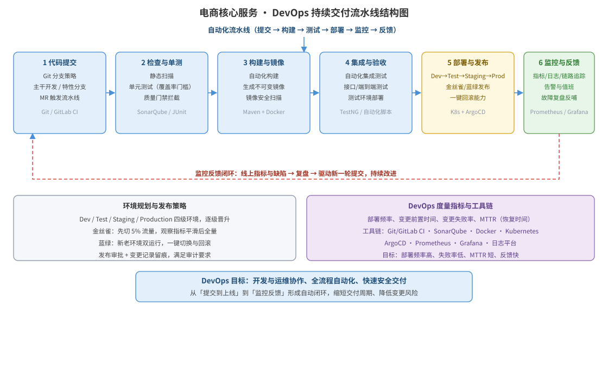

某互联网电商团队目前采用「开发完手动部署、上线靠固定发布窗口」的传统方式，部署周期长、上线风险高。为缩短交付周期并保障发布安全，团队决定引入 DevOps 实践。请设计一套覆盖提交到上线的持续交付流水线方案：流水线阶段与工具选型、阶段职责表、持续交付流水线结构图、环境规划与发布策略、度量指标与反馈闭环，并给出流水线定义伪代码。

---

答案：设计方案（设计目标 → DevOps 持续交付流水线结构图 → 流水线阶段职责表 → 环境与发布策略 → 度量与反馈闭环 → 流水线定义伪代码）

一、设计目标

1. 建立「提交 → 检查 → 构建 → 测试 → 部署 → 监控 → 反馈」的自动化流水线，从代码提交到生产发布全流程自动化，缩短交付周期；
2. 通过质量门禁、不可变镜像、金丝雀/蓝绿发布与一键回滚，降低上线风险，保障发布安全；
3. 以部署频率、变更失败率、恢复时间等度量驱动持续改进，形成开发与运维协作的反馈闭环。

二、DevOps 持续交付流水线结构图



说明：流水线由代码提交（Git）、静态检查与单元测试（SonarQube/JUnit）、构建与镜像（Maven/Docker）、集成与验收测试、部署与发布（K8s + 金丝雀/蓝绿）、监控与反馈（Prometheus/Grafana）六个阶段串成，线上指标与缺陷经监控反馈闭环反哺新一轮提交，形成持续改进循环。

三、流水线阶段职责表

| 阶段 | 职责 | 工具/技术 | 质量门禁 |
|------|------|-----------|----------|
| 代码提交 | 分支策略、合并请求触发流水线 | Git / GitLab CI | MR 必须通过流水线 |
| 检查与单测 | 静态扫描、单元测试、覆盖率门槛 | SonarQube / JUnit | 覆盖率与质量阈值不达标即拦截 |
| 构建与镜像 | 自动化构建、生成不可变镜像、镜像安全扫描 | Maven / Docker | 镜像漏洞超阈值不发布 |
| 集成与验收 | 自动化集成/接口/端到端测试 | TestNG / 自动化脚本 | 测试全绿方可晋升 |
| 部署与发布 | Dev→Test→Staging→Prod 晋升、金丝雀/蓝绿、回滚 | Kubernetes / ArgoCD | 金丝雀指标正常才全量 |
| 监控与反馈 | 指标、日志、链路追踪、告警与复盘 | Prometheus / Grafana | 异常触发告警与回滚 |

四、环境规划与发布策略

- 环境晋升：Dev → Test → Staging → Production 四级环境，镜像经逐级验证后晋升，杜绝「在我机器上没问题」的差异；
- 金丝雀发布：先切 5% 流量观察错误率与延迟，指标平滑后逐步放量到全量，异常即自动回滚；
- 蓝绿发布：新老环境双运行，一键切换与回滚，降低发布窗口风险；
- 发布留痕：发布审批、变更记录与审计日志齐备，满足可追溯要求。

五、度量指标与反馈闭环

- 核心度量：部署频率（越高越好）、变更前置时间（越短越好）、变更失败率（越低越好）、恢复时间 MTTR（越短越好）；
- 反馈闭环：线上指标与缺陷经监控平台汇聚 → 团队复盘定位根因 → 形成改进项驱动新一轮提交，实现「部署即反馈、反馈即改进」。

六、流水线定义伪代码

```text
pipeline "持续交付流水线":
  trigger: merge_request_to_main
  stage "检查与单测":   sonar-scanner && mvn test          # 覆盖率 < 80% → 失败
  stage "构建与镜像":   mvn package && docker build && docker scan
  stage "集成与验收":   deploy to test && run 自动化集成/端到端测试
  stage "部署与发布":   promote test→staging→prod
                       canary 5% → 观察 30min → 全量     # 异常 → 自动回滚
  stage "监控与反馈":   推送指标到 Prometheus，告警阈值触发值班
```

---

评分标准：（满分 10 分）
- 要点 1（1 分）：明确 DevOps 设计目标（全流程自动化、质量门禁、低风险发布、度量驱动改进），给 1 分。
- 要点 2（3 分）：持续交付流水线结构图完整——六阶段串联清晰、含工具选型与反馈闭环箭头，给 3 分；缺一阶段或闭环扣 1 分。
- 要点 3（2 分）：流水线阶段职责表正确——每阶段职责、工具与质量门禁一一对应，每答对两类约 0.5 分，合计 2 分。
- 要点 4（2 分）：环境规划与发布策略合理——四级环境晋升、金丝雀/蓝绿发布、一键回滚与发布留痕，给 2 分。
- 要点 5（2 分）：度量指标与反馈闭环正确（部署频率、变更失败率、MTTR）且流水线定义伪代码可执行，给 2 分。

---

解析：本方案紧扣「DevOps」知识点——DevOps 是打破开发与运维边界的软件工程范型，强调文化、自动化与度量三者的统一。方案以持续交付流水线为核心，把提交到上线固化为可自动执行的六个阶段，用质量门禁与不可变镜像保障质量，用金丝雀/蓝绿发布与一键回滚保障发布安全，用部署频率、变更失败率、MTTR 度量验证改进效果，并以监控反馈闭环实现「开发运维协作、快速安全交付」，体现对 DevOps 范型从理念到工程落地的完整理解。
