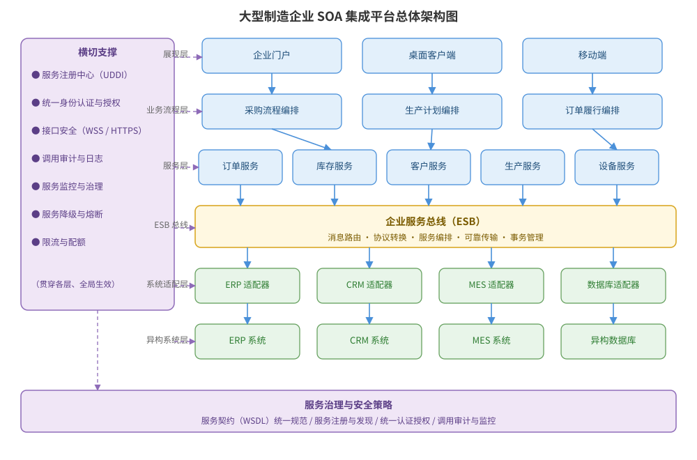

某大型制造企业拟整合 ERP、CRM、MES 等异构系统，建设面向服务架构（SOA）的统一集成平台，实现业务能力服务化与跨系统流程编排。请为该 SOA 集成平台进行设计：服务分层、企业服务总线（ESB）、服务治理与安全、业务流程编排，给出总体架构图，并说明关键设计决策与服务的接口规范。

---

答案：设计方案（设计目标 → SOA 集成平台架构图 → 分层职责表 → 关键设计决策 → 服务契约接口）

一、设计目标

1. 将异构系统能力封装为可复用的标准业务服务，实现业务能力与底层实现解耦；
2. 通过 ESB 完成协议转换、消息路由与服务编排，屏蔽 ERP/CRM/MES 的异构差异；
3. 建立服务治理与安全体系，保证服务注册、认证授权与调用审计可管控。

二、SOA 集成平台总体架构图



说明：自上而下为展现层、业务流程编排层、业务服务层、ESB 总线、系统适配层与异构系统层；左侧「横切支撑」贯穿各层，负责服务注册、认证授权、安全与监控；底部「服务治理与安全策略」统一定义服务契约与安全规范。

三、分层职责表

| 层 | 职责 | 关键组件 |
|----|------|----------|
| 展现层 | 多端访问入口 | 企业门户、桌面客户端、移动端 |
| 业务流程层 | 跨服务流程编排 | 采购流程、生产计划、订单履行编排 |
| 服务层 | 标准业务服务暴露 | 订单、库存、客户、生产、设备服务 |
| ESB | 协议转换、路由、可靠传输、事务 | 消息路由、服务编排引擎 |
| 系统适配层 | 屏蔽异构系统差异 | ERP/CRM/MES/数据库适配器 |
| 异构系统层 | 存量业务系统与数据 | ERP、CRM、MES、异构数据库 |

四、关键设计决策

1. 服务契约（WSDL）统一规范：服务层只暴露标准契约，内部实现可独立演化，新增系统只需提供适配器即可接入，避免点对点集成；
2. ESB 承担协议转换与消息路由，集中处理异构系统的通信差异，降低集成耦合；
3. 业务流程在编排层定义，业务变更通过调整编排而非改动服务实现，提升响应速度；
4. 服务注册中心（UDDI）统一管理服务注册与发现，治理与安全策略（认证授权、审计、熔断限流）贯穿各层。

五、服务契约接口与调用流程

```
服务契约: 订单服务（WSDL）
操作: createOrder / queryOrder / cancelOrder
消息格式: 标准 XML/SOAP + 消息头（安全令牌、追踪 ID）
调用流程:
  客户端 → 认证授权 → ESB 路由到订单服务 → 可靠传输
  → 结果返回；全程写入审计日志，异常触发降级/重试
```

---

评分标准：（满分 10 分）
- 要点 1（1 分）：明确 SOA 设计目标（服务化、解耦、ESB 集成、治理安全），给 1 分。
- 要点 2（3 分）：总体架构图完整——六层结构、ESB、横切支撑、服务治理策略齐备且衔接清晰，给 3 分；缺一处扣 1 分。
- 要点 3（2 分）：分层职责表正确——每层职责与关键组件匹配，每答对 2 层约 0.7 分，合计 2 分。
- 要点 4（2 分）：关键设计决策合理——服务契约规范化、ESB 屏蔽异构差异、编排层支撑流程变更、注册中心与治理安全贯穿，答对 3 项给 1.5 分、答全给 2 分。
- 要点 5（1 分）：接口/伪代码正确——给出服务契约（WSDL）与调用流程（认证、路由、可靠传输、审计），给 1 分。
- 要点 6（1 分）：方案呼应异构系统整合场景（ERP/CRM/MES 适配接入、避免点对点集成），给 1 分。

---

解析：本方案紧扣「面向服务架构」知识点——体现 SOA 的核心思想：以服务为基本单元实现业务能力复用，通过 ESB 屏蔽异构系统差异，通过服务契约实现契约与实现分离，通过编排层支撑业务流程灵活变更。方案同时覆盖服务注册、认证授权、审计、熔断限流等治理与安全横切关注点，回应了制造企业整合 ERP/CRM/MES 异构系统的真实诉求，体现对 SOA 范型在集成场景下应用的理解。
