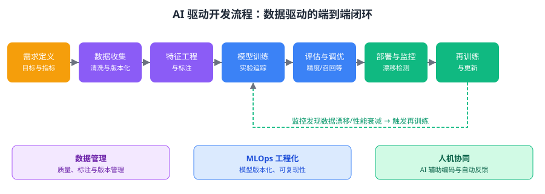

与传统软件流程相比，AI 驱动的软件开发流程有哪些新特点？请结合数据、模型、评估与部署等环节分条简述。

---

答案：
1. 数据成为一等公民：AI 开发需要专门的数据收集、清洗、标注与版本管理环节，数据质量直接决定模型表现，数据漂移会引发性能衰减。
2. 训练—评估—调优循环：以「模型训练—指标评估—调优再训练」为核心的迭代取代以代码评审为主的验证，精度、召回等指标是验收依据。
3. 强调 MLOps 工程化：实验追踪、模型版本化、训练可复现性与模型注册成为必要基础设施，保障 AI 流程的可管理性。
4. 部署与监控闭环：模型上线后持续监控数据漂移与性能指标，异常时自动触发再训练与重新发布，形成「训练—部署—监控—再训练」的闭环。
5. 人机协同加速反馈：借助 AI 辅助编码、测试与文档生成，同时依托 CI/CD 流水线和自动化反馈，缩短需求到交付的迭代周期。

---

评分标准：（满分 10 分）
- 要点 1（2 分）：数据成为一等公民——答出数据收集、清洗、标注与版本管理成为专门环节，数据质量直接决定模型表现、数据漂移引发性能衰减，答出核心内容即给分
- 要点 2（2 分）：训练—评估—调优循环——答出以「模型训练—指标评估—调优再训练」为核心的迭代取代以代码评审为主的验证，答出核心内容即给分
- 要点 3（2 分）：强调 MLOps 工程化——答出实验追踪、模型版本化、训练可复现性与模型注册等必要基础设施，答出核心内容即给分
- 要点 4（2 分）：部署与监控闭环——答出模型上线后持续监控数据漂移与性能指标、异常时自动触发再训练与重新发布，答出核心内容即给分
- 要点 5（2 分）：人机协同加速反馈——答出借助 AI 辅助编码、测试与文档生成，依托 CI/CD 流水线与自动化反馈缩短迭代周期，答出核心内容即给分

---

解析：AI 驱动开发流程在传统「需求—设计—编码—测试—部署」基础上，新增了数据处理、模型训练与评估、MLOps 工程化、模型监控与再训练等环节，形成数据驱动、持续迭代、人机协同的端到端闭环。理解其「数据＋模型＋工程化」三位一体的特征，是把握 AI 时代软件过程演进的关键。
