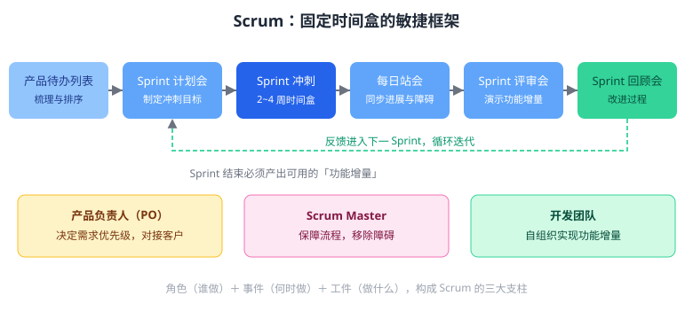

Scrum 是使用最广泛的敏捷框架之一，其核心事件是固定时间盒的 Sprint。如下图所示，下列关于 Sprint 的描述正确的是（　）

---

A. Sprint 没有时间限制，一直持续到全部需求完成为止
B. Sprint 是固定时间盒的迭代周期，通常为 2~4 周，Sprint 内目标保持稳定，结束时产出可用的功能增量
C. Sprint 只由产品负责人一人单独完成所有工作
D. Sprint 结束后无须交付任何可用的软件功能

---

答案：B

---

解析：Sprint（冲刺）是 Scrum 中固定时间盒的迭代单元，一般持续 2~4 周，期间冲刺目标保持稳定，结束时必须产出可用的功能增量并接受评审。围绕 Sprint 还有产品待办列表梳理、Sprint 计划会、每日站会、Sprint 评审会与回顾会等事件，角色包括产品负责人（决定需求优先级）、Scrum Master（保障流程）与自组织的开发团队。因此 A、C、D 均不符合 Scrum 的运作机制。
