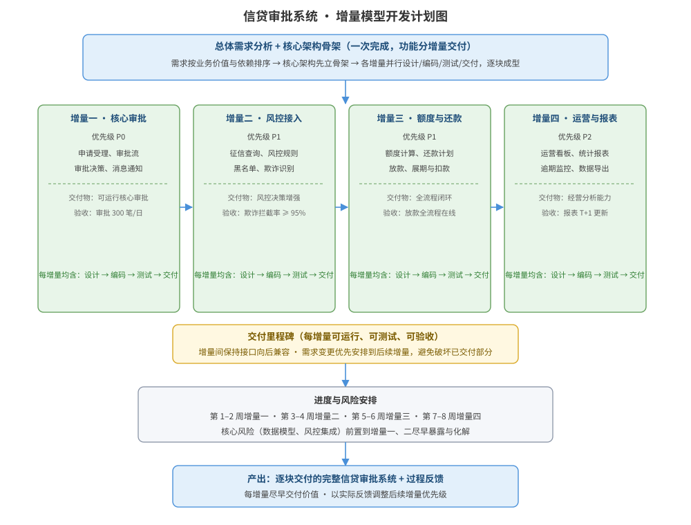

某银行「信贷审批系统」需求已完成总体分析：系统包含申请受理、审批流程、风控接入、额度计算、还款计划、放款、运营看板等二十余项功能，业务价值与优先级差异明显，客户希望系统能尽早交付可用功能并逐步完善。请为该系统的开发设计基于增量模型的实施计划：增量划分依据与增量规划、每个增量的范围与交付物/验收标准、增量模型计划结构图、进度与风险安排，并说明关键设计决策及与迭代模型的区别。

---

答案：设计方案（设计目标 → 增量模型计划结构图 → 增量划分与交付物表 → 进度与风险安排 → 关键设计决策）

一、设计目标

1. 按业务价值与依赖关系把系统划分为若干个可独立交付的增量，每个增量交付后即可运行、可测试、可验收，尽早向客户提供可用功能；
2. 核心架构（数据模型、审批主流程）先完成骨架，功能分增量逐步填充，增量间接口向后兼容，避免破坏已交付部分；
3. 高风险、高价值的功能前置，尽早暴露与化解集成风险，并依据各增量交付后的反馈调整后续优先级。

二、增量模型计划结构图

说明：总体需求分析与核心架构骨架一次完成，系统功能按优先级划分为增量一（核心审批）、增量二（风控接入）、增量三（额度与还款）、增量四（运营与报表），每个增量内部都完成设计、编码、测试、交付，增量顺序推进、前后衔接，最终拼装为完整系统。

三、增量划分与交付物表

| 增量 | 范围 | 优先级 | 交付物 | 验收标准 |
|------|------|--------|--------|----------|
| 增量一 | 申请受理、审批流、审批决策、消息通知 | P0 | 可运行的核心审批子系统 | 审批处理 300 笔/日、主流程端到端可运行 |
| 增量二 | 征信查询、风控规则、黑名单、欺诈识别 | P1 | 风控决策增强 | 欺诈拦截率 ≥ 95%、风控规则可配置 |
| 增量三 | 额度计算、还款计划、放款、展期与扣款 | P1 | 信贷全流程闭环 | 放款与还款全流程在线、账务正确 |
| 增量四 | 运营看板、逾期监控、统计报表、数据导出 | P2 | 经营分析能力 | 核心报表 T+1 更新、数据可导出 |

四、进度与风险安排

- 进度：第 1–2 周增量一，第 3–4 周增量二，第 5–6 周增量三，第 7–8 周增量四；每增量结束做演示与验收，形成交付里程碑。
- 风险前置：数据模型、风控集成是核心风险，安排在增量一、增量二尽早完成，出现偏差时在后续增量中及时调整。
- 变更管理：客户新需求优先安排到后续增量，避免中途破坏已交付增量，保证每个增量交付物稳定可用。

五、关键设计决策

1. 增量划分以「业务价值 × 依赖 × 风险」为依据：核心审批价值最高且无前置依赖，排为增量一；风控依赖征信外部接口，风险高，紧随其后尽早验证；
2. 架构先行、接口兼容：先建立稳定的核心架构与增量间接口，增量实现时向后兼容，保证前序增量交付物不被后续改动破坏；
3. 与迭代模型的区别：增量模型按功能切分、每增量交付一部分可运行的完整功能子集，功能逐步增补直至完整；迭代模型按迭代周期（时间盒）切分，每个迭代对整体需求进行「设计→实现→评估」的往复精化，功能在迭代间持续演进而非按块交付。本方案以功能增量为主、每增量内部辅以小幅迭代细化。

---

评分标准：（满分 10 分）
- 要点 1（1 分）：明确增量模型设计目标（按价值分增量、尽早交付、架构先行、风险前置），给 1 分。
- 要点 2（3 分）：增量模型计划结构图完整——总体需求与架构骨架 + 四个增量及各增量「设计→编码→测试→交付」内部活动、里程碑清晰，给 3 分；缺一处扣 1 分。
- 要点 3（2 分）：增量划分与交付物表正确——四个增量范围、优先级、交付物与验收标准一一对应，每增量约 0.5 分，合计 2 分。
- 要点 4（2 分）：进度与风险安排合理——按周排程、高风险功能前置、变更安排到后续增量，给 2 分。
- 要点 5（2 分）：关键设计决策正确——划分依据（价值×依赖×风险）、接口向后兼容、与迭代模型的区别表述清晰，给 2 分。

---

解析：本方案紧扣「增量模型」知识点——增量模型把系统按功能划分为若干可独立交付的增量，每个增量交付后都是可运行、可测试的产品，兼具瀑布的顺序性与演化的渐进性。方案以信贷审批系统为对象，按「业务价值 × 依赖 × 风险」划分四个增量，架构先立骨架、功能分块交付、接口向后兼容，并说明增量（按功能块交付子集）与迭代（按时间盒往复精化）的本质区别，体现对增量模型过程组织与取舍的完整理解。
