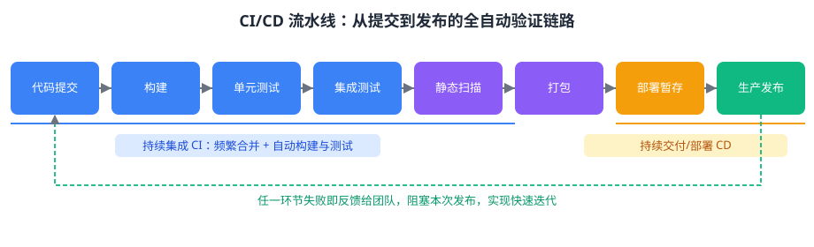

持续集成（CI）要求团队成员频繁地将代码____到共享主干，每次提交或合并都会自动触发____与自动化测试，以便尽早发现集成冲突。在 AI 项目中，CI 流水线还应在模型变更时自动运行评估，防止模型指标回退。

---

答案：合并（集成）；构建

---

解析：持续集成的要义是「频繁合并 + 自动化验证」：开发者的改动尽快并入共享主干，由 CI 服务器自动完成构建、单元测试（AI 项目还包括模型评估），一旦失败立即反馈给团队，把集成问题消灭在早期，避免「集成的最后一刻」大爆炸。持续集成是持续交付与持续部署（CI/CD）流水线的基础环节。
