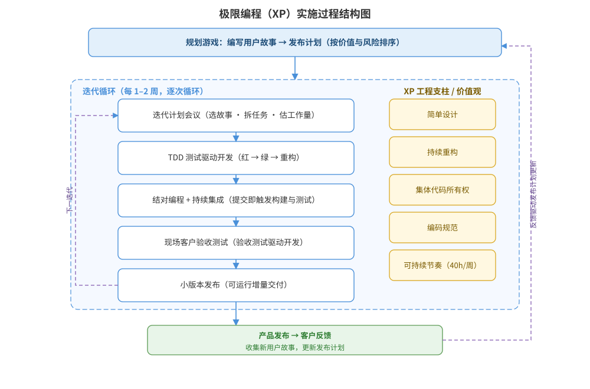

一个 8 人团队拟采用极限编程（XP）开发一款面向教师的智能备课 Web 应用，需在 3 个月内交付可上线版本，且需求会在开发中持续细化变化。请为该项目的 XP 实施进行设计：规划游戏与发布计划、迭代节奏、测试驱动开发（TDD）流程、结对编程与持续集成的组织方式，给出 XP 实施过程结构图，并说明关键设计决策与 TDD 循环接口。

---

答案：设计方案（设计目标 → XP 实施过程结构图 → 核心实践落地表 → 迭代与发布节奏 → 关键设计决策 → TDD 循环伪代码）

一、设计目标

1. 以规划游戏把用户故事排入发布计划，按价值与风险决定优先级；
2. 以 1–2 周迭代快速交付可运行增量，通过现场客户反馈持续修正；
3. 以 TDD、结对编程、持续集成落实质量内建，降低需求变化带来的返工成本。

二、XP 实施过程结构图



说明：规划游戏产出用户故事与发布计划；每个迭代内执行「迭代计划会议 → TDD → 结对编程 + 持续集成 → 现场客户验收测试 → 小版本发布」，周而复始；发布后收集客户反馈更新发布计划；右侧为贯穿全程的 XP 工程支柱（简单设计、持续重构、集体代码所有权、编码规范、可持续节奏）。

三、核心实践落地表

| 实践 | 落地方式 | 产出/关口 |
|------|----------|-----------|
| 规划游戏 | 用户故事 → 按价值/风险排序 → 发布计划 | 发布计划 |
| 迭代计划 | 选故事、拆任务、估工作量 | 迭代待办 |
| TDD | 红→绿→重构，先写测试后写实现 | 单元测试全绿 |
| 结对编程 | 两人一机、定期轮换 | 结对代码评审 |
| 持续集成 | 每次提交触发构建与自动化测试 | 集成绿灯 |
| 现场客户 | 客户代表驻场、验收测试驱动 | 验收通过 |
| 小版本发布 | 每迭代交付可运行增量 | 可上线版本 |

四、迭代与发布节奏设计

- 迭代周期：1 周；8 人 2 人一组共 4 组，组内结对并定期轮换；
- 迭代内时间分配：TDD 驱动的开发约 60%、集成与验收约 30%、迭代回顾改进约 10%；
- 发布节奏：每迭代末发布可运行版本，3 个月共约 12 个迭代，第 1 个迭代后即形成可演示骨架。

五、关键设计决策

1. TDD 与重构配合：先写失败测试（红）→ 最小实现转绿 → 重构消除重复与坏味道，保证设计可持续演进；
2. 持续集成作为质量闸门：提交即构建测试，测试不绿不合并，配合集体代码所有权与编码规范；
3. 现场客户参与验收测试：以验收测试驱动开发，把需求歧义提前暴露在迭代内；
4. 以每周 40 小时的可持续节奏约束工作量，防止过度承诺影响质量。

六、TDD 循环接口与伪代码

```
REPEAT per 用户故事/任务:
  RED:      编写失败测试，断言预期行为
  GREEN:    编写最小实现，使测试通过
  REFACTOR: 重构去除重复与坏味道，保持测试全绿
  提交 → 触发持续集成（构建 + 全部自动化测试）
UNTIL 验收测试通过 → 集成进可运行版本
```

---

评分标准：（满分 10 分）
- 要点 1（1 分）：明确 XP 实施目标（规划游戏、快速迭代、质量内建、现场客户反馈），给 1 分。
- 要点 2（3 分）：实施过程结构图完整——规划游戏→迭代循环（计划/TDD/结对+持续集成/验收/小版本发布）→反馈更新发布计划、并含工程支柱，给 3 分；缺一处扣 1 分。
- 要点 3（2 分）：核心实践落地表正确——规划游戏、TDD、结对编程、持续集成、现场客户、小版本发布等实践与落地方式、产出匹配，每答对 3 项约 1 分，合计 2 分。
- 要点 4（1 分）：迭代与发布节奏设计合理（1 周迭代、迭代内时间分配、3 个月约 12 次发布），给 1 分。
- 要点 5（2 分）：关键设计决策合理——TDD 红绿重构、持续集成质量闸门、现场客户验收、可持续节奏，答对 2 项给 1 分、答全给 2 分。
- 要点 6（1 分）：接口/伪代码正确——给出 TDD 循环与持续集成触发流程，给 1 分。

---

解析：本方案紧扣「极限编程」知识点——完整落地 XP 的核心实践（规划游戏、小版本发布、简单设计、TDD、结对编程、持续集成、现场客户、重构、编码规范、可持续节奏），并以「迭代循环 + 工程支柱」的结构图清晰呈现实践之间的协作关系。方案针对教师智能备课应用需求持续变化的特点，通过短迭代、快速反馈、质量内建把变更成本降到最低，体现对 XP 价值观与工程实践整合应用的理解。
