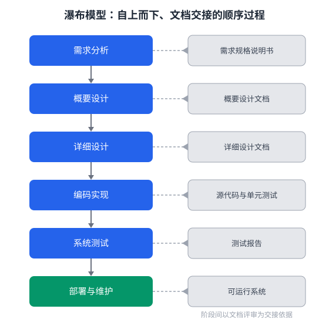

瀑布模型将软件生命周期划分为需求分析、设计、编码、测试等阶段，各阶段自上而下顺序推进。下列关于瀑布模型特征的描述，正确的是（　）

---

A. 各阶段顺序执行，前一阶段完成后才能进入下一阶段，阶段间以文档评审为交接
B. 各阶段可以任意并行、随意回退，无须任何评审
C. 需求可以随时大幅变更，不影响后续阶段
D. 只有测试阶段才需要编写文档

---

答案：A

---

解析：瀑布模型是典型的顺序型生命周期模型，需求分析、概要设计、详细设计、编码实现、测试、部署与维护等阶段自上而下依次执行，每个阶段的产出（如需求规格说明书、设计文档）经评审确认后作为下一阶段的输入，一般不回退、不并行。由于需求在前期一次性冻结，面对需求频繁变化的 AI 软件项目时容易引发返工，这也是它常与迭代、敏捷方法结合使用的原因。B、C、D 与瀑布模型强调顺序性、文档完备性和严格评审的特征相悖。
