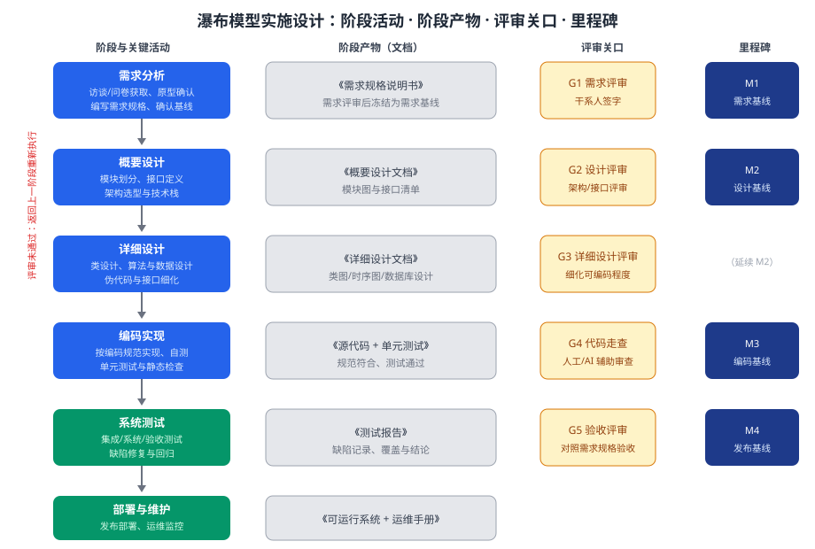

某政务机构拟开发「电子证照登记系统」，需求明确、业务流程稳定、变更风险低，项目合同要求以文档化方式逐阶段验收。请为该项目的瀑布模型实施进行设计：阶段划分与各阶段活动、阶段产物与评审关口、里程碑与基线，给出实施过程结构图，并说明关键设计决策与适用性边界。

---

答案：设计方案（实施目标 → 阶段过程结构图 → 阶段与产物职责表 → 评审关口与里程碑 → 关键设计决策 → 阶段产物模板接口）

一、设计目标

1. 按瀑布模型顺序组织「需求分析 → 概要设计 → 详细设计 → 编码实现 → 系统测试 → 部署维护」，阶段边界清晰；
2. 每个阶段以评审关口收尾、以文档化产物交接，满足合同逐阶段验收要求；
3. 设置里程碑与基线控制变更，保证需求、设计、编码、发布全程可追踪。

二、实施过程结构图



说明：左侧为阶段与关键活动，中间为阶段产物（文档），右侧为评审关口 G1–G5 与里程碑 M1–M4；评审未通过时返回上一阶段重新执行。

三、阶段与产物职责表

| 阶段 | 关键活动 | 阶段产物 | 评审关口 |
|------|----------|----------|----------|
| 需求分析 | 获取、原型确认、编写规格 | 《需求规格说明书》 | G1 需求评审 |
| 概要设计 | 模块划分、接口定义、架构选型 | 《概要设计文档》 | G2 设计评审 |
| 详细设计 | 类设计、算法与数据设计、伪代码 | 《详细设计文档》 | G3 详细设计评审 |
| 编码实现 | 按规范编码、单元测试、静态检查 | 《源代码 + 单元测试》 | G4 代码走查 |
| 系统测试 | 集成/系统/验收测试、缺陷回归 | 《测试报告》 | G5 验收评审 |
| 部署维护 | 发布部署、运维监控 | 《可运行系统 + 运维手册》 | 验收后交付 |

四、评审关口与里程碑

- M1 需求基线：需求评审通过后冻结，此后需求变更必须走正式变更控制流程；
- M2 设计基线：概要 + 详细设计评审通过，模块接口清单冻结；
- M3 编码基线：代码走查通过、单元测试满足退出准则；
- M4 发布基线：验收评审通过，交付版本锁定。

五、关键设计决策

1. 阶段间以「评审关口 + 文档化产物」双重交接，评审未通过不得进入下一阶段，保证质量关口前置；
2. 需求基线冻结后启用正式变更控制（CCB 审批），控制范围蔓延，匹配合同逐阶段验收方式；
3. 该模型仅适用于需求明确、技术成熟、变更风险低的项目；若需求频繁变化或需快速反馈交付，应改用迭代或敏捷模型。

六、阶段产物模板接口

```
文档ID: SDD-001（详细设计）
版本: v1.0
输入: 概要设计文档
内容: 模块结构、类图/时序图、算法与数据结构、接口定义
评审关口: G3 详细设计评审
基线关联: M2 设计基线
```

---

评分标准：（满分 10 分）
- 要点 1（1 分）：明确瀑布实施目标（阶段顺序组织、文档化验收、里程碑基线控制），给 1 分。
- 要点 2（3 分）：实施过程结构图完整——六个阶段、阶段产物、评审关口 G1–G5、里程碑 M1–M4 齐备且衔接清晰，给 3 分；缺一处扣 1 分。
- 要点 3（2 分）：阶段与产物职责表正确——每阶段活动、产物与评审关口匹配，每答对 2 行给约 0.7 分，合计 2 分。
- 要点 4（2 分）：里程碑与基线设置合理——需求/设计/编码/发布四基线及其冻结与变更控制含义，答对两项给 1 分、答全给 2 分。
- 要点 5（1 分）：关键设计决策合理——评审关口+文档交接、基线冻结后 CCB 变更控制，给 1 分。
- 要点 6（1 分）：说明适用性边界（适用于需求明确、变更风险低的项目，需求多变时应改用迭代/敏捷），给 1 分；另给出阶段产物模板接口（含输入、内容、评审关口、基线关联）再给 1 分，合计 2 分。

---

解析：本方案紧扣「瀑布模型」知识点——体现其「顺序推进、阶段间以文档交接、评审关口控制质量、基线冻结管理变更」的核心特征，并通过里程碑把阶段成果与合同验收对应起来。设计同时强调适用性边界：瀑布模型适合需求明确、变更风险低的项目；一旦需求频繁变化，需回归迭代/敏捷等更具应变能力的模型，体现对过程选择理性权衡的理解。
