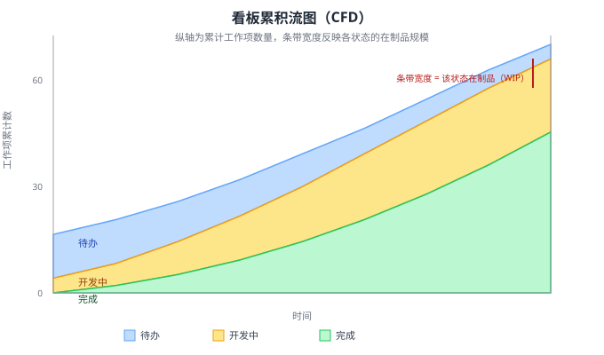

看板方法借助量化指标透视工作流健康度。如下图所示，____（CFD）把各看板列的累计工作项数量随时间的变化画成带状图，是暴露瓶颈、观察流动平稳性的常用工具；在制品（WIP）过高会拉长交付周期（Lead Time），因此限制在制品能____交付周期、加快反馈。

---

答案：累积流图（Cumulative Flow Diagram）；缩短

---

解析：累积流图将不同状态（待办、开发中、完成）的累计工作项数量按时间堆积成带状，条带宽度反映各状态的在制品规模，条带持续变宽或宽度异常往往意味着瓶颈与拥堵；限制在制品能减少排队与多任务切换，从而缩短从工作项进入工作流到完成的交付周期，这是看板平稳节奏、支撑持续改进的度量基础。
