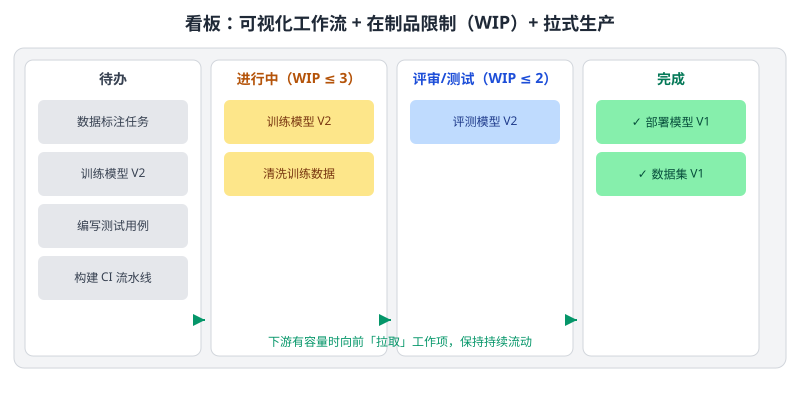

看板方法源自精益生产，通过可视化工作流管理开发过程。如下图所示，下列属于看板方法核心要点的有（　）

---

A. 将工作流程可视化，形成「待办—进行中—评审/测试—完成」等看板列
B. 通过限制在制品（WIP）数量来控制并行任务数量，暴露瓶颈
C. 采用拉式生产，上一环节完成后才拉取新的工作项
D. 强制要求固定时间盒的冲刺迭代周期

---

答案：ABC

---

解析：看板方法的核心包括工作流可视化（把流程拆成看板列并逐项流动）、限制在制品数量 WIP（控制并行、暴露瓶颈、平稳节奏）、拉动式生产（工作项按下游需求拉取）以及持续流动与过程改进。它与 Scrum 的主要差异之一是不强制固定时间盒的冲刺，而是让工作项按状态持续流动，因此 D 不属于看板的核心要点。AI 项目中的数据标注、模型训练、评测等环节同样适合用看板暴露瓶颈。
