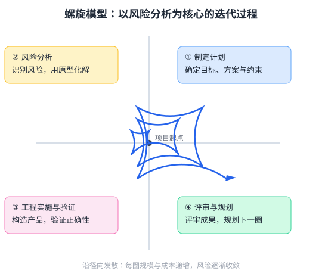

螺旋模型把迭代、原型与瀑布模型相结合，每一圈螺旋都围绕风险分析展开。如下图所示，螺旋模型每一圈典型的四个环节是（　）

---

A. 制定计划 → 风险分析与化解 → 工程实施与验证 → 评审并规划下一圈
B. 需求冻结 → 编码 → 测试 → 发布，全程不进行风险评估
C. 一次性编写全部代码 → 统一测试 → 直接上线
D. 只做文档评审，不进行任何开发活动

---

答案：A

---

解析：螺旋模型将系统开发表示为一条沿四个象限不断外扩的螺旋线：每一圈先确定目标、方案与约束（制定计划），然后进行风险分析与原型化解，再进入工程实施与验证，最后评审成果并规划下一圈，如此循环直至产品完成。风险分析是螺旋模型的标志性环节，尤其适合大型高风险项目；在 AI 项目中，数据质量、模型性能等不确定因素也可纳入其风险分析范畴。B、C、D 均不含风险分析环节。
