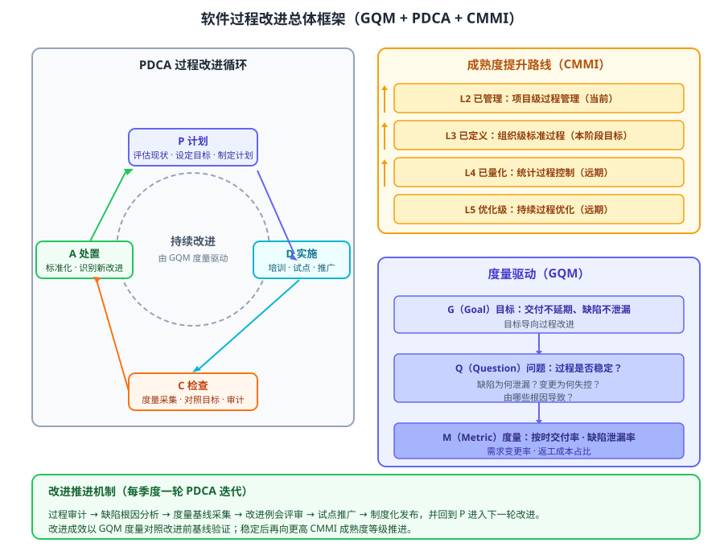

某软件企业当前处于 CMMI 2 级（已管理级），过程审计显示：需求变更频繁失控、缺陷泄漏率高、交付延期常态化。企业拟系统性地改进软件过程，在三个季度内达到「交付不延期、缺陷不泄漏」的量化目标，并为向 CMMI 3 级（已定义级）提升奠定基础。请设计该企业的软件过程改进方案：给出改进的总体框架、改进活动与度量指标体系、关键改进决策，以及改进循环的推进流程（伪代码）。

---

答案：设计方案（设计目标 → 改进总体框架 svg → 改进活动与度量指标表 → 关键改进决策 → 改进循环伪代码）

一、设计目标

1. 以量化目标牵引改进：三季度内实现按时交付率 ≥ 95%、缺陷泄漏率较基线下降 50%；
2. 以 GQM 建立「目标—问题—度量」的测量体系，使改进效果可度量、可对照、可复核；
3. 以 PDCA 循环组织改进活动，并与 CMMI 成熟度提升路线衔接，为进入 3 级奠定基础。

二、总体框架



说明：方案由三部分构成——左侧 PDCA 循环作为改进的组织机制（计划、实施、检查、处置），右侧上方为 CMMI 成熟度提升路线（由 L2 向 L3 及以上演进），右侧下方为 GQM 度量驱动（目标→问题→度量）；底部为每季度一轮的推进机制，改进成效以度量对照基线验证。

三、改进活动与度量指标体系

| 改进活动 | 对应阶段 | 关键产出 | 度量指标（GQM） |
|----------|----------|----------|-----------------|
| 过程审计与缺陷根因分析 | P 计划 | 缺陷泄漏根因清单 | 缺陷泄漏率（发布后缺陷/全部缺陷） |
| 需求变更流程再造 | P/D 计划与实施 | 变更评审与冻结制度 | 需求变更率、变更审批平均周期 |
| 迭代计划与进度管理改进 | D 实施 | 规模估算与缓冲管理 | 按时交付率（按期完成迭代占比） |
| 度量采集与基线对比 | C 检查 | 过程度量报告 | 按时交付率、缺陷泄漏率、返工成本占比 |
| 改进评审与制度化 | A 处置 | 修订的组织标准过程 | 过程符合度（审计项通过率） |

四、关键改进决策

1. 以缺陷泄漏与交付延期为改进抓手：用根因分析锁定「需求变更失控」与「缺陷泄漏」两大根因，避免面面俱到、资源分散；
2. GQM 先建度量、再谈改进：先确立改进目标，再分解为可回答的问题，最后落到可采集的度量，保证度量服务于目标而非为度量而度量；
3. PDCA 每季度一轮、试点推广：每个改进项先在试点项目验证，有效再全组织推广，降低改进风险；
4. 过程改进与 CMMI 路线衔接：本阶段聚焦 2 级→3 级的关键过程域（需求管理、项目计划与监控、过程定义），量化成果稳定后再向 4 级推进；
5. 改进成效以基线对照判定：改进前后用同一套度量指标对比，未达基线则回到 PDCA 的 P 重新分析。

五、改进循环推进流程（伪代码）

```
function improve(quarter):
    issues = auditAndRootCause()          // 过程审计 + 缺陷根因分析
    goals  = gqmDecompose(target, issues) // G 目标 → Q 问题 → M 度量
    baseline = collectMetrics(goals)      // 采集改进前基线
    plan = makePlan(issues, goals)        // P：制定改进计划（含试点范围）
    doPilot(plan)                         // D：试点验证
    rollOut(plan)                         // D：全组织推广
    report = collectMetrics(goals)        // C：对照基线采集
    if not meetBaseline(report, baseline):
        return improve(quarter + 1)       // 未达目标回到 P
    standardize(report)                   // A：标准化、制度化发布
```

---

评分标准：（满分 10 分）
- 要点 1（1 分）：明确设计目标——量化目标牵引、GQM 可度量、PDCA 组织并与 CMMI 衔接，给 1 分。
- 要点 2（2 分）：给出改进总体框架并配结构图，覆盖 PDCA 循环、CMMI 成熟度路线与 GQM 度量驱动且关系清晰，给 2 分；缺要素或关系错误酌情扣分。
- 要点 3（3 分）：改进活动与度量指标表覆盖改进活动、阶段、产出与度量指标，指标与目标对应，给 3 分；缺活动或指标含糊每处扣 0.5 分。
- 要点 4（3 分）：关键改进决策有效回应约束——根因抓手、GQM 先行、试点推广、与 CMMI 衔接、基线对照判定，每答对一项给 0.6 分，合计 3 分。
- 要点 5（1 分）：给出改进循环推进伪代码，PDCA 闭环与基线对照逻辑正确，给 1 分。

---

解析：软件过程改进是组织层面的系统性工程，目标是提升过程能力与交付质量。方案以「根因聚焦 + GQM 度量驱动 + PDCA 循环组织 + CMMI 路线衔接」为主线，先锁定缺陷泄漏与交付延期两大根因，用「目标—问题—度量」建立可复核的测量体系，以每季度一轮的 PDCA 试点推广落地改进，并以基线对照判定成效，体现过程改进「度量先行、试点推广、闭环迭代、持续演进」的工程方法。
