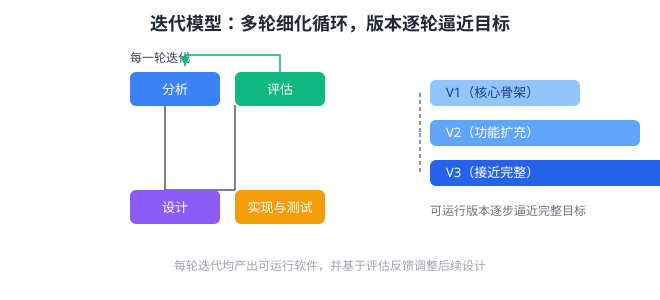

迭代模型通过多轮「分析—设计—实现—评估」循环反复细化系统，每一轮都产出一个可运行版本并逐步逼近最终目标。下列对迭代模型的理解，正确的是（　）

---

A. 每一轮迭代都必须交付全部最终功能，否则视为失败
B. 通过一轮轮对同一系统进行细化、评估与调整，使系统版本逐轮逼近完整目标
C. 迭代模型与增量模型含义完全相同，都只开发一次即结束
D. 迭代只在文档层面循环，不产生任何可运行软件

---

答案：B

---

解析：迭代开发的核心是「小步快跑、逐轮逼近」：每一轮迭代都完成分析、设计、实现与评估，产出一个可运行版本，并依据评估反馈调整下一轮的设计。它与增量模型侧重点不同——增量强调按功能块拆分交付，迭代强调在时间轴上反复细化同一系统（如统一过程 RUP 的迭代式开发）。因此 A、C、D 均不正确。
