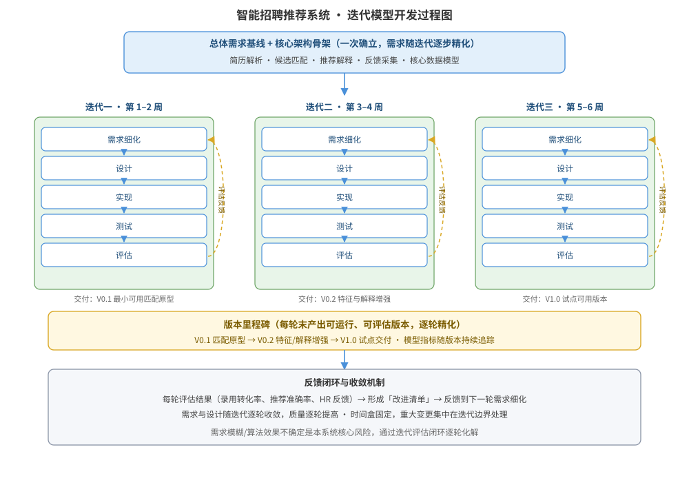

某 HR 科技公司要建设「智能招聘推荐系统」：依据简历画像与职位需求推荐候选人，涉及人才库清洗、简历解析、匹配算法、推荐结果解释、HR 反馈采集等功能。业务方对录用转化率、解释可信度等指标期望高，但需求表述模糊，匹配算法与特征体系需要依据真实数据反复调优，需求很可能随业务试点逐步变化。请为该系统的开发设计基于迭代模型的过程方案：迭代周期与迭代划分、每个迭代的内部活动与交付物/评估准则、迭代模型过程结构图、进度与反馈安排，并说明关键设计决策及与瀑布模型、增量模型的区别。

---

答案：设计方案（设计目标 → 迭代模型过程结构图 → 迭代规划与交付物表 → 进度与反馈安排 → 关键设计决策）

一、设计目标

1. 把不确定的需求通过短周期、固定时间盒的迭代逐步精化：每个迭代对整体系统执行「需求细化 → 设计 → 实现 → 测试 → 评估」，产出可运行版本，逐轮逼近业务目标；
2. 把 AI 模型效果的不确定性当作核心风险：每个迭代设置效果评估与反馈环节，依据真实数据调优算法、特征与交互，实现模型与产品的共同演进；
3. 需求在迭代间持续演化：允许每轮根据上轮评估结果调整需求优先级与设计，不追求一次成型，最终交付需求收敛、质量达标的完整系统。

二、迭代模型过程结构图

说明：总体需求形成稳定基线后进入迭代周期。每个迭代按固定时间盒（2 周）执行「需求细化 → 设计 → 实现 → 测试 → 评估」五步活动，评估结果（含模型指标与 HR 反馈）反馈到下一迭代的需求细化，形成闭环；迭代一产出 V0.1 最小可用匹配原型，迭代二产出 V0.2 特征与解释增强，迭代三产出 V1.0 试点可用版本。随迭代推进，需求与设计逐轮收敛、质量逐轮提高。

三、迭代规划与交付物表

| 迭代 | 时间盒 | 范围与主要活动 | 交付物 | 评估准则 |
|------|--------|----------------|--------|----------|
| 迭代一 | 第 1–2 周 | 人才库接入、简历解析、候选匹配原型、HR 反馈采集接口；确立核心架构骨架 | V0.1 可运行版本 | 端到端可运行、候选匹配准确率基线 ≥ 60%、可采集反馈 |
| 迭代二 | 第 3–4 周 | 匹配算法调优、特征体系增强、推荐结果解释、评价数据回流 | V0.2 特征与解释增强 | 录用转化率较 V0.1 提升 ≥ 15%、解释可信度评分 ≥ 4.0 |
| 迭代三 | 第 5–6 周 | 模型进一步调优、推荐排序优化、试点部门试用、运营看板 | V1.0 试点可用版本 | 录用转化率达业务目标、试点反馈闭环、性能达标 |

四、进度与反馈安排

- 每个迭代 2 周时间盒固定不变，迭代三后依据试点反馈决定是否追加迭代四（模型专项优化或新需求引入）；
- 每个迭代末召开评估评审：对照评估准则逐项打分，未达标项列入下一迭代「改进清单」，模型指标（录用转化率、推荐准确率）随版本持续追踪；
- 需求变更集中在迭代边界处理：迭代中途不引入重大需求变更，保证每轮交付物稳定可评估。

五、关键设计决策

1. 采用固定时间盒的迭代周期而非按功能块切分：每个迭代都作用于整体系统并对其精化，这与增量模型按功能块逐块交付、瀑布模型按阶段顺序一次性推进有本质区别——迭代重在「往复精化」，增量重在「逐块交付」，瀑布重在「阶段顺序」；
2. 把「评估 + 反馈」作为迭代模型的核心环节：智能招聘推荐系统效果不确定，必须通过每轮真实数据评估形成闭环，这是本方案区别于简单循环的关键决策；
3. 迭代节奏与需求演化解耦：需求可变但迭代周期固定，通过「改进清单」把反馈落实到下一轮，既保持演进性又保证节奏可控。

---

评分标准：（满分 10 分）
- 要点 1（1 分）：明确迭代模型设计目标（时间盒迭代、逐轮精化、评估反馈闭环），给 1 分。
- 要点 2（3 分）：迭代模型过程结构图完整——总体需求基线 + 三个迭代及各自「需求细化→设计→实现→测试→评估」内部活动、评估→需求细化的反馈闭环、版本演进清晰，给 3 分；缺反馈闭环扣 1 分，缺迭代内部活动扣 1 分。
- 要点 3（2 分）：迭代规划与交付物表正确——三个迭代的时间盒、范围、交付物与评估准则一一对应，每项约 0.6 分，合计 2 分。
- 要点 4（1 分）：进度与反馈安排合理——时间盒固定、变更集中在迭代边界、评估评审闭环，给 1 分。
- 要点 5（3 分）：关键设计决策正确——与增量模型（按块交付）、瀑布模型（阶段顺序）的区别表述清晰，评估反馈决策有依据，给 3 分；区别表述不清扣 2 分。

---

解析：本方案紧扣「迭代模型」知识点——迭代模型按时间盒组织开发周期，每个迭代对整体需求进行「设计→实现→评估」的往复精化，需求在迭代间持续演进而非一次性确定。针对智能招聘推荐系统「需求模糊、模型效果不确定」的特点，方案固定 2 周时间盒，把算法效果评估与 HR 反馈作为每轮迭代的核心活动并形成闭环，通过「改进清单」把评估结果落实到下一轮需求细化，同时辨析迭代（时间盒往复精化）与增量（功能块逐块交付）、瀑布（阶段顺序推进）的过程组织差异，体现对迭代模型完整而准确的理解。
