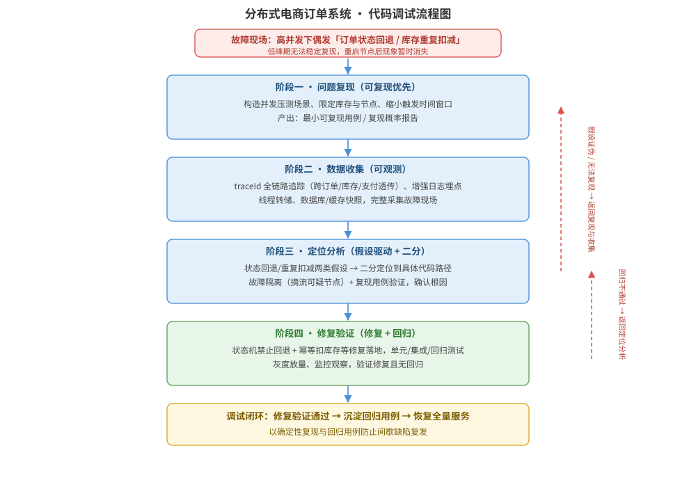

某分布式电商订单系统在「双 11」高并发场景下出现间歇性故障：用户下单后偶发「库存重复扣减」与「订单状态回退」（如已支付状态偶发变回待支付），低峰期无法稳定复现，每次重启节点后现象暂时消失。系统由订单服务、库存服务、支付服务组成，通过消息队列异步结算，日志分散、缺少全链路追踪。请为该系统设计系统化的代码调试方案：问题复现与假设、日志与全链路追踪设计、二分定位与故障隔离、修复与回归验证，并给出代码调试流程结构图、关键接口/伪代码说明及关键设计决策。

---

答案：设计方案（设计目标 → 代码调试流程结构图 → 阶段活动与职责表 → 关键接口/伪代码说明 → 关键设计决策）

一、设计目标

1. 建立「可复现、可观测、可定位、可验证」的闭环调试流程，把间歇性并发缺陷稳定复现并定位到具体代码路径；
2. 先止血后定位：通过状态机约束、摘流隔离等手段立即止损，避免故障扩大，再从容开展根因分析；
3. 把偶发问题转化为确定性可复现问题，修复后以回归用例与灰度放量验证，防止「重启后消失」掩盖真因。

二、代码调试流程结构图



说明：调试流程分四个阶段——问题复现（构造并发压测、缩小时间窗口、产出最小可复现用例）→ 数据收集（traceId 全链路追踪、增强日志、线程转储、数据快照）→ 定位分析（假设驱动 + 二分定位 + 故障隔离，用复现用例验证根因）→ 修复验证（修复落地、回归测试、灰度放量、监控观察）。若假设被证伪或无法复现则回退到复现/收集阶段，若回归不通过则返回定位分析，形成调试闭环。

三、阶段活动与职责表

| 阶段 | 主要活动 | 输入 | 输出/退出条件 |
|------|----------|------|----------------|
| 问题复现 | 构造并发压测场景（限定库存、并发下单）、缩小时间窗口、观察复现规律 | 故障现场、压测工具 | 最小可复现用例或复现概率报告 |
| 数据收集 | 埋点日志、全链路追踪（traceId）、线程转储、数据库/缓存快照 | 复现场景 | 完整调用链与异常数据现场 |
| 定位分析 | 假设驱动：状态回退/重复扣减假设 → 二分定位 → 故障隔离 → 复现用例验证 | 调用链与日志 | 根因确认（精确到代码路径与行） |
| 修复验证 | 代码修复、单元/集成/回归测试、灰度放量、监控观察 | 根因报告 | 修复验证通过、无回归、监控平稳 |

四、关键接口/伪代码说明

- 全链路追踪接口：每个请求注入 `traceId`，跨服务透传（HTTP 头 `X-Trace-Id`、MQ 消息属性），日志统一携带 `traceId + spanId`，按一次下单串联订单→库存→支付全链路；
- 状态机禁止回退伪代码（防止已支付状态回退）：

```
if order.status >= targetStatus:      # 新状态等级不高于当前，禁止回退
    reject / 忽略，并记录告警
else:
    update orders set status=targetStatus
    where id=orderId and status=expectedStatus   # 乐观锁 CAS，防止覆盖并发更新
```

- 幂等扣库存伪代码（防止重复扣减）：

```
if Redis.setnx(lockKey, traceId, ttl=10s) == false:
    return "处理中，等待重试"
if deductId 已存在于扣减流水表:            # 幂等判断
    return "已扣减，直接返回成功"
执行扣减并写入扣减流水(deductId)
```

五、关键设计决策

1. 先止血后定位：通过状态机禁止回退、幂等扣库存、摘流可疑节点三类措施立即止损，避免故障在并发场景下扩大，再从容定位根因；
2. 以「可复现」为第一优先：间歇缺陷必须先构造最小复现环境（限定并发、固定数据），否则无法验证根因与修复，因此专门设计复现阶段并作为流程入口；
3. 定位采用「假设驱动 + 二分」：基于状态回退、重复扣减两类现象建立假设，用全链路追踪与增强日志验证，用二分法把范围缩小到具体代码路径，避免盲目打补丁掩盖真因。

---

评分标准：（满分 10 分）
- 要点 1（1 分）：明确调试设计目标（可复现、可观测、止血优先、回归验证闭环），给 1 分。
- 要点 2（3 分）：代码调试流程结构图完整——复现→收集→定位→修复验证四个阶段、阶段间反馈回路与退出条件清晰，给 3 分；缺反馈回路扣 1 分，缺阶段活动扣 1 分。
- 要点 3（2 分）：阶段活动与职责表正确——各阶段输入输出与退出条件一一对应，每项约 0.5 分，合计 2 分。
- 要点 4（2 分）：接口/伪代码正确——traceId 透传、状态机禁止回退、幂等扣库存伪代码逻辑正确，给 2 分。
- 要点 5（2 分）：关键设计决策合理——止血优先、复现优先、假设驱动二分定位，给 2 分。

---

解析：本方案紧扣「代码调试」知识点——代码调试是定位并消除缺陷的系统化过程，核心方法论是「复现—隔离—定位—修复—回归验证」。针对分布式环境下「间歇性状态回退与重复扣减」难以复现的特点，方案把可复现作为第一优先，通过 traceId 全链路追踪与增强日志实现可观测，用状态机禁止回退、幂等扣减等约束先止血，再以假设驱动加二分定位根因，最后以回归与灰度放量验证修复，形成完整调试闭环，体现对调试方法与工具（追踪、日志、断点/二分、回归）的系统化运用。
