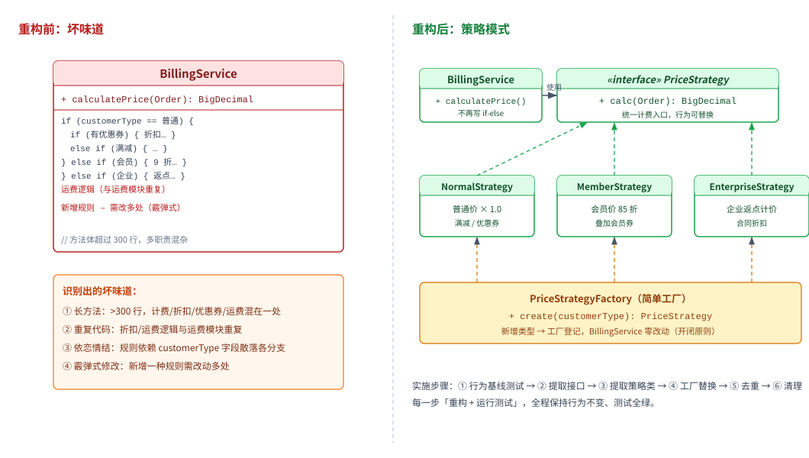

一个电商计费模块中，`BillingService.calculatePrice` 依据客户类型（普通/会员/企业）与订单属性，用大量嵌套 if-else 实现折扣、加价与优惠券抵扣；方法超过 300 行，且与「运费计算」存在重复逻辑。新增计费规则时需在多处修改，被评审标记为长方法、重复代码、依恋情结与霰弹式修改等坏味道。请为该方法所在模块设计一套代码重构方案：识别坏味道与根因，给出重构后的类结构（使用策略模式），按小步重构分阶段实施，并说明每一步如何通过测试保证行为不变。

---

答案：设计方案（重构目标 → 坏味道识别 → 重构后类结构 svg → 分步实施与测试保障 → 关键设计决策 → 接口/伪代码）

一、重构目标

1. 消除长方法与嵌套 if-else，使计费规则可独立扩展，符合开闭原则；
2. 消除与运费模块的重复代码，统一取价口径；
3. 全程小步重构，每一阶段保持测试全绿（行为不变），降低回归风险。

二、坏味道识别与根因

| 坏味道 | 表现 | 根因 |
|--------|------|------|
| 长方法 | calculatePrice 超 300 行、多职责 | 计费、折扣、优惠券、运费混在一个方法 |
| 重复代码 | 折扣/运费逻辑与运费模块重复 | 规则未下沉为独立模块 |
| 依恋情结 | 依据 customerType 字段分支散落 | 类型行为未内聚到各自策略 |
| 霰弹式修改 | 新增规则需改多处 | 规则用 if-else 内联、未集中登记 |

三、重构后类结构（策略模式 + 简单工厂）



说明：`BillingService` 只依赖 `PriceStrategy` 接口，不再写类型分支；三种计费规则各自封装为策略类，由 `PriceStrategyFactory` 按客户类型统一创建；新增「金牌会员」时仅新增策略类并在工厂登记，实现开闭原则。

四、分步实施与测试保障（小步重构）

| 步骤 | 操作（安全重构手法） | 测试保障 |
|------|----------------------|----------|
| 1 行为基线 | 用覆盖各客户类型与优惠组合的测试锁定当前行为 | 全量单测通过后锁定基线 |
| 2 提取接口 | 定义 `PriceStrategy` 接口与 `calc(Order)` 签名 | 编译通过，行为不变 |
| 3 提取策略类 | 将普通/会员/企业分支分别 Extract Class 为三个策略类 | 每提取一个类跑一次全量测试 |
| 4 工厂替换 | 引入 `PriceStrategyFactory.create(customerType)` 替换 if-else | 端到端用例对比新旧结果一致 |
| 5 去重 | 把运费/折扣公共规则提取到共享模块 | 与运费模块共用同一实现 |
| 6 清理 | 删除死代码、调整命名与常量 | 全量回归 + 代码评审 |

五、关键设计决策

1. 用策略模式替换类型分支：每个客户类型的计费规则成为可独立测试、可独立演进的策略类，BillingService 不再变动；
2. 工厂集中登记规则：`create(customerType)` 用映射表集中维护，新增类型改工厂一处而非散落多分支；
3. 先测试后重构：先建行为基线测试再动手，每步「重构 + 运行测试」，保证行为等价；
4. 规则下沉：把与运费重复的逻辑提取为共享定价服务，从根上消除重复代码。

六、接口与伪代码

```
// 策略接口
public interface PriceStrategy {
    BigDecimal calc(Order order);
}

// 具体策略示例（会员折扣）
public class MemberStrategy implements PriceStrategy {
    public BigDecimal calc(Order order) {
        return order.amount()
                .multiply(new BigDecimal("0.85"))
                .subtract(coupon(order));
    }
}

// 简单工厂：按客户类型返回策略，新增类型只改此处
public class PriceStrategyFactory {
    private static final Map<CustomerType, PriceStrategy> MAP = Map.of(
        CustomerType.NORMAL,     new NormalStrategy(),
        CustomerType.MEMBER,     new MemberStrategy(),
        CustomerType.ENTERPRISE, new EnterpriseStrategy());
    public static PriceStrategy create(CustomerType t) {
        return MAP.get(t);
    }
}
```

```
// 客户端：不再出现 if-else 分支
public BigDecimal calculatePrice(Order order) {
    PriceStrategy strategy = PriceStrategyFactory.create(order.customerType());
    return strategy.calc(order);
}
```

---

评分标准：（满分 10 分）
- 要点 1（1 分）：明确重构目标（消除长方法与嵌套 if-else、消除重复代码、全程小步重构保持行为不变），给 1 分。
- 要点 2（2 分）：正确识别坏味道（长方法、重复代码、依恋情结、霰弹式修改）并给出根因，每识别并定位两个给 1 分，合计 2 分。
- 要点 3（2 分）：给出重构后的类结构（策略模式 + 简单工厂）并配结构图/类图，结构图正确且能说明三类策略与工厂的职责，给 2 分；结构正确但缺图或说明，酌情扣分。
- 要点 4（2 分）：按小步重构分阶段实施（行为基线→提取接口→提取策略类→工厂替换→去重→清理），并说明每一步通过测试保证行为不变，给 2 分；无测试保障，酌情扣分。
- 要点 5（2 分）：说明关键设计决策（策略替换类型分支、工厂集中登记规则、先测试后重构、公共规则下沉去重），答全给 2 分。
- 要点 6（1 分）：给出策略接口、具体策略与简单工厂的接口/伪代码，实现正确给 1 分。

---

解析：方案围绕「代码重构」的三要素展开——先识别坏味道并定位根因，再给出目标结构（策略模式）与逐步实施路径，最后用「行为基线测试 + 每步小步重构 + 测试保障」确保重构过程行为不变。策略模式消除类型分支、工厂集中登记规则、共享模块去重，共同达成开闭原则与单一职责，是消除长方法与霰弹式修改的典型工程做法。
