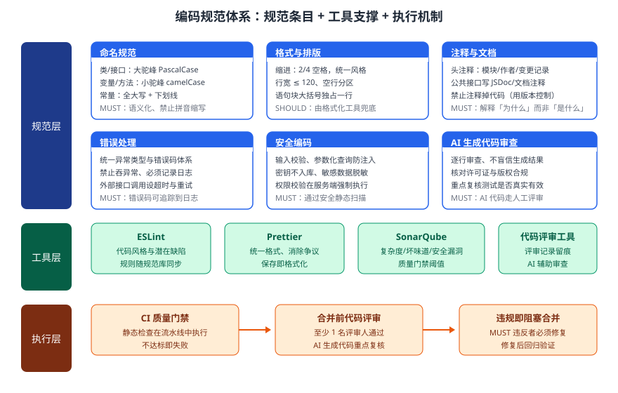

某团队 20 人，使用 AI 编程助手辅助开发一个中大型微服务系统，近期出现命名混乱、格式不统一、AI 生成代码混入未经验证、安全问题漏检等问题。请为该团队设计一套编码规范体系：规范条目、支撑工具、执行机制，并给出 AI 生成代码的审查规则，确保规范可落地、可检查、可执行。

---

答案：设计方案（规范目标 → 规范体系结构图 → 规范条目与工具职责表 → 执行机制 → 关键设计决策 → 检查规则配置接口）

一、设计目标

1. 建立统一、分级的编码规范（MUST/SHOULD），覆盖命名、格式、注释、错误处理、安全编码；
2. 用工具链将规范固化为自动化检查，减少对个人经验的依赖、保证一致性；
3. 针对 AI 生成代码建立强制审查与验证机制，防止「不可靠代码」直接入库。

二、规范体系结构图



说明：规范层给出条目，工具层把条目固化为可执行检查，执行层在 CI 与评审中强制落地；违反 MUST 即阻塞合并，形成「定义 → 检查 → 拦截」闭环。

三、规范条目与支撑工具职责表

| 子规范 | 核心条目（MUST） | 支撑工具 |
|--------|------------------|----------|
| 命名规范 | 类大驼峰、变量小驼峰、常量全大写、禁拼音缩写 | ESLint 命名规则 |
| 格式排版 | 行宽 ≤ 120、统一缩进、花括号独占行 | Prettier 自动格式化 |
| 注释文档 | 头注释、公共接口文档注释、禁止注释掉代码 | 文档工具 + 评审 |
| 错误处理 | 统一错误码、禁止吞异常、必须记录日志 | ESLint + SonarQube |
| 安全编码 | 参数化查询、密钥不入库、服务端鉴权 | SonarQube 安全扫描 |
| AI 代码审查 | 逐行审查、许可证合规、测试真实有效 | 代码评审工具 + AI 辅助 |

四、执行机制

1. CI 质量门禁：每次提交在流水线中运行 ESLint、Prettier 检查与 SonarQube 静态分析，不达标即失败；
2. 合并前评审：合并请求必须至少 1 名评审人通过，AI 生成代码须重点复核并在评审记录中标注来源；
3. 违规阻塞：违反 MUST 的代码一律退回，修复后重新提交并回归验证。

五、关键设计决策

1. 规范分 MUST/SHOULD 两级，MUST 由工具强制执行、SHOULD 以推荐形式给出，避免过度约束拖慢开发；
2. 格式化交给 Prettier 兜底，把评审注意力集中到逻辑、安全与设计而非排版，提高评审效率；
3. AI 生成代码默认视为「候选代码」，必须通过静态检查、单元测试与人工评审三重关卡后方可合并。

六、检查规则配置接口

```
# .eslintrc 关键规则（编码规范条目到工具的映射）
rules:
  camelcase: "error"                  # MUST：命名规范
  max-len: ["error", 120]             # MUST：格式规范
  no-empty-function: "error"
  no-secrets: "error"                 # MUST：安全，密钥不入库
  prefer-const: "warn"                # SHOULD：建议级别
```

---

评分标准：（满分 10 分）
- 要点 1（1 分）：明确编码规范目标（统一分级规范、工具化检查、AI 代码强制审查），给 1 分。
- 要点 2（2 分）：规范体系结构图完整——规范层、工具层、执行层三层齐备且关系清晰（条目→工具→拦截），给 2 分、缺一层给 1 分。
- 要点 3（2 分）：规范条目与工具职责表合理——覆盖命名/格式/注释/错误处理/安全并给出支撑工具，每答对 2 行给约 0.7 分，合计 2 分。
- 要点 4（2 分）：执行机制可落地——CI 质量门禁、合并前评审、违规阻塞三项齐备，给 2 分、缺一项给 1 分。
- 要点 5（1 分）：关键设计决策合理——MUST/SHOULD 分级、格式化工具兜底、AI 代码三重把关，给 1 分。
- 要点 6（2 分）：给出检查规则配置接口（规范到 ESLint 规则的映射、含 MUST/SHOULD 分级示例），完整规范给 2 分。

---

解析：本方案紧扣「编码规范」知识点——以「规范条目 → 支撑工具 → 执行机制」三层体系解决规范落地难的问题：规范条目明确「写什么」，工具把规范变成自动化检查，CI 门禁与评审保证「不达标不合并」。针对 AI 编程助手普及带来的新问题，将 AI 生成代码按「候选代码」管理并强制人工审查与验证，使编码规范在 AI 辅助开发场景下依然可执行、可度量。
