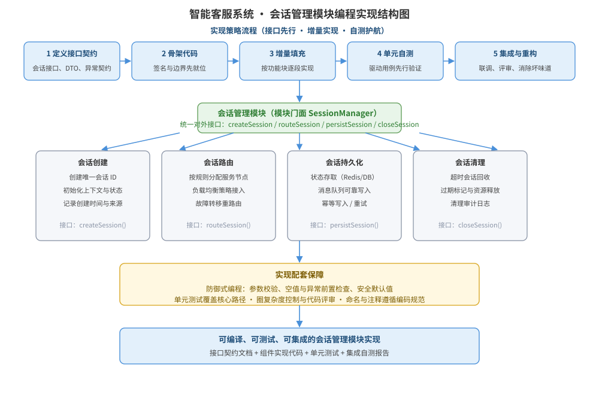

某智能客服系统的「会话管理模块」已通过接口设计：对外提供创建会话、路由会话、持久化会话、关闭会话四项能力，将部署为高并发分布式服务。请在进入编码前为该模块设计编程实现方案：实现策略流程、模块组件结构图、组件职责表、关键实现决策、关键接口与伪代码，并说明单元测试与集成自测的配套安排。

---

答案：设计方案（实现目标 → 模块编程实现结构图 → 组件职责表 → 关键实现决策 → 接口与伪代码 → 测试配套）

一、实现目标

1. 采用「接口先行、增量实现、自测护航」的实现策略，先定义稳定的接口契约与骨架，再按功能块增量填充，保证模块可编译、可测试、可集成；
2. 模块内部按单一职责拆分为会话创建、路由、持久化、清理四个组件，依赖关系清晰、便于并行实现与单元测试；
3. 通过防御式编程与单元测试配套，保证高并发场景下的健壮性与可维护性。

二、模块编程实现结构图



说明：实现按「定义接口契约 → 骨架代码 → 增量填充 → 单元自测 → 集成与重构」五步推进；会话管理模块以门面统一对外接口，向下分派到创建、路由、持久化、清理四个组件，并以防御式编程与单元测试作为实现配套保障。

三、组件职责表

| 组件 | 职责 | 对外接口 |
|------|------|----------|
| SessionManager（门面） | 统一对外接口、参数校验、分派调用 | createSession / routeSession / persistSession / closeSession |
| 会话创建 | 生成唯一会话 ID、初始化上下文状态、记录来源与时间 | createSession() |
| 会话路由 | 按规则分配服务节点、负载均衡接入、故障转移重路由 | routeSession() |
| 会话持久化 | 状态存取、消息队列可靠写入、幂等写入与重试 | persistSession() |
| 会话清理 | 超时会话回收、过期标记、资源释放与审计日志 | closeSession() |

四、关键实现决策

1. 接口先行：先冻结接口契约（参数、返回、异常），骨架代码签名与边界先就位，各组件可并行实现互不阻塞；
2. 增量填充：按「创建 → 路由 → 持久化 → 清理」顺序逐块实现，每块实现后立即以驱动用例验证，避免一次性大改动；
3. 防御式编程：所有对外方法入口做参数校验与空值/前置条件检查，异常路径返回安全默认值，杜绝脏数据流入下游；
4. 幂等与重试：持久化写入采用幂等键（会话 ID + 序号），失败重试并保留重试上限，保证分布式场景数据一致。

五、关键接口与伪代码

```text
interface SessionManager {
  SessionId createSession(UserId uid, Context ctx);      // 校验 uid 非空后创建
  NodeRef     routeSession(SessionId sid);                // 负载均衡选取节点
  boolean     persistSession(SessionState state);         // 幂等写入，失败重试
  void        closeSession(SessionId sid, Reason reason); // 清理并回收资源
}
```

```text
createSession(uid, ctx):
  前置检查：uid 为空 → 抛 IllegalArgumentException
  sid := 生成唯一会话 ID（时间戳 + 节点号 + 随机数）
  初始化会话上下文（渠道、超时、状态位）
  记录创建时间与来源（审计）
  return sid

persistSession(state):
  幂等键 := state.sid + ":" + state.version
  若 Redis 中幂等键已存在 → 直接返回成功
  否则写入消息队列（失败重试，最多 3 次）
  成功后标记幂等键，return true
```

六、单元测试与集成自测配套

- 单元测试：对四个组件分别建立测试桩，覆盖核心路径（正常创建、路由命中、幂等重试、超时清理）与异常路径（空参数、队列故障、节点不可用）；
- 集成自测：以门面为入口做端到端自测，验证组件间调用链与接口契约一致；
- 质量把关：圈复杂度控制在阈值内、实现代码通过代码评审后再进入联调。

---

评分标准：（满分 10 分）
- 要点 1（1 分）：明确实现目标（接口先行、增量实现、自测护航、健壮可维护），给 1 分。
- 要点 2（3 分）：模块实现结构图完整——实现策略流程五步与模块组件结构（门面 + 四组件）清晰对应，给 3 分；缺一处扣 1 分。
- 要点 3（2 分）：组件职责表正确——四组件职责与对外接口一一对应、依赖清晰，每答对一组约 0.5 分，合计 2 分。
- 要点 4（2 分）：关键实现决策合理——接口先行、增量填充、防御式编程、幂等与重试，每项 0.5 分，合计 2 分。
- 要点 5（1 分）：接口与伪代码正确——接口签名完整、伪代码体现前置检查与幂等逻辑，给 1 分。
- 要点 6（1 分）：给出单元测试与集成自测配套安排，给 1 分。

---

解析：本方案紧扣「编程实现」知识点——编程实现不仅是写代码，更强调接口先行、增量构造、防御式编程与自测护航。方案以门面模式统一对外接口，把模块拆分为职责单一的组件，通过「先契约后实现、分块填充、每块自测」降低实现复杂度，用幂等与重试保证分布式可靠性，并用单元测试与集成自测把实现质量落实为可验证的工程活动，体现对编程实现方法的完整理解。
