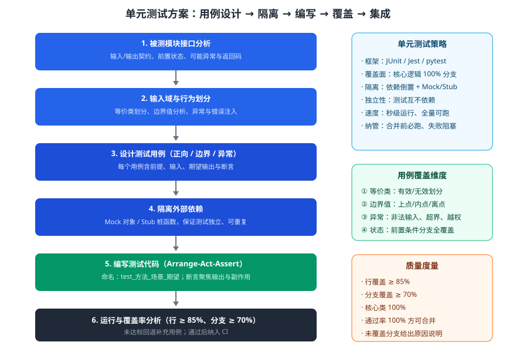

某团队为「订单金额计算器」模块设计单元测试方案。该模块含折扣叠加、税费计算、金额舍入、满减判定等逻辑，曾出现折扣叠加顺序错误与舍入误差缺陷。请设计一套单元测试方案：测试框架选型、用例设计维度、测试代码结构、外部依赖隔离策略与覆盖率目标，并给出关键测试用例与测试代码结构示例。

---

答案：设计方案（测试目标 → 方案结构图 → 框架与用例维度 → 隔离与结构 → 关键设计决策 → 测试用例表与示例代码）

一、设计目标

1. 覆盖折扣叠加、税费、舍入与满减全部规则，重点抓边界与异常；
2. 测试与实现解耦、独立可重复、秒级运行；
3. 用覆盖率约束 + CI 集成保证质量不回退。

二、方案总体结构



说明：按「接口分析 → 输入域划分（等价类/边界值/异常）→ 设计用例 → 隔离依赖 → 编写 A-A-A 测试 → 覆盖分析」执行，覆盖率未达标回退补充用例，通过后纳入 CI 在合并前必跑。

三、测试框架与用例设计维度

| 维度 | 内容 | 覆盖要求 |
|------|------|----------|
| 等价类 | 有效/无效金额、折扣档位、税费率档位 | 每类至少 1 例 |
| 边界值 | 满减临界、舍入临界（如 0.005）、折扣边界 | 上点/内点/离点全覆盖 |
| 异常 | 负数金额、非法折扣、越权税率 | 必须断言异常类型 |
| 状态 | 已取消/已关闭订单不允许计费 | 前置条件分支全覆盖 |

四、外部依赖隔离与测试结构

- 隔离策略：金额计算依赖的汇率服务、税率服务用 Mock/Stub 注入固定值；金额一律用定点数（BigDecimal）或整数分运算，避免浮点误差；
- 代码结构：Arrange（构造输入与 mock）→ Act（调用被测方法）→ Assert（断言返回值与副作用）；命名 `test_方法_场景_期望`。

五、关键设计决策

1. 金额计算必须使用定点数（BigDecimal）或整数分，禁止 double 直接累乘，从源头消除舍入缺陷；
2. 用例按「等价类 + 边界值 + 异常」三维生成，折扣叠加顺序等核心规则另做全分支覆盖；
3. 覆盖率门禁：行覆盖 ≥ 85%、分支 ≥ 70%，核心类 100%，未达标的代码不得合并。

六、关键测试用例与结构示例

| 用例 | 输入场景 | 期望结果 |
|------|----------|----------|
| TC-01 | 原价 100，折扣 0.9 再叠加满 50 减 5 | 85.00 |
| TC-02 | 金额 0.005 半舍入 | 0.01（四舍五入到分） |
| TC-03 | 满减边界 50.00（含）/ 49.99（不含） | 触发 / 不触发满减 |
| TC-04 | 负数金额 -10 | 抛出参数异常 |
| TC-05 | 已关闭订单计费 | 抛出状态异常 |

```
test_calc_full_reduction_threshold():
    # Arrange
    calc = AmountCalculator(rateProvider=mock_rate(0.06))
    # Act
    total = calc.calculate(49.99, discount=1.0)
    # Assert
    assert not calc.qualifies_full_reduction(total)   # 49.99 不触发满减
```

---

评分标准：（满分 10 分）
- 要点 1（1 分）：明确单元测试目标（覆盖全部规则、独立可重复、覆盖率+CI 保证），给 1 分。
- 要点 2（2 分）：方案结构图完整——接口分析 → 输入域划分 → 用例设计 → 隔离 → A-A-A → 覆盖分析，含回退补用例，给 2 分、缺回退给 1 分。
- 要点 3（2 分）：框架与用例维度合理——等价类、边界值、异常、状态四维覆盖，每答对一维给 0.5 分，合计 2 分。
- 要点 4（1 分）：隔离策略正确——Mock/Stub 注入外部服务、定点数避免浮点误差，给 1 分。
- 要点 5（2 分）：关键设计决策合理——定点数运算、等价类+边界值+异常三维、覆盖率门禁（行 ≥ 85%、分支 ≥ 70%），答对两项给 1 分、答全给 2 分。
- 要点 6（2 分）：测试用例表覆盖边界/异常且期望正确，测试代码结构符合 Arrange-Act-Assert，完整规范给 2 分。

---

解析：本方案紧扣「单元测试」知识点——在单元层面以被测模块的接口契约为对象，用等价类、边界值、异常三维设计用例系统覆盖业务规则，用 Mock/Stub 隔离外部依赖保证测试独立可重复，以 Arrange-Act-Assert 统一测试结构，以覆盖率门禁与 CI 集成守住质量底线。定点数运算与边界用例直接针对历史缺陷（舍入误差、满减边界），体现了单元测试「小步快验、缺陷前移」的价值。
