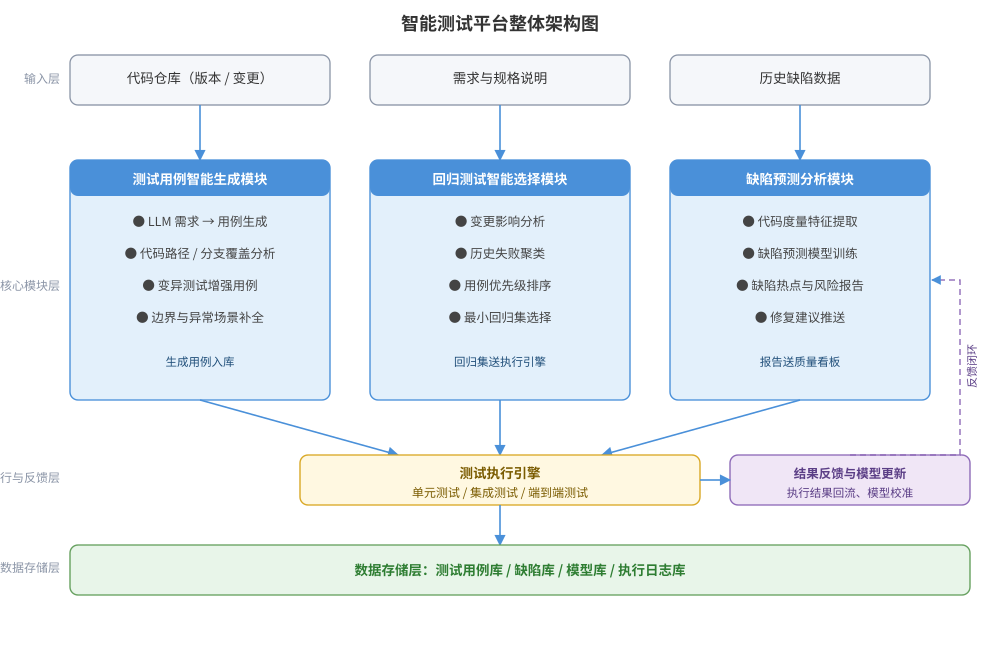

某互联网公司拟构建智能测试平台：被测 Web 系统模块约 200 个，每日多次构建，回归测试用例已超 2 万条，全量回归耗时过长。请为该智能测试平台进行设计：测试用例智能生成、回归测试智能选择、缺陷预测分析三大核心模块，给出平台整体架构图，并说明关键设计决策与回归集选择接口。

---

答案：设计方案（设计目标 → 智能测试平台架构图 → 模块职责表 → 关键设计决策 → 回归集选择伪代码）

一、设计目标

1. 用 LLM 与代码分析自动生成测试用例，提升覆盖率并降低人工编写成本；
2. 用变更影响分析与用例优先级排序裁剪回归集，明显缩短回归耗时；
3. 用历史缺陷与代码度量训练缺陷预测模型，提前定位缺陷热点。

二、智能测试平台架构图



说明：代码仓库、需求与历史缺陷数据进入三大核心模块；生成的用例与精简回归集送测试执行引擎执行；执行结果回流入模型更新，形成「执行—学习—改进」闭环；用例、缺陷、模型与执行日志统一存储。

三、模块职责表

| 模块 | 核心能力 | 输入 | 输出 |
|------|----------|------|------|
| 测试用例智能生成 | LLM 需求→用例、代码路径/分支覆盖分析、变异测试增强 | 需求、代码、历史缺陷 | 新用例、边界补充用例 |
| 回归测试智能选择 | 变更影响分析、历史失败聚类、用例优先级排序 | 变更集、用例库、历史结果 | 精简回归集 |
| 缺陷预测分析 | 代码度量特征提取、预测模型训练、热点报告 | 代码度量、缺陷历史 | 缺陷热点与风险报告 |

四、关键设计决策

1. 回归选择采用「变更影响分析 + 历史失败聚类 + 优先级排序」三步，把 2 万条回归用例裁剪为影响面相关子集，显著缩短回归耗时；
2. 用例生成采用「LLM 生成 + 静态分析补全 + 变异增强」组合，保证生成质量与覆盖率可测；
3. 执行结果回流更新模型（正确性校准、语料增强），形成持续改进闭环；
4. 模型预测结果仅作辅助建议，最终由测试负责人确认，避免误报直接阻断发布。

五、回归集选择接口与伪代码

```
输入: 变更文件集 C、用例-覆盖矩阵 M、历史失败记录 H、预算时间 T
输出: 精简回归集 R
R = 由 C 影响到的用例 ∪ 高失败概率用例 ∪ 冒烟基线用例
排序: 按 (影响分值 × 失败概率) 降序，取前 k 条使执行预算 ≤ T
返回: R（同时输出裁剪依据，供审计与追溯）
```

---

评分标准：（满分 10 分）
- 要点 1（1 分）：明确智能测试设计目标（用例智能生成、回归智能选择、缺陷预测、闭环改进），给 1 分。
- 要点 2（3 分）：架构图完整——输入层、三大核心模块、执行引擎、反馈闭环、存储层齐备且层次清晰，给 3 分；缺一处扣 1 分。
- 要点 3（2 分）：模块职责表正确——三模块的输入、核心能力与输出匹配，每答对一个模块约 0.7 分，合计 2 分。
- 要点 4（2 分）：关键设计决策合理——回归集裁剪策略、LLM+静态分析+变异组合、结果回流闭环、AI 建议人工确认，答对 3 项给 1.5 分、答全给 2 分。
- 要点 5（1 分）：接口/伪代码正确——给出回归集选择算法（影响面+失败概率+冒烟基线+预算约束），给 1 分。
- 要点 6（1 分）：方案呼应场景约束（2 万条回归用例耗时过长、每日多次构建），体现裁剪与闭环的价值，给 1 分。

---

解析：本方案紧扣「智能测试」知识点——以 AI 为核心重构测试全流程：用例生成智能化、回归选择智能化、缺陷预测智能化，并通过「执行—学习—改进」闭环持续提升。方案直面场景中「回归用例规模大、回归耗时过长」的痛点，用变更影响分析与优先级排序裁剪回归集，同时用「AI 建议、人工确认」控制误报风险，体现对智能测试落地可行性的理性权衡。
