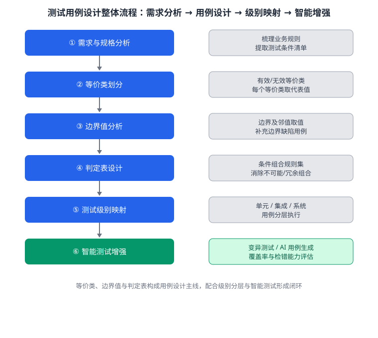

某网上银行系统新增「转账」功能，业务规则如下：转账金额必须为正数且不超过单笔限额 10000 元；当账户处于冻结状态或余额不足时，转账被拒绝；同一账户当日累计转账不得超过 50000 元；系统需为各类失败原因返回明确错误码。测试组希望在有限的测试资源下尽可能多地发现缺陷。下图给出了测试用例设计的整体流程（）。请综合运用测试用例设计方法（等价类划分、边界值分析、判定表驱动法）设计一套「转账」功能的测试方案：先说明各方法的调用关系与分工，再按方法设计代表性用例，然后将用例映射到单元、集成、系统三个测试级别，最后说明如何借助智能测试手段增强用例覆盖。

---

答案：
1. 调用的知识点：测试用例设计中的等价类划分、边界值分析、判定表驱动法，测试级别（单元/集成/系统），以及智能测试（变异测试、AI 辅助用例生成）。调用关系为：先按等价类划分得到基础用例集，再用边界值分析补充边界附近的缺陷用例，用判定表覆盖多条件组合，随后将用例按测试级别分层执行，最后用智能测试手段自动扩充与验证用例集。
2. 等价类划分（先建立有效/无效等价类）：
   - 有效等价类：金额为 1–10000 的正数、账户状态正常、余额充足、当日累计未超限；
   - 无效等价类：金额为 0、负数、超过 10000、非数字、账户冻结、余额不足、当日累计已超限。每个等价类取一个代表值即可覆盖整类行为。
3. 边界值分析（针对金额与限额边界补充用例）：金额取 1、10000 及其邻值（如 0.01、9999.99、10000.01、0、-1）；当日累计取 49999.99、50000、50000.01 等，验证限额在边界处是否被精确触发；错误码在边界内外应保持一致的可判定结果。
4. 判定表驱动法（覆盖条件组合）：以「账户状态（正常/冻结）」「余额（充足/不足）」「金额（合法/超单笔限额/非法）」为条件，列出全部规则：冻结状态下无论其他条件一律拒绝并返回冻结错误码；「正常+不足」拒绝并返回余额不足错误码；「正常+充足+合法」成功转账；金额非法返回格式错误码。删除不可能与冗余组合后得到最少规则集，为每条规则设计用例与期望输出（含错误码）。
5. 测试级别映射：
   - 单元测试：对金额校验、限额计算的底层函数，用等价类与边界值用例验证单点逻辑；
   - 集成测试：验证账户、余额、限额、日志各模块在转账流程中的协作，用判定表用例确认组合规则在跨模块调用下仍成立；
   - 系统测试：端到端验证转账全流程、错误码正确展示及并发下的限额竞争，用真实业务场景验证整体行为。
6. 智能测试增强：对核心函数执行变异测试，评估现有用例的缺陷检错能力，找出检错盲区；利用 AI 辅助生成补充边界与异常组合用例；依据历史缺陷模式对用例做回归优先级排序，使用例集随版本迭代持续增强。
7. 结论：采用「等价类→边界值→判定表」的用例设计主线，配合测试级别分层与智能测试增强，可在有限资源下同时获得较高的缺陷检出率与覆盖率，形成可复用、可评估的「转账」功能测试方案。

---

评分标准：（满分 10 分）
- 要点 1（1 分）：正确调用等价类划分、边界值分析、判定表驱动法、测试级别与智能测试等知识点，并说明「等价类定骨架、边界值补边界、判定表管组合、智能测试做增强」的分工，给 1 分。
- 要点 2（2 分）：正确建立有效/无效等价类（金额、账户状态、余额、当日累计限额），并说明每个等价类取代表值覆盖整类，给 2 分；缺类或分类错误，酌情扣分。
- 要点 3（1 分）：针对金额与限额边界正确设计边界值用例（含 1、10000 及其邻值、累计 50000 邻值），给 1 分。
- 要点 4（2 分）：用判定表覆盖「账户状态×余额×金额」条件组合，正确列出冻结/余额不足/成功/非法各规则及对应错误码，并说明删除不可能与冗余组合得最少规则集，给 2 分。
- 要点 5（2 分）：将用例正确映射到单元、集成、系统三个测试级别并说明各自侧重点，每级别约 0.5 分、能体现层次递进，合计 2 分；未分层，酌情扣分。
- 要点 6（1 分）：说明如何借助智能测试手段（变异测试、AI 辅助用例生成、缺陷模式回归排序）增强用例覆盖，给 1 分。
- 要点 7（1 分）：给出完整结论，综合体现「设计—分层—增强」的完整链路，给 1 分。

---

解析：综合题要求把用例设计方法与测试过程组织起来。答题关键是先说明四种方法的先后分工（等价类定骨架、边界值补边界、判定表管组合、智能测试做增强），再落到三个测试级别的具体映射，体现「设计—分层—增强」的完整链路。图示即该方案的流程抽象，图中 ①—④ 对应设计主线，⑤ 对应级别映射，⑥ 对应智能增强。
