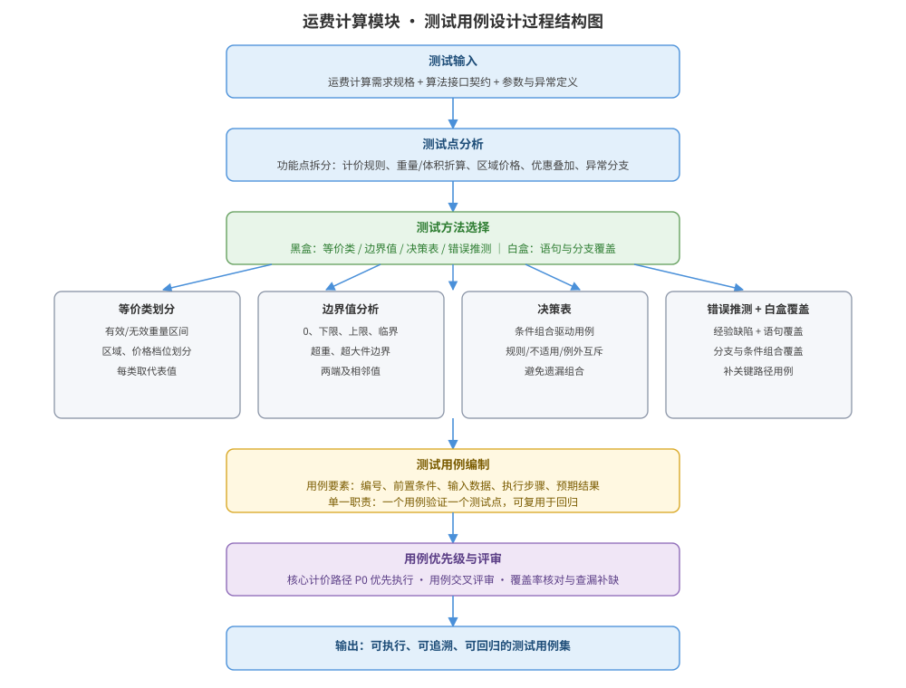

某电商系统的「运费计算」模块已通过接口设计，其计价规则为：重量 ≤ 1kg 收基础运费 8 元；1kg < 重量 ≤ 10kg 按 8 元 + 超出部分每 kg 2 元计费；重量 > 10kg 按 8 元 + 前 9kg 每 kg 2 元 + 超出 10kg 部分每 kg 3 元计费；体积折算重量 = 长×宽×高(cm) ÷ 6000，取实际重量与折算重量的较大者；会员可享 9 折，活动期订单再叠加满 50 减 10。请为该模块设计一套完整的测试用例方案：测试点分析、测试方法选用（等价类/边界值/决策表）、测试用例表、优先级与回归安排，并给出测试用例设计过程结构图与用例驱动伪代码。

---

答案：设计方案（设计目标 → 测试用例设计过程结构图 → 测试点与测试方法 → 用例表 → 优先级与回归 → 用例驱动伪代码）

一、设计目标

1. 覆盖运费计算的计价规则、体积折算、会员折扣与满减叠加四类功能点，保证核心路径与异常分支均有测试用例；
2. 综合运用等价类划分、边界值分析、决策表与错误推测，辅以白盒语句/分支覆盖，保证用例全面且最小化；
3. 用例要素完整（编号、前置、输入、步骤、预期结果）、单一职责、可执行可回归，核心路径 P0 优先执行。

二、测试用例设计过程结构图



说明：用例设计从「需求与接口契约」出发，先做测试点分析，再按黑盒方法（等价类/边界值/决策表/错误推测）与白盒覆盖组合生成用例，编制用例后按优先级与交叉评审收敛，输出可执行、可追溯、可回归的用例集。

三、测试点分析与测试方法选用

| 测试点 | 主要方法 | 说明 |
|--------|----------|------|
| 重量档位 | 等价类 + 边界值 | 0、1、10、10 与 10+ 的临界点 |
| 体积折算 | 等价类 | 折算重量 vs 实际重量取大 |
| 会员折扣 | 决策表 | 是否会员 × 是否活动叠加组合 |
| 满减叠加 | 决策表 | 满 50 减 10 与折扣先后顺序 |
| 异常分支 | 错误推测 + 白盒 | 空参数、负数、超大体积、精度舍入 |

四、测试用例表（示例）

| 用例编号 | 前置条件 | 输入数据 | 执行步骤 | 预期结果 |
|----------|----------|----------|----------|----------|
| TC-01 | 普通用户、非活动期 | 重量 0.5kg | 调用计算接口 | 运费 = 8 元 |
| TC-02 | 普通用户、非活动期 | 重量 1kg | 调用计算接口 | 运费 = 8 元（边界） |
| TC-03 | 普通用户、非活动期 | 重量 10kg | 调用计算接口 | 运费 = 8 + 9×2 = 26 元（边界） |
| TC-04 | 普通用户、非活动期 | 重量 10.5kg | 调用计算接口 | 运费 = 8 + 9×2 + 0.5×3 = 27.5 元 |
| TC-05 | 普通用户、非活动期 | 长 100×宽 100×高 100cm，重 0.8kg | 调用计算接口 | 折算重 = 1000000÷6000 ≈ 166.7kg，取大计费 |
| TC-06 | 会员、活动期 | 重量 5kg，基础价 18 元 | 调用计算接口 | 先折扣后满减：18×0.9=16.2 < 50，不满减，运费 16.2 元 |
| TC-07 | 会员、活动期 | 重量 20kg，基础价 60 元 | 调用计算接口 | 60×0.9=54 ≥ 50，54−10=44 元 |
| TC-08 | 任意用户 | 重量 -1kg | 调用计算接口 | 返回参数错误异常，不计费 |

注：TC-02、TC-03 为边界值用例，覆盖档位切换临界点；TC-06、TC-07 为决策表用例，验证「折扣后是否满足满减」的组合分支。

五、优先级与回归安排

- 优先级：核心计价路径（TC-01/03/04）、体积折算（TC-05）与决策组合（TC-07）为 P0 优先执行；异常分支为 P1。
- 回归安排：用例可复用于每次构建后的回归测试，P0 用例全量回归，P1 用例在核心逻辑变更时回归。
- 评审收敛：用例交叉评审，核对覆盖率并查漏补缺（如超大体积、精度舍入到分的场景）。

六、用例驱动伪代码

```text
test_freight():
  cases := 用例表(TC-01 … TC-08)
  for c in cases:
    setup(c.前置条件)                    // 构造用户与订单上下文
    result := calcFreight(c.输入)        // 调用被测接口
    assert result == c.预期结果           // 逐项断言，失败即记录缺陷
    tearDown()                           // 清理上下文，保证用例相互独立
```

---

评分标准：（满分 10 分）
- 要点 1（1 分）：明确测试用例设计目标（覆盖核心路径与异常分支、用例要素完整、可回归），给 1 分。
- 要点 2（3 分）：测试用例设计过程结构图完整——从需求/契约到测试点分析、黑盒白盒方法、用例编制、优先级评审到用例集的流程清晰，给 3 分；缺一处扣 1 分。
- 要点 3（2 分）：测试点分析与方法选用正确——重量档位用等价类/边界值、折扣满减用决策表、异常用错误推测与白盒，每类约 0.5 分，合计 2 分。
- 要点 4（3 分）：测试用例表正确——用例要素完整、边界值（1kg/10kg）与决策组合预期结果计算正确（TC-03=26 元、TC-07=44 元等），计算错一处扣 1 分。
- 要点 5（1 分）：优先级与回归安排合理、用例驱动伪代码可执行，给 1 分。

---

解析：本方案紧扣「测试用例设计」知识点——以运费计算的典型规则（分档计价、体积折算、折扣与满减叠加）为对象，综合运用等价类划分覆盖重量档位、边界值分析覆盖 1kg 与 10kg 临界点、决策表覆盖会员与活动组合分支、错误推测补充异常输入，再以白盒覆盖补全分支路径。方案强调用例要素完整、单一职责、优先级划分与可回归，把测试用例从「随手写几条」提升为系统化、可执行、可追溯的测试资产，体现对测试用例设计方法的全面理解。
