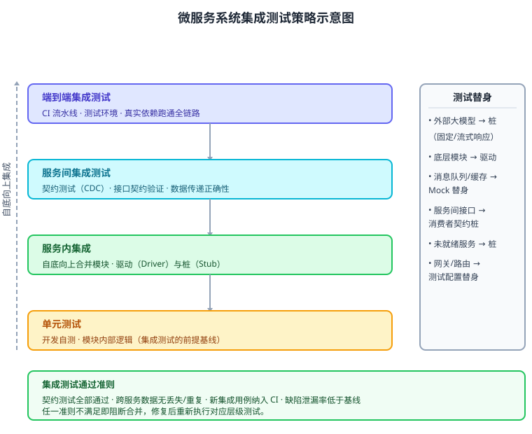

某公司研发「智能问答微服务系统」，由 API 网关、会话服务、知识检索服务、模型网关、数据服务五个服务组成，其中模型网关封装外部大模型供应商 API。各服务已通过单元测试，现需进行集成测试。系统约束：外部大模型依赖不稳定且计费昂贵，测试须与之解耦；希望尽早暴露接口不匹配与数据传递问题；回归测试成本可控，测试须可重复执行。请设计该系统的集成测试方案：给出集成测试的层次与执行流程、测试桩与驱动设计、关键策略决策，以及代表性集成测试用例（伪代码）。

---

答案：设计方案（设计目标 → 集成测试层次 svg → 测试桩/驱动设计表 → 关键策略决策 → 集成测试用例伪代码）

一、设计目标

1. 尽早暴露服务间接口不匹配、数据格式与传递错误，缩短缺陷定位成本；
2. 用桩/驱动/契约测试隔离外部大模型等不稳定依赖，保证测试确定、可重复、低成本；
3. 集成测试用例可持续集成到 CI 流水线，回归成本可控。

二、总体结构



说明：按「单元测试 → 服务内集成 → 服务间集成 → 端到端集成」自底向上推进。服务内集成用驱动（Driver）与桩（Stub）逐层合并模块；服务间集成用契约测试（CDC）验证接口契约；端到端集成在测试环境以真实依赖跑通全链路，并由 CI 流水线自动触发。

三、测试桩与驱动设计

| 替身类型 | 替身对象 | 用途 | 实现要点 |
|----------|----------|------|----------|
| Stub（桩） | 模型网关的外部大模型 API | 服务内集成时替代未就绪/不稳定依赖 | 返回固定或脚本化响应，注入测试数据 |
| Driver（驱动） | 被测模块/服务的调用方 | 服务内集成时驱动底层模块 | 构造输入、校验输出，逐层向上合并 |
| Mock（模拟） | 消息队列、会话缓存 | 服务间交互模拟 | 记录调用、断言交互与数据传递 |
| 契约桩（CDC） | 服务间接口 | 服务间契约测试 | 消费者契约驱动生成桩与断言 |

四、关键策略决策

1. 自底向上为主、与持续集成结合：先服务内自底向上合并，保证底层逻辑稳定后再做服务间集成；每合并一层即提交 CI，尽早暴露问题；
2. 契约测试先行：服务间以 OpenAPI/消费者契约定义接口，用契约测试验证提供者实现与消费者假设一致，接口不匹配在部署前发现；
3. 外部依赖仿真隔离：对外部大模型用固定响应的桩替换，避免计费与不稳定；对未就绪服务用桩，对底层模块用驱动；
4. 分层回归：单元与服务内集成每次提交运行，服务间集成每日运行，端到端集成按发布节奏运行，控制回归成本；
5. 通过准则量化：契约测试通过、接口数据往返一致、缺陷泄漏率低于基线，任一不满足即阻断合并。

五、代表性集成测试用例（伪代码）

```
@Test 会话服务 ⇄ 知识检索服务（服务间集成）
given: 用户提问「什么是软件危机」
when:  会话服务调用 GET /v1/search?q=软件危机
then:  返回命中文档数组 docs[]
  assert docs 结构符合契约（id, title, score）
  assert 超时 ≤ 3s，超出即触发降级路径
```

```
@Test 会话服务 → 模型网关（外部大模型桩）
stub:  模型网关返回固定补全文本（含流式分片）
when:  会话服务请求补全
then:  断言按流式协议逐片透传、终止标记正确
  assert 不真正调用外部大模型（计费为零、可重复执行）
```

---

评分标准：（满分 10 分）
- 要点 1（1 分）：明确设计目标——尽早暴露接口不匹配、隔离外部依赖、CI 可回归，给 1 分。
- 要点 2（2 分）：给出集成测试层次与流程并配图，层次（单元→服务内→服务间→端到端）与流转正确，给 2 分；缺层次或顺序错误酌情扣分。
- 要点 3（3 分）：测试桩与驱动设计表覆盖 Stub/Driver/Mock/契约桩的替身对象与用途，给 3 分；缺替身或用途含糊每处扣 0.5 分。
- 要点 4（3 分）：关键策略决策有效回应约束——自底向上+持续集成、契约测试、外部依赖仿真隔离、分层回归、量化通过准则，每答对一项给 0.6 分，合计 3 分。
- 要点 5（1 分）：给出代表性集成测试用例伪代码（含桩与断言），完整可执行，给 1 分。

---

解析：集成测试的目标是验证模块/服务组合后的交互正确性。方案按「单元—服务内—服务间—端到端」自底向上组织，用驱动与桩控制被测对象边界，用契约测试把接口不匹配前移到部署前，用外部依赖仿真保证测试确定、可重复、低成本，并以分层回归与量化准则控制回归成本，体现集成测试「先小后大、替身隔离、契约先行、可自动回归」的工程方法。
