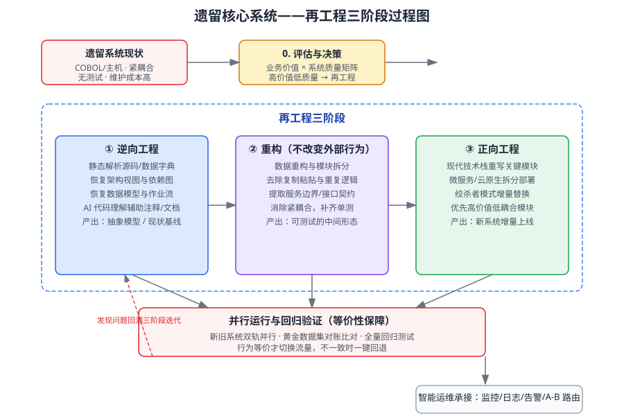

某银行的账户核心系统已运行 15 年：基于 COBOL 与主机平台，模块高度耦合、几乎没有自动化测试，任何需求变更都要数周评估，维护成本逐年攀升；但该系统承载全部核心账务，绝不能整体停摆或一次性替换。管理层拟对该遗留系统实施再工程改造。请综合运用「软件再工程」「软件演化」「遗留系统」「智能运维」「回归测试」知识，制定完整的再工程方案：先说明调用到的知识点，再给出分步推理，最后给出包含三阶段过程图、并行切换与风险控制的最终方案。

---

答案：（分步综合分析）

一、知识点调用

调用「软件再工程」的逆向工程、重构、正向工程三阶段方法论；调用「软件演化」的演化维护思想，明确再工程是"在行为等价前提下改善结构、提升可演化性"；调用「遗留系统」知识进行业务价值与系统质量评估、识别替换风险；调用「智能运维」知识完成新系统的可观测性承接与新旧系统的流量切换；调用「回归测试」知识保障行为等价性（黄金数据对账、全量回归）。五个知识点协同，把"老旧核心系统如何现代化"转化为"评估决策 → 逆向理解 → 重构改良 → 正向重建 → 并行验证 → 智能运维接管"的工程问题。

二、分步推理

1. 评估与决策（遗留系统）：用「业务价值 × 系统质量」四象限定位——本系统业务价值高、系统质量低，属于"必须再工程/替换"象限；因不能整体停摆，选择"逆向—重构—正向"渐进式再工程，而非一次性重写，以控制风险。
2. 逆向工程：通过静态解析源代码、数据字典与作业控制流，恢复系统的架构视图、模块依赖图、数据模型与关键业务规则；借助智能代码理解工具自动生成注释与文档，形成"现状基线"（抽象模型），作为后续重构与正向工程的依据。
3. 重构（不改变外部行为）：在行为等价前提下改善内部结构——进行数据重构、模块拆分、去除复制粘贴与重复逻辑、提取服务边界与接口契约，并逐步补齐单元测试，把紧耦合的"大泥球"改造成可测试、可渐进替换的中间形态。
4. 正向工程：用现代技术栈（Java、微服务、云环境）对关键模块重新实现；采用「绞杀者模式」按"高价值、低耦合"优先级增量替换老模块，新老模块通过接口契约协同，避免大爆炸式切换。
5. 并行运行与回归验证（回归测试）：新旧系统双轨并行，用黄金数据集逐笔对账（结果一致率、时延、异常差异）做等价性验证；每次增量上线执行全量回归测试，行为不一致时一键回退，只有对账通过才切换正式流量。
6. 智能运维承接：新系统接入监控、日志、告警、链路追踪与 A/B 路由；老系统保留只读切换开关作为兜底；对账异常与漂移由智能运维自动告警并触发回溯，形成"再工程—验证—运维—迭代"闭环。

三、结论/方案

最终方案为「评估决策 → 逆向工程 → 重构 → 正向工程 → 并行对账验证 → 智能运维接管」的渐进式再工程，三阶段过程见图 1。核心保障措施：以绞杀者模式增量替换控制风险，以黄金数据对账 + 全量回归保证行为等价，以一键回退 + 只读开关保证业务连续，以智能运维完成新老系统平稳衔接。再工程既保留核心业务价值，又显著提升可维护性与可演化性。

图 1 遗留系统再工程三阶段过程图

| 阶段 | 输入 | 输出 | 风险控制 |
|---|---|---|---|
| ① 逆向工程 | 遗留源码/数据字典/作业流 | 架构视图、数据模型、现状基线 | 全量解析 + AI 理解辅助 |
| ② 重构 | 现状基线 | 可测试的中间形态、接口契约 | 行为等价 + 补齐单测 |
| ③ 正向工程 | 中间形态契约 | 新系统增量上线 | 绞杀者模式 + 高价值低耦合优先 |
| 并行验证 | 新旧系统 | 对账报告、回归结果 | 黄金数据对账 + 一键回退 |
| 智能运维 | 新系统 + 老系统兜底 | 监控告警、A/B 路由、迭代反馈 | 全链路可观测 + 自动告警 |

---

评分标准：（满分 10 分）
- 要点 1（2 分）：准确调用软件再工程、软件演化、遗留系统、智能运维、回归测试知识点并建立联系，缺一类扣 1 分。
- 要点 2（4 分）：分步推理完整、逻辑自洽（评估决策 → 逆向 → 重构 → 正向 → 并行验证 → 智能运维），缺关键步骤每处扣 1 分；评估决策中须体现"不能整体停摆"对方法选择的约束。
- 要点 3（3 分）：方案可行，给出三阶段过程图与并行对账/回退策略（绞杀者模式增量替换、黄金数据对账、一键回退），缺过程图扣 2 分。
- 要点 4（1 分）：结论/方案表述清晰，风险控制与运维承接的落地细节论证充分。

---

解析：本题考查的是"遗留系统为什么不能直接重写"以及"再工程三阶段各自的价值"。判断要点是：先做业务价值×质量评估，确定再工程而非重写；逆向工程解决"看不懂"，重构解决"改不动"，正向工程解决"难演进"；并行运行与黄金数据对账解决"怕出事故"，智能运维解决"换完之后如何长期演进"。答题宜先确立渐进式替换（绞杀者模式）的总策略，再用对账与回退机制量化风险控制，体现软件再工程"行为等价、渐进演化"的方法论。
