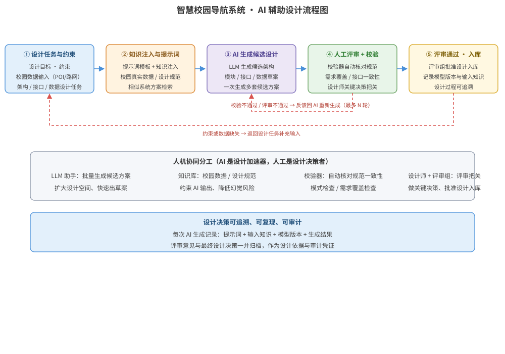

某高校要建设「智慧校园导航系统」：提供室内外一体化导航、教室/场馆检索、路线规划与校园信息服务。开发团队希望借助大语言模型（LLM）辅助完成架构设计与详细设计，但担心 AI 输出不一致、无法保证设计质量与规范，且 AI 生成的接口/数据设计可能脱离校园真实数据。请为该系统的设计阶段设计一套 AI 辅助设计方案：AI 辅助设计流程与角色分工、提示词与知识注入设计、AI 生成结果的人工评审与校验机制、AI 辅助设计流程结构图，并给出关键接口/伪代码说明及关键设计决策。

---

答案：设计方案（设计目标 → AI 辅助设计流程结构图 → 角色与职责表 → 关键接口/伪代码说明 → 关键设计决策）

一、设计目标

1. 把 LLM 嵌入设计工作流：由 AI 辅助生成候选架构、模块划分、接口草案与数据模型，显著提升设计产出效率；
2. 通过提示词工程与知识注入（校园建筑/POI/路网等真实数据与设计规范）约束 AI 输出，保证设计贴合实际、符合规范；
3. 建立「AI 生成 → 人工评审 → 校验修正」的人机协同闭环，把 AI 定位为设计助手而非替代者，确保设计质量可控、可追溯。

二、AI 辅助设计流程结构图



说明：主流程为「设计任务与约束 → 知识注入与提示词构造 → AI 生成候选设计 → 人工评审 + 校验 → 评审通过入库」。AI 依据校园真实数据（路网、POI、楼宇信息）与设计规范生成候选架构、模块/接口草案与数据模型；校验器自动核查 AI 输出与规范的一致性（模式检查、需求覆盖、接口一致性），人工设计师对关键决策逐项评审；校验或评审不通过时携带反馈返回 AI 重新生成，约束或数据缺失时返回设计任务补充输入，形成人机协同迭代闭环。

三、AI 辅助设计角色与职责表

| 角色 | 职责 | 关键产出 |
|------|------|----------|
| 设计师（人） | 确定设计目标与约束、评审 AI 候选方案、做关键设计决策 | 设计决策记录、评审意见 |
| LLM 助手（AI） | 依据提示词与注入知识生成候选架构、模块划分、接口/数据草案 | 候选设计方案、接口草案 |
| 知识库 | 提供校园数据（POI、路网、楼宇）与设计规范、历史方案 | 结构化知识、设计规范 |
| 校验器 | 自动检查 AI 输出：模式合规、需求覆盖、接口一致性 | 校验报告 |
| 评审组 | 组织评审会议、评估方案、批准入库 | 评审结论、设计基线 |

四、关键接口/伪代码说明

- 提示词模板与知识注入伪代码：

```
prompt = 模板(设计目标, 约束, 设计规范)
context = 检索知识库(校园路网, POI, 楼宇坐标, 相似系统方案)
aiInput = 组装(prompt, context)            # 注入真实数据与规范约束
candidate = llm.generate(aiInput)          # AI 生成候选设计
```

- 校验与迭代伪代码：

```
for candidate in ai.candidates:
    report = validator.check(candidate, 设计规范)   # 模式 / 需求覆盖 / 接口一致性
    if not report.passed:
        携带 report 反馈给 AI 重新生成（最多 N 轮）
    else:
        进入人工评审；评审通过后入库并记录模型版本与输入知识
```

五、关键设计决策

1. 采用「人机协同、AI 先行」：AI 先产出候选方案扩大设计空间，人工设计师做关键取舍与评审把关，避免盲目信任 AI 输出，也避免设计效率被 AI 取代的误区——AI 是设计加速器而非决策者；
2. 知识注入与规范约束前置：把校园真实数据与设计规范注入提示词，并让校验器自动核对 AI 输出，从源头降低 AI「幻觉」与脱离实际的风险；
3. 设计决策可追溯：每次 AI 生成都记录提示词、输入知识、模型版本与生成结果，评审意见与最终决策一并归档，保证设计过程可复现、可审计。

---

评分标准：（满分 10 分）
- 要点 1（1 分）：明确 AI 辅助设计目标（AI 提效、知识约束、人机协同质量可控），给 1 分。
- 要点 2（3 分）：AI 辅助设计流程结构图完整——设计任务→知识注入→AI 生成→人工评审+校验→入库的闭环、人机分工与反馈回路清晰，给 3 分；缺校验修正回路扣 1 分，缺知识注入环节扣 1 分。
- 要点 3（2 分）：角色与职责表正确——设计师、LLM 助手、知识库、校验器、评审组的职责与产出一一对应，每项约 0.4 分，合计 2 分。
- 要点 4（2 分）：接口/伪代码正确——提示词与知识注入、校验与迭代伪代码逻辑正确，给 2 分。
- 要点 5（2 分）：关键设计决策合理——人机协同、知识约束、决策可追溯，给 2 分。

---

解析：本方案紧扣「AI 辅助设计」知识点——AI 辅助设计是把大语言模型等 AI 能力嵌入软件设计活动，用 AI 生成候选方案、人工评审与校验把关，实现设计提效与质量可控的统一。针对智慧校园导航系统「数据真实、规范要求高、AI 输出易失控」的特点，方案采用「AI 先行生成、知识注入约束、校验器自动核对、人工评审决策」的人机协同闭环，把 AI 定位为设计助手而非替代者，并记录提示词、输入知识与模型版本保证设计可追溯，体现对 AI 辅助设计流程、人机分工与质量保障机制的深入把握。
