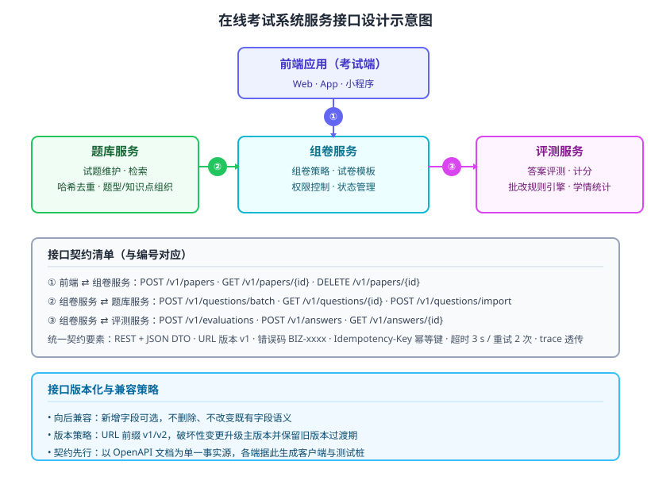

某在线教育企业建设「智能考试系统」，核心服务包括题库服务、组卷服务与评测服务，三者独立部署、独立扩缩容，且均需被前端考试端（Web/App/小程序）调用。系统须满足：接口向后兼容、前后端可并行开发、服务间故障不互相拖垮、调用可追溯可审计。请设计该系统的服务接口：给出接口设计的总体结构、接口清单与契约要素、关键接口设计决策，以及核心接口的定义（接口说明/伪代码）。

---

答案：设计方案（设计目标 → 接口结构 svg → 接口清单与契约表 → 关键设计决策 → 核心接口定义）

一、设计目标

1. 以稳定的接口契约解耦前端与三服务、以及服务之间，支撑并行开发与独立部署；
2. 接口显式化版本、错误码、幂等与超时重试语义，保证向后兼容与故障隔离；
3. 全部调用可观测可审计，统一携带 trace 与租户上下文。

二、总体结构



说明：前端考试端通过 RESTful 接口调用组卷服务，组卷服务再分别调用题库服务取题、评测服务批改；接口契约统一维护在 OpenAPI 文档中，作为单一事实源。服务间同步调用通过超时/重试/熔断隔离故障，异步环节（如批量评测）通过消息队列解耦。接口编号 ①②③ 与底部契约清单一一对应。

三、接口清单与契约要素

| 接口 | 方法与路径 | 请求 DTO（要点） | 响应 DTO（要点） | 错误码 |
|------|------------|------------------|------------------|--------|
| ① 创建试卷 createPaper | POST /v1/papers | 模板ID、知识点、难度、题量 | paperId、题目列表、总分 | BIZ-1001 参数错误 |
| ① 查询试卷 getPaper | GET /v1/papers/{id} | 路径参数 id | 试卷结构、各题分值 | BIZ-1002 试卷不存在 |
| ② 批量取题 fetchQuestions | POST /v1/questions/batch | 知识点、题型、难度、数量、排除集 | questions[]（含 hash、选项） | BIZ-2001 库存不足 |
| ② 导入试题 importQuestions | POST /v1/questions/import | 试题 JSON 列表 | 成功/跳过数、重复 hash 列表 | BIZ-2002 格式错误 |
| ③ 提交评测 submitEvaluation | POST /v1/evaluations | 试卷ID、作答明细 | 评测ID、预估得分 | BIZ-3001 评测冲突 |
| ③ 查询评测结果 getEvaluation | GET /v1/answers/{id} | 路径参数 id | 得分、每题批改明细 | BIZ-3002 结果未就绪 |

四、关键设计决策

1. 契约先行与 OpenAPI 单一事实源：先定义 OpenAPI 文档，再由各端生成客户端与测试桩，前后端并行开发不阻塞；
2. REST + JSON DTO + 显式错误码：错误码按域分编（1xxx 组卷 / 2xxx 题库 / 3xxx 评测），便于定位与前端统一提示；
3. 版本化策略：URL 前缀 v1/v2；破坏性变更升级主版本并保留旧版本过渡期，保证向后兼容；
4. 幂等与重试：写接口以 Idempotency-Key 保证重复提交安全；超时 3 s、重试 2 次、熔断保护，防止故障级联；
5. 可观测性透传：请求统一携带 trace-id 与 tenant-id，贯穿三服务，满足审计与排障。

五、核心接口定义（OpenAPI / 伪代码）

```
POST /v1/questions/batch
Headers: { "Authorization": "...", "Idempotency-Key": "d3f...",
           "X-Trace-Id": "t9...", "X-Tenant-Id": "t-1001" }
Body: {
  "knowledgePointIds": ["kp-301", "kp-302"],
  "types": ["单选题", "多选题"],
  "difficulty": [2, 3, 4],
  "count": 20,
  "excludeQuestionIds": ["q-1001"]
}
→ 200 {
  "questions": [
    { "questionId": "q-1042", "hash": "3f2a9b1c...",
      "stem": "…", "options": [{ "key": "A", "content": "…" }],
      "difficulty": 3 }
  ]
}
→ 400 { "code": "BIZ-2001", "message": "题目库存不足" }
```

```
// 组卷服务调用题库服务的幂等重试伪代码
function fetchQuestions(req):
    for attempt in 1..2:                 // 至多重试 2 次
        resp = post("/v1/questions/batch", req, key = req.idempotencyKey)
        if resp.status in {500, 503} or resp.timeout:
            backoff(attempt)             // 指数退避后重试
            continue
        if resp.code startsWith "BIZ-": // 业务错误不重试
            return resp
        return resp
    raise CircuitOpen()                  // 熔断降级
```

---

评分标准：（满分 10 分）
- 要点 1（1 分）：明确设计目标——以接口契约解耦并行开发、显式版本/错误码/幂等/超时重试、可观测审计，给 1 分。
- 要点 2（2 分）：给出接口设计总体结构并配结构图，前端与三服务的接口关系清晰、编号与契约清单对应，给 2 分；结构错误或接口关系缺失酌情扣分。
- 要点 3（3 分）：接口清单与契约要素表覆盖方法与路径、请求/响应 DTO、错误码，契约完整可落地，给 3 分；缺列或契约含糊每处扣 0.5 分。
- 要点 4（3 分）：关键设计决策有效回应约束——契约先行、错误码分域、版本化兼容、幂等重试熔断、可观测透传，每答对一项给 0.6 分，合计 3 分。
- 要点 5（1 分）：给出核心接口定义（OpenAPI 片段）或幂等重试伪代码，结构正确完整，给 1 分。

---

解析：接口设计是把系统边界固化为可执行契约的过程。方案先确立接口设计的质量目标（解耦、兼容、容错、可审计），再以结构图固定「前端—组卷—题库/评测」的调用拓扑，用契约清单固化方法、DTO 与错误码，通过版本化、幂等、超时重试与熔断等决策回应约束，并以 OpenAPI 与伪代码把接口落到可实现、可测试的细节，体现接口设计「先定契约、再谈实现、兼容演进」的工程方法。
