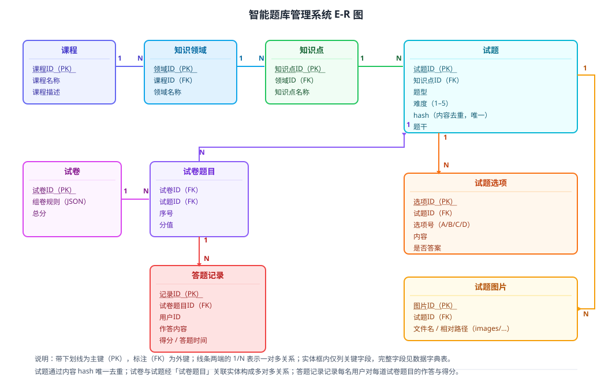

某教育科技公司建设「智能题库管理系统」，需支撑多课程试题的统一维护与复用。系统约束：试题按课程—知识领域—知识点的二级知识体系组织；支持单选题、多选题、判断题、填空题及各类主观题，选择题须记录选项；题目可通过图片增强（图片存于与试题文件同级的 images/ 目录）；须通过内容 SHA-256 哈希实现跨课程去重；支持自动组卷，并记录用户答题记录用于学情分析。请设计该系统的数据模型：给出 E-R 图、主要数据表的数据字典、关键数据设计决策，以及核心建表语句或伪代码。

---

答案：设计方案（设计目标 → E-R 图 → 数据字典表 → 关键设计决策 → 核心建表语句）

一、设计目标

1. 用「课程 → 知识领域 → 知识点 → 试题」的层次结构承载二级知识体系，保证数据可按知识体系查询与统计；
2. 用关联实体表达「试卷—试题」多对多关系，并沉淀用户作答明细，支撑组卷与学情分析；
3. 数据冗余与查询性能取得平衡：适度反范式化，配合索引保证高频检索（按知识点取题、按 hash 去重）高效。

二、总体结构（E-R 图）



说明：课程、知识领域、知识点构成三级层次；试题挂在知识点下，包含 hash 唯一约束用于去重；试题与试题选项、试题图片为一对多；试卷与试题通过「试卷题目」关联实体构成多对多；答题记录记录每名用户对每道试卷题目的作答与得分。

三、数据字典（主要数据表）

| 表 | 字段（要点） | 主键/外键/约束 |
|----|--------------|----------------|
| 课程 | 课程ID、课程名称、课程描述 | PK：课程ID；课程名称唯一 |
| 知识领域 | 领域ID、课程ID、领域名称 | PK：领域ID；FK：课程ID；同课程领域名唯一 |
| 知识点 | 知识点ID、领域ID、知识点名称 | PK：知识点ID；FK：领域ID；同领域知识点名唯一 |
| 试题 | 试题ID、知识点ID、题型、难度、hash、题干 | PK：试题ID；FK：知识点ID；hash 唯一索引 |
| 试题选项 | 选项ID、试题ID、选项号、内容、是否答案 | PK：选项ID；FK：试题ID；同试题选项号唯一 |
| 试题图片 | 图片ID、试题ID、文件名、相对路径 | PK：图片ID；FK：试题ID；路径唯一 |
| 试卷 | 试卷ID、组卷规则(JSON)、总分 | PK：试卷ID |
| 试卷题目 | 试卷ID、试题ID、序号、分值 | 联合主键（试卷ID, 序号）；FK：试卷ID、试题ID |
| 答题记录 | 记录ID、试卷题目ID、用户ID、作答内容、得分、答题时间 | PK：记录ID；FK：试卷题目ID |

四、关键设计决策

1. 三级知识体系分层设计：课程—领域—知识点逐层一对多，使「按知识点取题」「按领域统计」有天然索引支撑；知识点名称与题干正文保持一致，作为组卷的知识面约束；
2. 内容哈希去重：对题干、选项与答案的规范化文本计算 SHA-256 存入 hash 字段并建唯一索引，导入时以 hash 判断重复，保证同一课程内不重复；
3. 多对多显式化：试卷与试题之间用关联实体「试卷题目」承载序号与分值，使一份试卷可记录同题多次出现、不同分值，且不与试题表耦合；
4. 适度反范式化：试卷表冗余存储组卷规则（JSON）与总分，避免每次查询重算；答题记录冗余用户作答，保证历史数据不受试题内容变更影响；
5. 索引与约束：对（知识点ID, 题型, 难度）建联合索引加速取题；对 hash 建唯一索引加速去重；外键保证知识体系引用完整性。

五、核心建表语句（伪代码 / DDL）

```
CREATE TABLE 知识点 (
    知识点ID   BIGINT PRIMARY KEY,
    领域ID     BIGINT NOT NULL REFERENCES 知识领域(领域ID),
    知识点名称 VARCHAR(100) NOT NULL,
    UNIQUE (领域ID, 知识点名称)
);

CREATE TABLE 试题 (
    试题ID    BIGINT PRIMARY KEY,
    知识点ID  BIGINT NOT NULL REFERENCES 知识点(知识点ID),
    题型      VARCHAR(16) NOT NULL,
    难度      TINYINT CHECK (难度 BETWEEN 1 AND 5),
    hash      CHAR(64) NOT NULL UNIQUE,        -- SHA-256 内容去重
    题干      TEXT NOT NULL,
    INDEX idx_kp_type_diff (知识点ID, 题型, 难度)  -- 按知识点取题
);

CREATE TABLE 试卷题目 (
    试卷ID BIGINT NOT NULL REFERENCES 试卷(试卷ID),
    试题ID BIGINT NOT NULL REFERENCES 试题(试题ID),
    序号   INT NOT NULL,
    分值   INT NOT NULL,
    PRIMARY KEY (试卷ID, 序号)
);
```

---

评分标准：（满分 10 分）
- 要点 1（1 分）：明确设计目标——承载二级知识体系、支撑组卷与学情分析、平衡冗余与性能，给 1 分。
- 要点 2（2 分）：给出 E-R 图，实体关系（课程—领域—知识点—试题、试题—选项/图片、试卷—试题多对多、答题记录）正确完整，给 2 分；实体或关系缺失酌情扣分。
- 要点 3（3 分）：数据字典覆盖主要表的关键字段、主外键与约束，命名清晰、类型合理，给 3 分；缺表或字段含糊每处扣 0.5 分。
- 要点 4（3 分）：关键设计决策有效回应约束——三级层次、hash 去重、多对多关联实体、适度反范式化、索引与约束，每答对一项给 0.6 分，合计 3 分。
- 要点 5（1 分）：给出核心建表语句/伪代码，主外键、唯一约束与索引正确，给 1 分。

---

解析：数据设计是把业务规则固化为数据结构的工程活动。方案以 E-R 图明确实体与关系，用「课程—领域—知识点—试题」的层次结构承载知识体系，以 hash 唯一索引落实去重规则，以关联实体表达试卷与试题的多对多关系，通过联合索引与适度反范式化平衡查询性能，并以 DDL 把设计落到可实现的约束上，体现数据设计「先建模、再约束、性能与一致性并重」的工程方法。
