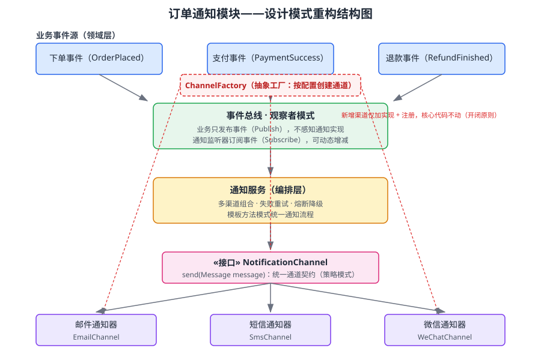

某电商平台的「订单通知」模块运行两年来问题频出：结账核心流程直接 `new` 出邮件、短信、微信等具体通知器，新增一个通知渠道（如企业微信）就要改动结账代码；下单、支付、退款等不同业务事件都要触发通知，通知逻辑在各处重复拷贝；通知渠道与业务逻辑紧耦合，导致单元测试无法单独进行。请综合运用「设计模式」「接口设计」「软件设计质量」「软件架构设计」知识，为该通知模块设计重构方案：先定位问题并说明调用到的知识点，再给出分步推理，最后给出包含重构结构图、职责表与关键设计决策的最终方案。

---

答案：（分步综合分析）

一、知识点调用

调用「设计模式」中的观察者模式（业务事件与通知解耦）、策略模式（通知渠道可替换）、抽象工厂模式（渠道实例化与配置解耦）、模板方法模式（统一通知流程）；调用「接口设计」知识定义统一的通道契约 `NotificationChannel`；调用「软件设计质量」知识，以开闭原则、依赖倒置原则、低耦合高内聚与可测试性作为重构目标；调用「软件架构设计」知识将模块划分为「领域事件层—分发层—编排层—通道实现层」的分层结构。四个知识点协同，把「加渠道改核心代码」的问题转化为「事件驱动 + 策略化通道 + 工厂装配」的设计问题。

二、分步推理

1. 问题定位与目标确定：核心问题有三处——（1）业务代码直接依赖具体通知实现，违反依赖倒置原则；（2）新增渠道需改动结账代码，违反开闭原则；（3）通知逻辑重复且与业务耦合，内聚低、不可测。重构目标为：新增渠道零改动核心代码、业务只发事件不感知通道、各通道可独立测试与替换。
2. 定义统一通道契约（接口设计）：抽象出 `NotificationChannel` 接口，含 `send(Message message)` 方法；邮件、短信、微信分别实现该接口。业务层只依赖接口，不依赖具体类，实现「依赖倒置」。
3. 事件与通知解耦（观察者模式）：引入事件总线，下单、支付、退款作为事件源，发布（Publish）事件即可；通知监听器订阅（Subscribe）相应事件。业务逻辑只负责产生领域事件，不再关心"谁"接收，通知者可以动态增减而不影响业务。
4. 渠道装配（抽象工厂模式）：定义 `ChannelFactory`，依据配置项（如是否启用某渠道、渠道优先级）创建具体通道对象。新增渠道时只需新增实现类并在工厂注册，核心代码不动。
5. 统一通知流程（模板方法模式）：通知服务以模板方法定义「发送 → 失败重试 → 熔断降级」的固定流程骨架，各渠道只需实现具体发送细节；支持多渠道组合编排。
6. 可测试性与质量验证：由于业务依赖接口、事件经总线分发，单元测试可用 Mock 通道独立验证业务事件发布逻辑，各渠道可单独测试；集成测试通过工厂装配真实/模拟通道验证组合场景。重构后按开闭原则验证：新增企业微信渠道只需「加实现 + 工厂注册」，验证代码改动点数量由"多处"降为"两处"。

三、结论/方案

最终采用「事件驱动 + 策略化通道 + 工厂装配」的分层方案：领域事件（下单/支付/退款）→ 事件总线（观察者分发）→ 通知服务（模板方法编排：组合、重试、降级）→ `NotificationChannel` 接口（策略契约）→ 邮件/短信/微信具体实现（由 `ChannelFactory` 按配置创建）。结构图见图 1，模块职责见表 1，关键决策见下：接口最小化、事件与实现完全解耦、新增渠道成本收敛为「实现类 + 工厂注册」两处、测试可独立进行。

图 1 订单通知模块设计模式重构结构图

| 模块/角色 | 对应模式 | 职责 |
|---|---|---|
| 业务事件（下单/支付/退款） | 领域事件 | 业务产生并发布事件，不感知通知实现 |
| 事件总线 | 观察者模式 | 维护订阅关系，把事件分发给订阅者 |
| 通知服务 | 模板方法模式 | 编排多渠道、失败重试、熔断降级 |
| NotificationChannel 接口 | 策略模式（接口契约） | 统一通道发送契约，业务仅依赖接口 |
| 邮件/短信/微信通道 | 策略具体实现 | 各自实现 send()，可独立替换与测试 |
| ChannelFactory | 抽象工厂模式 | 按配置创建通道，新增渠道仅注册 |

---

评分标准：（满分 10 分）
- 要点 1（2 分）：准确调用设计模式（观察者/策略/抽象工厂/模板方法）、接口设计、软件设计质量、软件架构设计知识点，并说明与问题的对应关系；调用不全或与场景脱节酌情扣分。
- 要点 2（4 分）：分步推理完整、逻辑自洽（问题定位 → 接口契约 → 观察者解耦 → 工厂装配 → 模板流程 → 可测试性验证），缺关键步骤每处扣 1 分。
- 要点 3（3 分）：方案可行，给出重构结构图与职责表，并能体现"新增渠道只改实现类与工厂注册"的开闭原则验证；缺结构图扣 2 分、缺职责表扣 1 分。
- 要点 4（1 分）：结论/方案表述清晰，可测试性与扩展性的落地细节论证充分。

---

解析：本题的考查核心是「设计模式要为具体的耦合问题服务，而非炫技」。判断要点是学生能否把"加渠道改核心代码、通知逻辑重复"这两类症状，分别映射到开闭原则与单一职责的违背，再对症选用观察者（解耦事件与处理者）、策略（可替换通道）、抽象工厂（装配与配置）、模板方法（统一流程）四类模式；结构图与职责表使方案可核验。答题时宜先定位问题再选模式，并用"新增渠道改动点"量化验证开闭原则。
