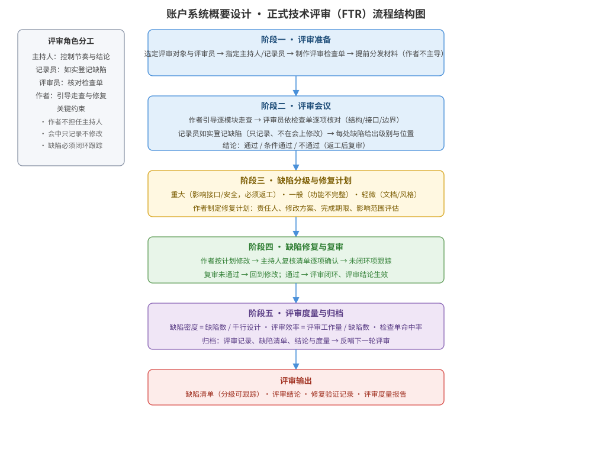

某互联网金融平台的「账户系统」概要设计已完成：系统划分为 8 个模块、定义了 5 个对外接口与账户数据模型，即将进入详细设计。为确保设计缺陷在编码前被发现，需要组织一次正式技术评审（FTR）。请为本次评审设计完整方案：评审类型与时机、评审角色分工、评审检查单、评审流程结构图、缺陷分级与闭环处理，并说明关键设计决策与评审度量。

---

答案：设计方案（设计目标 → 设计评审流程结构图 → 角色分工与检查单 → 缺陷分级与闭环处理 → 关键设计决策与评审度量）

一、设计目标

1. 在详细设计启动前，通过一次正式技术评审（FTR）系统发现概要设计中的结构、接口与数据设计缺陷，降低缺陷在编码后的修复成本；
2. 用评审检查单把评审对象落到可逐项核对的设计要素（模块划分、接口契约、数据模型、边界与异常），避免评审流于形式；
3. 建立「缺陷分级 → 修复 → 复审 → 度量归档」的闭环，保证每条缺陷可跟踪、评审结论可量化。

二、设计评审流程结构图

说明：评审按「准备 → 评审会议 → 缺陷分级与修复计划 → 修复与复审 → 评审度量与归档」五阶段推进；评审会议中作者引导走查、评审员依检查单逐项核对、记录员如实登记缺陷，缺陷全部闭环后评审输出结论。

三、评审角色分工与评审检查单

评审角色分工表：

| 角色 | 职责 | 关键约束 |
|------|------|----------|
| 主持人 | 控制评审节奏、引导走查顺序、形成评审结论 | 由资深设计人员担任，作者不得兼任 |
| 记录员 | 如实登记缺陷（位置、描述、级别），形成评审记录 | 只记录、不参与会上修改 |
| 评审员 | 依检查单逐项核对设计要素，给出修改意见 | 覆盖架构、接口、数据、测试等视角 |
| 作者 | 介绍设计思路、引导逐模块走查、会后修复缺陷 | 不主导结论，保证评审独立性 |

设计评审检查单（示例）：

| 检查项 | 核对内容 | 通过标准 |
|--------|----------|----------|
| 模块划分 | 8 个模块职责是否单一、依赖方向是否合理 | 无「上帝模块」、依赖无环 |
| 接口契约 | 5 个对外接口的参数、返回值与错误码 | 与契约一致、异常语义明确 |
| 数据模型 | 账户数据模型是否满足业务约束（唯一性、一致性） | 主键/外键/索引设计合理 |
| 边界处理 | 超时、重试、幂等、并发与金额精度 | 均有明确策略 |

四、缺陷分级与闭环处理

- 缺陷分级：重大（影响接口/安全/数据一致性，必须返工）、一般（功能不完整，修复后复审）、轻微（文档/风格问题，汇总修复）。
- 闭环流程：评审会议登记缺陷 → 作者制定修复计划（责任人、方案、期限、影响范围）→ 修复后由主持人复核清单逐项确认 → 未闭环项持续跟踪直至清零。
- 复审结论：全部缺陷闭环且重大缺陷返工完成，评审结论方生效。

五、关键设计决策与评审度量

1. 评审时机前移：在详细设计启动前评审概要设计，缺陷修复成本约为编码后发现的三分之一；
2. 检查单驱动：评审员只针对检查单与缺陷发表意见，不重写设计，保证评审高效、客观；
3. 评审度量：缺陷密度 = 缺陷数 / 千行设计，评审效率 = 评审人时 / 缺陷数，检查单命中率 = 检查单命中缺陷数 / 总缺陷数，度量结果归档并反哺下一轮评审。

---

评分标准：（满分 10 分）
- 要点 1（1 分）：明确设计评审目标与评审类型/时机（编码前 FTR、评审对象为概要设计），给 1 分。
- 要点 2（3 分）：评审流程结构图完整——准备→会议→缺陷分级→修复复审→度量归档五阶段清晰、含角色约束，给 3 分；缺一阶段扣 1 分。
- 要点 3（2 分）：角色分工与评审检查单合理——作者不兼任主持人、检查单覆盖模块/接口/数据/边界，每答对一类约 0.5 分，合计 2 分。
- 要点 4（2 分）：缺陷分级与闭环处理正确——重大/一般/轻微分级、修复与复审闭环可跟踪，给 2 分。
- 要点 5（2 分）：关键设计决策与评审度量合理——评审前移、检查单驱动、缺陷密度/评审效率/检查单命中率等度量，给 2 分。

---

解析：本方案紧扣「设计评审」知识点——评审是设计质量保证的关键活动，核心在于「早发现、早修复、可闭环、可度量」。方案把正式技术评审组织为准备、会议、分级、复审、归档五阶段，用检查单把设计要素变为可逐项核对的对象，用角色分工保证评审独立性与有效性，用缺陷密度、评审效率等度量把评审从主观活动提升为可量化改进的工程实践。
