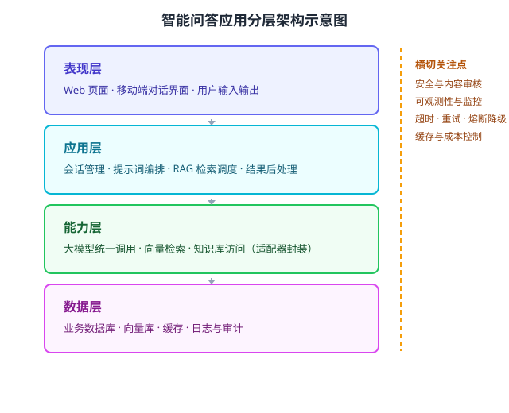

下图是一个智能问答应用的分层架构示意图（）。请结合图示简述各层的主要职责，并说明将大语言模型能力纳入架构设计时需要重点权衡哪些质量属性。

---

答案：

1. 各层职责：表现层负责与用户的对话交互与输入输出展示；应用层实现业务流程，包括会话管理、提示词编排与 RAG 检索调度等 AI 编排逻辑；能力层以统一接口封装大模型调用、向量检索与知识库访问，屏蔽底层模型与检索服务的差异；数据层负责业务数据、向量库、缓存以及日志审计数据的持久化与访问。
2. 需要权衡的质量属性（至少答出 3 个并举例）：
   - 性能与延迟：大模型推理耗时较长，需通过缓存命中、模型分级（轻量/重量模型）与异步处理来改善响应时间；
   - 可扩展性：模型升级或替换、并发量增长时，通过统一接口与适配器保证新增模型厂商无需改动业务层；
   - 安全性与合规性：需对用户输入进行提示注入防护，对敏感数据进行脱敏，并对生成内容进行安全审核；
   - 可靠性与容错：大模型服务可能超时或失败，需要超时、重试、熔断与降级策略（如降级为规则问答）；
   - 可维护性与可测试性：AI 组件与应用逻辑解耦，便于单独 Mock 与测试。
3. 横切关注点（可选补充）：安全审核、可观测性与监控、熔断降级、成本控制等应作为横切关注点贯穿各层，而不是堆叠在单一模块中。

---

评分标准：（满分 10 分）
- 要点 1（4 分）：分层说明各层职责，答出至少 3 层且职责正确（表现层对话交互与展示、应用层业务流程与 AI 编排、能力层统一封装大模型/检索、数据层持久化业务数据/向量库/缓存/日志）即给满分；每缺一层扣 1 分。
- 要点 2（4 分）：答出至少 3 个需权衡的质量属性并结合架构举例（性能与延迟、可扩展性、安全性与合规、可靠性与容错、可维护性与可测试性），缺 1 个扣 1 分。
- 要点 3（2 分）：答出横切关注点（安全审核、可观测性监控、熔断降级、成本控制应贯穿各层而非堆叠在单一模块）即给分（可选补充）。
- 缺要点或表述不清者，视情况酌情扣分。

---

解析：本题要求把分层架构的职责划分与大模型引入后的质量属性权衡结合回答。图示给出四层结构及右侧横切关注点，答题时应先分层说明职责，再围绕性能、可扩展、安全、可靠性、可维护性等质量属性说明架构层面的设计决策，体现 AI 组件与传统组件一样要纳入架构整体设计。
