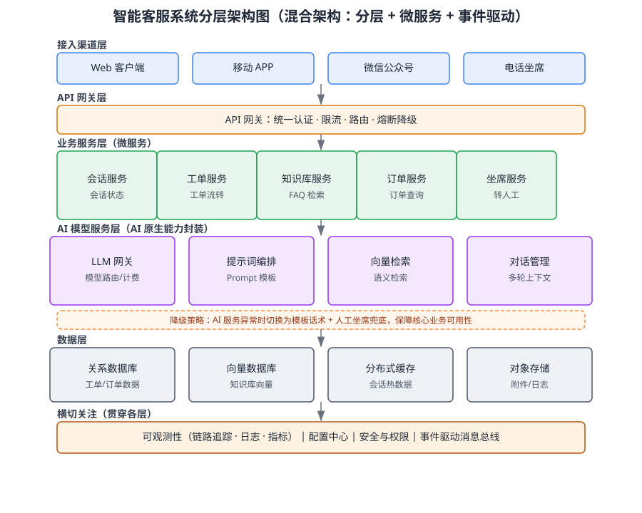

某电商企业拟构建一套智能客服系统，需将大语言模型（LLM）驱动的自然语言对话能力与既有业务（工单管理、知识库检索、订单查询）深度集成。系统计划部署于云端，要求支撑高并发访问、按需弹性扩展、全程可观测，并保证在 AI 能力异常或模型服务不可用时核心客服业务仍可平稳运行。请综合运用软件架构设计相关知识，为该智能客服系统设计软件架构方案，明确回答以下三点：调用并说明所依据的知识点；给出从需求到方案的推理步骤；给出最终架构方案（含分层架构图与模块职责划分）。

---

答案：

**1. 知识点调用**

本题综合运用软件架构设计相关的多个知识点：软件架构设计（质量属性驱动的架构设计、架构风格选型与权衡）、软件工程范型（微服务、面向服务架构、AI 原生架构）、接口设计与数据设计、软件质量属性（性能、可用性、可修改性、可测试性）。场景中的"高并发、可扩展、可观测、AI 故障不拖垮业务"分别对应性能、可修改性、可测试性与可用性等质量属性场景，是后续架构决策的输入。

**2. 分步推理**

- （1）识别质量属性场景：将非功能需求转译为可度量的质量属性场景。性能：峰值 5000 QPS，P95 响应时间小于 800ms；可用性：AI 模块故障时核心客服业务仍可用，整体 SLA 99.99%；可修改性：新增客服渠道（如小程序）不影响既有服务；可测试性：AI 组件可独立测试、可灰度发布。
- （2）架构风格选型：采用"分层 + 微服务 + 事件驱动"的混合风格。分层结构保证关注点分离；业务能力按领域拆分为微服务，支持独立部署与独立扩展；AI 能力以独立的"模型服务"形态封装，便于模型版本替换与灰度；跨服务事件（如工单状态变更）经事件驱动消息总线解耦，避免同步调用形成级联故障。
- （3）组件划分与职责：按"接入渠道 → API 网关 → 业务服务 → AI 模型服务 → 数据层"划分，并设横切关注层统一承载可观测性、配置、安全与消息总线，模块职责见下表。
- （4）数据设计：业务数据与向量数据分离——关系数据库承载工单、订单等结构化数据，向量数据库承载知识库语义向量，分布式缓存承载会话热数据，对象存储承载附件与日志，避免 AI 检索流量影响业务事务。
- （5）AI 与传统业务集成：AI 对话能力经 LLM 网关统一封装，业务服务通过异步消息调用 AI 服务；设计熔断与降级——AI 服务异常时降级为模板话术并转人工坐席兜底，使可用性质量属性不因 AI 故障而破坏。
- （6）可观测性设计：全链路分布式追踪、结构化日志与指标采集贯穿各层，支撑故障定位、容量规划与 AI 服务质量监控。

**3. 结论/方案**

架构方案如图 1 所示：采用混合风格的分层架构，AI 原生能力独立成层并与传统业务解耦；核心设计决策是"事件驱动解耦 + 熔断降级 + 向量检索分离"，保证 AI 能力可插拔、故障可控、业务可演进。

图 1 智能客服系统分层架构图

| 层/组件 | 职责 | 支撑的质量属性 |
|---|---|---|
| 接入渠道层（Web/APP/微信/电话） | 多端接入、会话入口 | 可修改性：新增渠道不改核心 |
| API 网关 | 统一认证、限流、路由、熔断降级 | 性能、可用性 |
| 业务服务层（会话/工单/知识库/订单/坐席） | 业务逻辑与状态流转，独立扩展 | 可扩展性、可维护性 |
| AI 模型服务层（LLM 网关/提示词编排/向量检索/对话管理） | 对话生成、知识增强检索、多轮管理 | 可测试性、可替换性 |
| 数据层（关系库/向量库/缓存/对象存储） | 结构化数据、语义向量、热数据、附件 | 性能、一致性 |
| 横切关注（可观测性/配置/安全/消息总线） | 链路追踪、配置中心、权限、事件解耦 | 可测试性、可用性 |

---

评分标准：（满分 10 分）
- 要点 1（2 分）：准确调用知识点（软件架构设计、微服务/AI 原生架构、接口与数据设计、质量属性）并说明其与场景的对应关系；知识点调用不全或未与场景建立联系酌情扣分。
- 要点 2（4 分）：分步推理完整、逻辑自洽（质量属性识别 → 风格选型 → 组件划分 → 数据设计 → AI 集成与降级 → 可观测性）；缺少关键步骤每处扣 1 分。
- 要点 3（3 分）：架构方案可行，给出架构图与模块职责表，关键决策（熔断降级、事件解耦、向量检索分离）有依据；缺架构图扣 2 分、缺职责表扣 1 分。
- 要点 4（1 分）：结论/方案表述清晰，AI 与既有业务集成的可落地性论证充分。

---

解析：本题将传统软件架构设计能力与 AI 原生能力集成相结合，属于软件设计领域的高阶综合应用。评分重点是学生能否在质量属性驱动下完成架构权衡，而非仅罗列架构名词；架构图与职责表共同构成可核验的方案产出，符合综合题"显式联系场景与知识点"的考查要求。
