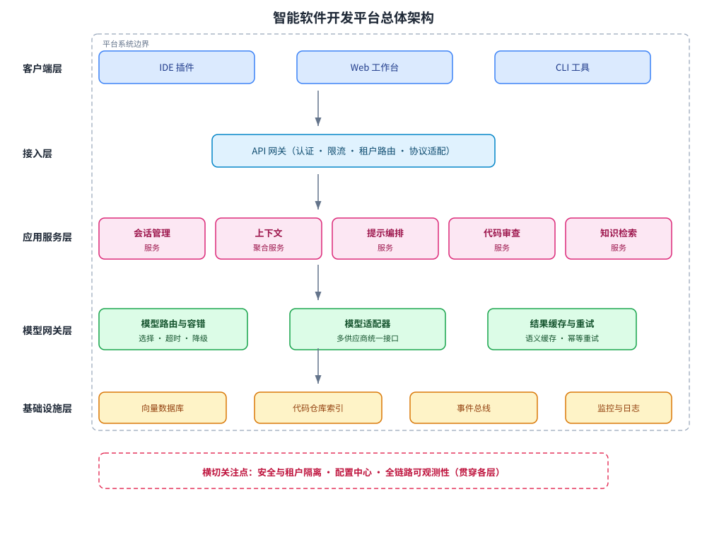

某软件公司拟建设「智能软件开发平台」，把 AI 编程助手能力集成进企业现有 IDE 工作流，支持代码补全、代码生成、基于仓库上下文的代码问答与代码审查。平台要求：支持同时接入多个大模型供应商并可运行时切换、单请求平均响应不超过 3 秒、可按峰值流量横向扩展、代码与仓库数据须租户级安全隔离。请为该平台设计软件架构：给出总体结构（含分层与组件）、模块/服务职责、关键技术决策，并说明模型网关与应用层之间的接口约定。

---

答案：设计方案（设计目标 → 总体架构 svg → 模块/服务职责表 → 关键技术决策 → 模型网关接口与提示编排伪代码）

一、设计目标

1. 面向 AI 原生软件工程场景，形成「客户端接入 → 应用编排 → 模型网关 → 基础设施」的清晰分层，实现关注点分离；
2. 模型网关层屏蔽供应商差异，支持运行时切换与统一计量，平均响应 ≤ 3 秒；
3. 应用服务按能力拆分、无状态设计，可随峰值流量水平扩展；租户数据端到端隔离。

二、总体架构



说明：请求经 API 网关鉴权、限流与路由进入应用服务层；应用服务层完成会话与上下文管理、提示编排、知识检索和代码审查后，统一调用模型网关；模型网关按路由策略选择供应商并缓存结果，最终读写基础设施层。安全、配置中心、可观测性为横切关注点，贯穿各层。

三、模块/服务职责

| 层次 | 组件 | 职责 |
|------|------|------|
| 客户端层 | IDE 插件 / Web 工作台 / CLI | 采集编辑上下文，展示流式补全与问答结果 |
| 接入层 | API 网关 | 认证授权、限流、租户路由、协议适配 |
| 应用服务层 | 会话管理服务 | 维护会话状态与消息历史 |
| 应用服务层 | 上下文聚合服务 | 汇总当前文件、相关代码片段与仓库信息 |
| 应用服务层 | 提示编排服务 | 按任务拼装提示词模板，控制上下文窗口 |
| 应用服务层 | 代码审查服务 | 组织审查任务、解析结果并生成报告 |
| 应用服务层 | 知识检索服务 | 基于向量与仓库索引做语义检索 |
| 模型网关层 | 模型路由与容错 | 供应商选择、超时/重试、降级 |
| 模型网关层 | 模型适配器 | 统一请求/响应模型，屏蔽供应商差异 |
| 模型网关层 | 结果缓存 | 对可复用结果按租户做语义缓存 |
| 基础设施层 | 向量数据库 / 仓库索引 | 代码向量与元数据存储、检索 |
| 基础设施层 | 事件总线 | 异步解耦、审计与埋点 |
| 基础设施层 | 监控与日志 | 链路追踪、指标、日志聚合 |
| 横切 | 安全 / 配置中心 / 可观测性 | 租户隔离、动态配置、全链路观测 |

四、关键技术决策

1. 分层 + 微服务拆分：把「上下文编排」「提示编排」「代码审查」拆为独立服务，各自独立部署与扩缩容，匹配不同峰值负载；
2. 模型网关抽象：定义统一 `CompletionRequest/CompletionResponse`，通过适配器插件化接入供应商；路由按「租户策略 + 成本 + 可用性」打分，支持运行时切换；
3. 上下文窗口控制：用 Token 预算 + 摘要化策略管理上下文，避免超出窗口并控制成本；当 $tokens=\sum_{i=1}^{n} \text{tokens}(s_i)$ 超出预算时，对最早的会话片段做摘要；
4. 异步流式响应：补全结果经 SSE 流式推送，把首字节时延（TTFB）优化到 500 ms 以内，改善交互体验；
5. 租户级隔离：向量库按租户分片、密钥按租户托管、网关层强制租户上下文透传。

五、模型网关接口约定（伪代码）

```
POST /v1/complete
{
  "tenant": "t-1001",
  "task": "code_completion",
  "context": [{"role": "user", "content": "..."}],
  "model_prefs": {"provider": "anthropic", "fallback": ["openai"]},
  "budget_tokens": 4096
}
→ 200
{
  "provider": "anthropic",
  "content": "...",
  "usage": {"tokens": 812, "cost": 0.0042}
}
```

```
// 提示编排服务伪代码
function buildPrompt(task, context):
    budget = budgetOf(task)
    segments = [systemPrompt(task), contextSummary(context)]
    while tokenCount(segments) > budget:
        segments[last] = summarize(segments[last])   // 超出预算则摘要最旧片段
    return segments
```

---

评分标准：（满分 10 分）
- 要点 1（1 分）：明确设计目标（清晰分层与关注点分离、模型网关统一屏蔽供应商、低时延、可水平扩展、租户级隔离），给 1 分。
- 要点 2（2 分）：给出总体架构（分层 + 组件）并配架构图，层次清晰、组件完整、请求流转正确，给 2 分；结构正确但缺图或组件不全，酌情扣分。
- 要点 3（3 分）：职责表覆盖客户端、接入层、应用服务层、模型网关层、基础设施层与横切关注点的组件职责，分层完整给 3 分；缺层或缺关键组件，每处酌情扣 0.5 分。
- 要点 4（3 分）：关键技术决策有效回应约束——模型网关抽象与运行时切换、低时延（流式推送与缓存）、水平扩展（无状态服务拆分）、租户级隔离，每答对一项给 0.75 分，合计 3 分。
- 要点 5（1 分）：给出模型网关与应用层之间的接口约定（请求/响应结构）或提示编排伪代码，正确完整给 1 分。

---

解析：方案覆盖「软件架构设计」的核心活动——先确立设计目标与质量属性，再以分层 + 微服务给出总体结构，用职责表固化模块边界，用模型网关等关键决策回应多供应商、低时延、可扩展与安全隔离等约束，并通过接口约定把设计落到可实现的边界上，体现架构设计「自顶向下、关注点分离、取舍有据」的工程方法。
