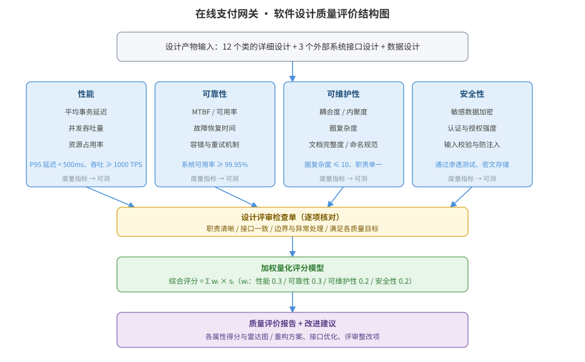

某在线支付网关的详细设计已完成：共 12 个类、3 个外部系统接口（银行清算、风控、账务），需在进入编码前对其设计质量进行系统评价。请为该设计设计质量评价方案：质量属性与度量指标、设计评审检查单、量化评分模型，给出设计质量评价结构图，并说明关键设计决策与改进建议。

---

答案：设计方案（设计目标 → 设计质量评价结构图 → 质量属性与度量指标表 → 评审检查单 → 加权量化评分模型 → 关键设计决策与改进建议）

一、设计目标

1. 基于 ISO/IEC 25010 选取性能、可靠性、可维护性、安全性四类关键质量属性，为每类定义可测的度量指标与通过标准；
2. 用设计评审检查单把质量属性落到可逐项核对的评审项，避免主观打分；
3. 用加权量化评分模型给出设计质量的综合量化结论，并输出可执行的改进建议。

二、设计质量评价结构图

说明：设计产物（类设计、外部接口、数据设计）进入四维质量属性评价框架，每维定义度量指标与通过标准；经设计评审检查单逐项核对后，按加权模型计算综合评分，输出质量评价报告与改进建议。

三、质量属性与度量指标表

| 质量属性 | 度量指标 | 通过标准 | 度量来源 |
|----------|----------|----------|----------|
| 性能 | 平均事务延迟、并发吞吐量、资源占用 | P95 延迟 < 500ms、吞吐 ≥ 1000 TPS | 压测/仿真 |
| 可靠性 | MTBF、系统可用率、故障恢复时间 | 可用率 ≥ 99.95%、RTO ≤ 30min | 故障注入 |
| 可维护性 | 耦合度、内聚度、圈复杂度、文档完整度 | 圈复杂度 ≤ 10、职责单一 | 静态分析/评审 |
| 安全性 | 加密强度、认证授权、输入校验 | 通过渗透测试、敏感数据密文存储 | 安全评审 |

四、设计评审检查单（示例）

| 评审项 | 核对内容 | 通过标准 |
|--------|----------|----------|
| 接口一致性 | 银行清算/风控/账务三接口的参数、返回值与错误码 | 与契约一致、异常语义明确 |
| 职责分配 | 12 个类是否单一职责、边界清晰 | 无「上帝类」、依赖方向合理 |
| 边界处理 | 超时、重试、幂等、并发冲突 | 均有明确策略 |
| 安全实现 | 敏感字段加密、认证授权、输入校验 | 满足安全基线 |

五、加权量化评分模型

- 质量综合评分 $S=\sum w_i \cdot s_i$（$w_i$：性能 0.3、可靠性 0.3、可维护性 0.2、安全性 0.2；$s_i\in[0,10]$）
- 判定等级：$S\geq8$ 为优，$6\leq S<8$ 为良，$S<6$ 需整改后复审
- 计算示例：性能 8.5、可靠性 8.0、可维护性 9.0、安全性 9.5，则 $S=0.3\times8.5+0.3\times8.0+0.2\times9.0+0.2\times9.5=8.65$，评为优。

六、关键设计决策与改进建议

1. 权重按业务关键度设定：支付网关对性能与可靠性最敏感，各占 0.3，可维护性与安全性各占 0.2；
2. 度量指标必须可测、可验证，评审检查单逐项核对并留评审记录，保证评价可追溯；
3. 改进建议：对圈复杂度超标的类进行重构、为外部接口补充重试与幂等设计、补齐异常路径处理与测试。

---

评分标准：（满分 10 分）
- 要点 1（1 分）：明确设计质量评价目标与质量属性选取依据，给 1 分。
- 要点 2（3 分）：评价结构图完整——输入→四维属性与指标→评审检查单→加权评分→报告与建议流程清晰，给 3 分；缺一处扣 1 分。
- 要点 3（2 分）：质量属性与度量指标表正确——四类属性各给出可测指标与通过标准，每答对一类约 0.5 分，合计 2 分。
- 要点 4（2 分）：评审检查单与评分模型合理——评审项含接口/职责/边界/安全，评分权重合理且计算示例正确，给 2 分。
- 要点 5（1 分）：关键设计决策合理——权重按业务关键度设定、指标可测可验证、评审留痕，给 1 分。
- 要点 6（1 分）：给出基于评价结果的改进建议，给 1 分。

---

解析：本方案紧扣「软件设计质量」知识点——把 ISO/IEC 25010 质量属性模型落实到具体可测的度量指标，通过评审检查单把质量属性翻译为逐项核对的评审项，并用加权评分模型给出可量化、可比较的质量结论。设计强调「指标可测、评审留痕、权重按业务关键度」，将设计质量从主观评审提升为可度量、可改进的工程活动，体现对设计质量度量的理解。
