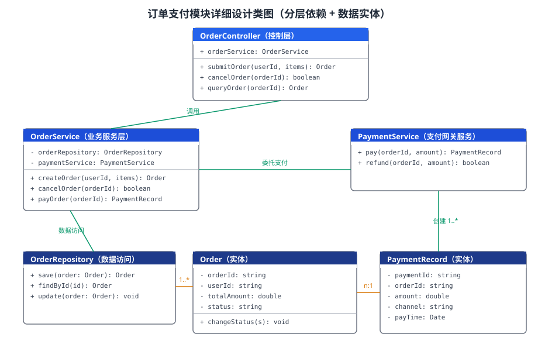

某电商平台需要实现「订单支付模块」的详细设计。模块负责订单的创建、取消与在线支付，要求：订单创建后 30 分钟内未支付自动超时关闭；支付调用外部支付网关，需防重、防重复支付；订单状态变更必须可审计。请基于分层架构给出该模块的详细设计：类图结构、各类的职责与接口、关键业务时序、关键设计决策与必要的伪代码。

---

答案：设计方案（设计目标 → 类图 → 类职责表 → 关键设计决策 → 时序与伪代码）

一、设计目标

1. 按「控制层—服务层—数据访问层—实体」分层组织，降低耦合、便于测试与替换；
2. 保证支付幂等（防重复支付）、订单超时自动关闭、状态变更可审计；
3. 接口清晰，各层可独立开发、独立单元测试。

二、总体结构类图



说明：控制层只做参数校验与权限控制；服务层编排业务规则并委托支付网关与仓储；实体承载状态与金额规则；仓储封装持久化，便于替换数据源与 mock 测试。

三、类职责表

| 类 | 职责 | 关键接口 |
|------|------|----------|
| OrderController | 参数校验、权限控制、REST 适配 | submitOrder / cancelOrder / queryOrder |
| OrderService | 订单与支付业务规则编排 | createOrder / cancelOrder / payOrder |
| PaymentService | 外部支付网关封装与幂等控制 | pay / refund |
| OrderRepository | 订单持久化与查询 | save / findById / update |
| Order | 订单状态流转与金额计算 | changeStatus / getTotal |
| PaymentRecord | 支付流水记录（实体） | — |

四、关键设计决策

1. 幂等设计：支付以 `orderId + paymentNo`（支付请求唯一号）建立唯一约束，重复请求直接返回既有结果，杜绝重复扣款；
2. 状态机：订单状态限定为 `待支付 → 已支付 / 已关闭 → 已完成 / 已取消`，非法迁移抛异常并写审计日志；
3. 超时关闭：服务启动定时任务，扫描「创建超过 30 分钟且状态为待支付」的订单并关闭，同时记录超时原因；
4. 依赖倒置：`OrderService` 依赖 `OrderRepository` 接口而非具体实现，单元测试可用内存仓储或 mock，不依赖真实数据库。

五、核心业务时序与伪代码

支付时序：`Controller → OrderService.payOrder → 校验订单状态 → 生成支付流水 → PaymentService.pay → 网关回调 → 更新订单与流水 → 审计日志`。

```
def payOrder(orderId, paymentNo):
    order = repository.findById(orderId)
    if order.status != PENDING:                  # 防重复支付
        raise DuplicatePayment(orderId)
    record = paymentService.pay(orderId, paymentNo, order.totalAmount)
    if record.status == SUCCESS:
        order.changeStatus(PAID)
        repository.update(order)
        audit(order, "PAY_SUCCESS", paymentNo)   # 状态变更可审计
    return order
```

---

评分标准：（满分 10 分）
- 要点 1（1 分）：明确详细设计目标（分层解耦、支付幂等、超时关闭、状态可审计），给 1 分。
- 要点 2（3 分）：类图结构完整——控制层、服务层、数据访问层、实体类齐备，属性/方法标注正确，类间依赖关系清晰，完整给 3 分；缺一层或关系不清晰扣 1 分。
- 要点 3（2 分）：类职责表正确——每类职责单一、关键接口命名合理，每答对 2 个类给约 0.7 分，合计 2 分。
- 要点 4（2 分）：关键设计决策合理——支付幂等键防重、状态机限定合法迁移、定时任务超时关闭、依赖倒置便于测试，答对两项给 1 分、答全给 2 分。
- 要点 5（2 分）：给出支付时序与伪代码，逻辑完整（校验状态 → 委托支付 → 成功更新与审计），可读可执行给 2 分、缺审计或防重给 1 分。

---

解析：本方案紧扣「软件详细设计」知识点——在概要设计确定的分层架构之上，将订单支付模块细化为可编码、可测试的类图与接口，并以幂等键、状态机、定时任务等机制落实防重复支付、超时关闭与审计等非功能要求。类职责单一、依赖倒置与伪代码细化使该模块可独立开发、可单元测试，体现了详细设计从接口到实现细节的落地过程。
