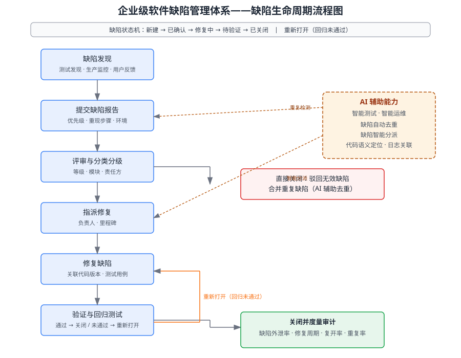

某电商软件团队近期质量数据不佳：生产环境缺陷占比（缺陷外泄率）连续两个迭代超过 20%，缺陷平均修复周期长达 9 天，且同一缺陷被多人重复上报、重复修复，耗费大量人力。团队希望能系统性改进缺陷管理。请综合运用软件缺陷管理相关知识，为该团队设计一套企业级软件缺陷管理体系，明确回答以下三点：调用并说明所依据的知识点；给出从现状分析到方案的推理步骤；给出最终方案（含缺陷生命周期流程/体系图与缺陷等级表）。

---

答案：

**1. 知识点调用**

本题综合运用软件缺陷管理相关的多个知识点：软件缺陷管理（缺陷生命周期、缺陷分类分级、缺陷报告规范）、软件质量度量（缺陷外泄率、修复周期、复开率、重复率等度量指标）、软件测试（回归测试在缺陷验证阶段的作用）、软件配置管理（变更管理、版本控制与缺陷的关联追溯）、智能测试与智能运维（AI 辅助缺陷去重、智能分派与代码语义定位）。"外泄率高、修复周期长、重复上报"三个现象分别指向测试关口薄弱、流转低效、缺乏自动去重三个根因。

**2. 分步推理**

- （1）建立缺陷管理目标与度量体系：核心目标为降低缺陷外泄率、缩短修复周期。以缺陷外泄率、平均修复周期、复开率、重复上报率为基准度量，设定可量化改进目标（如外泄率由 20% 降至 10% 以内），为后续改进提供可核验基线。
- （2）设计缺陷生命周期流程：明确"发现 → 提交 → 评审分级 → 分配 → 修复 → 验证与回归 → 关闭"的状态机（新建/已确认/修复中/待验证/已关闭/重新打开），在评审环节过滤无效缺陷与重复缺陷，避免无效流转占用修复资源。
- （3）建立缺陷分类分级标准：按严重度（致命/严重/一般/轻微）与发生频率综合确定优先级，分级决定处理时限与升级路径，使有限资源优先投入高影响缺陷。
- （4）与工程流水线集成：缺陷与代码版本、测试用例、构建产物建立关联；修复提交后自动触发回归测试，通过方可关闭，未通过自动"重新打开"，形成闭环并支撑缺陷根因分析。
- （5）引入 AI 辅助：利用智能测试与智能运维能力自动去重合并重复上报，按模块历史缺陷与团队技能智能分派，基于代码语义与日志自动定位可疑模块，压缩修复周期并减少人工重复劳动。
- （6）持续度量与审计：按月复盘外泄率、修复周期等指标，定位薄弱环节（测试覆盖不足、评审标准不一等），推动缺陷管理持续改进。

**3. 结论/方案**

缺陷管理体系以"流程 + 分级 + 工程化集成 + AI 辅助 + 度量审计"五要素构成闭环：流程保证规范流转，分级保证资源聚焦，工程化集成保证验证可控，AI 辅助化解重复与分派低效，度量审计保证改进可核验。缺陷生命周期流程见图 1，缺陷等级与处理时限见下表。

图 1 缺陷生命周期流程图

| 等级 | 判定标准（影响面 × 严重度） | 处理时限 | 升级路径 |
|---|---|---|---|
| 致命 | 阻塞核心功能、数据丢失、安全漏洞 | 4 小时 | 立即上报，冻结发布 |
| 严重 | 主要功能失效、影响大量用户 | 24 小时 | 当日升级项目负责人 |
| 一般 | 次要功能异常、存在变通方案 | 3 个工作日 | 常规排期处理 |
| 轻微 | 界面、文案等非功能问题 | 下个迭代 | 批量修复 |

---

评分标准：（满分 10 分）
- 要点 1（2 分）：准确调用知识点（缺陷管理、质量度量、回归测试、配置管理、智能测试/智能运维）并说明其与现状问题的对应关系；知识点调用不全或与现象脱节酌情扣分。
- 要点 2（4 分）：分步推理完整、逻辑自洽（度量基线 → 生命周期流程 → 分级标准 → 工程化集成 → AI 辅助 → 持续度量）；缺少关键步骤每处扣 1 分。
- 要点 3（3 分）：方案可行，给出缺陷生命周期流程/体系图与缺陷等级表，能说明流程各环节与现状问题（外泄率高、周期长、重复上报）的对应改进；缺流程/体系图扣 2 分、缺等级表扣 1 分。
- 要点 4（1 分）：结论/方案表述清晰，闭环与持续改进机制论证充分。

---

解析：本题将软件缺陷管理与质量度量、配置管理、智能测试/智能运维等知识相融合，考查学生对缺陷管理体系性设计的把握。评分重点是能否把"外泄率高、修复周期长、重复上报"三个现象转化为可度量的根因并有针对性地设计流程与控制；流程图与等级表构成可核验的方案产出。
