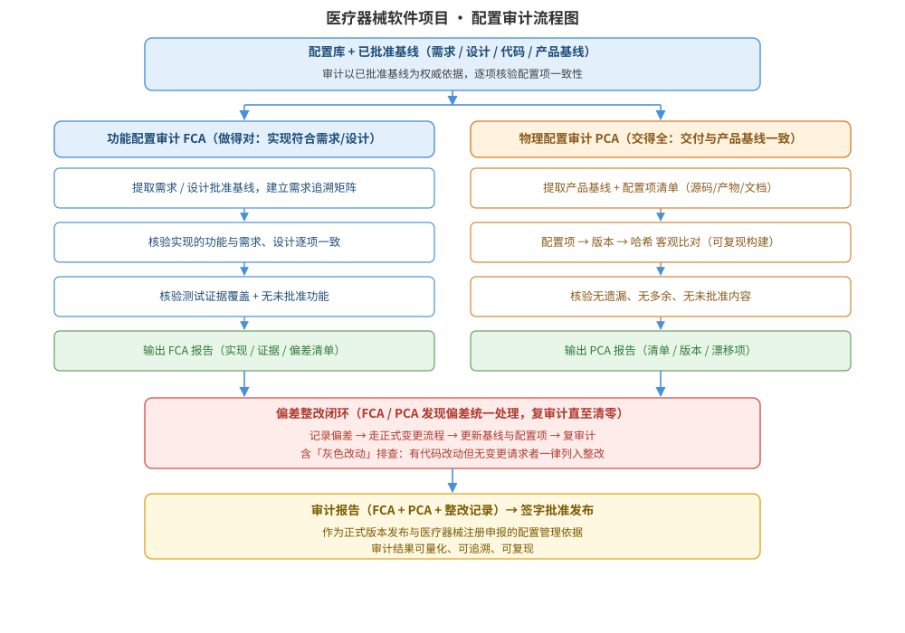

某医疗器械软件项目已完成开发并通过内部测试，即将向监管部门提交注册申报并发布正式版本。项目使用 Git 管理源码、配置文件与文档，已建立功能基线、分配基线与产品基线，但配置项标识不全、部分版本记录与实际交付物不一致，开发与测试阶段还存在未走正式变更流程的改动。请为该项目的发布设计配置审计方案：审计类型与范围（功能配置审计 FCA 与物理配置审计 PCA）、审计检查表设计、基线一致性核验流程、配置审计流程结构图，并给出审计接口/伪代码说明及关键设计决策。

---

答案：设计方案（设计目标 → 配置审计流程结构图 → 审计类型与检查表 → 基线一致性核验流程 → 审计接口/伪代码说明 → 关键设计决策）

一、设计目标

1. 通过功能配置审计（FCA）与物理配置审计（PCA）验证「产品实现与配置项文档一致、配置项与已批准基线一致」，保证交付物可追溯、可复现；
2. 在发布前把配置管理偏差（标识不全、版本不一致、未走变更流程的灰色改动）系统排查并闭环整改，形成审计报告作为注册申报与发布依据；
3. 建立可重复执行的审计流程与检查表，使审计结果量化、可追溯、可验证。

二、配置审计流程结构图



说明：审计分两条主线——功能配置审计（FCA）：从已批准需求/设计基线出发，核验实现功能与文档描述一致、测试证据覆盖且无未批准功能；物理配置审计（PCA）：核对发布的配置项（源码、二进制、配置文件、文档）与产品基线的清单、版本、哈希完全一致，无遗漏、无多余、无漂移。FCA 与 PCA 发现的问题统一进入偏差整改闭环（记录 → 走正式变更流程 → 更新基线与配置项 → 复审计），全部清零后形成审计报告，签字批准发布。

三、审计类型与检查表设计

| 审计类型 | 审计对象 | 核心检查项 | 判定准则 |
|----------|----------|------------|----------|
| 功能配置审计 FCA | 需求、设计、源码、测试 | 实现功能与需求/设计一致；测试证据覆盖；需求追溯矩阵完整 | 每项需求有实现与测试证据，无未批准功能 |
| 物理配置审计 PCA | 源码库、构建产物、配置文件、文档 | 配置项与基线清单一致；版本号/哈希匹配；无多余或未批准内容 | 配置项齐全、版本一致、无漂移 |
| 变更与发布审计 | 变更记录、基线记录 | 所有改动均有正式变更请求与批准记录；基线更新及时 | 变更闭环、无灰色改动 |

四、基线一致性核验流程

1. 从配置库提取批准基线快照（需求基线、设计基线、代码基线、产品基线）；
2. 建立「配置项 → 基线 → 版本 → 哈希」映射表，逐项比对：配置项清单与基线清单一致（无遗漏、无多余）；二进制构建产物与源码基线哈希一致（可复现构建）；文档版本与产品基线版本一致；
3. 全量比对「变更记录 × 代码提交 × 需求追踪」，定位未走流程的灰色改动；
4. 问题整改后复审计，全部清零后出具审计报告，批准发布。

五、审计接口/伪代码说明

- 基线一致性比对伪代码：

```
baseline = loadBaseline("产品基线-1.0")
for item in manifest:                        # 配置项清单逐项核验
    expect = baseline.items[item.id]
    actual = checksum(item.artifact)         # 计算版本号 / 哈希
    assert actual == expect, f"{item} 与基线不一致"
    trace.check(item.id, "版本 / 哈希一致")
```

- 变更闭环审计伪代码：

```
for commit in repo.commits(基线期间):
    if commit.changedCIs and 变更请求号 为空:
        记录灰色改动，列入整改清单            # 未走正式变更流程
for ci in 整改清单:
    补充变更请求，更新基线与配置项后复审
```

六、关键设计决策

1. 功能审计与物理审计分离：FCA 从「需求/设计」向下核验「实现与证据」，PCA 从「基线/清单」向上核验「配置项内容与版本」，两者互为补充，覆盖「做得对不对」与「交得全不全」两个层面；
2. 以「配置项 → 基线 → 版本 → 哈希」映射为客观依据：用哈希比对替代人工目视，保证审计结果可复现、可验证，避免口头确认；
3. 偏差强制走正式变更流程闭环：审计发现问题不直接改，而是先记录、走变更申请、更新基线与配置项后再复审计，保证变更全程可追溯，符合医疗器械注册申报的合规要求。

---

评分标准：（满分 10 分）
- 要点 1（1 分）：明确配置审计设计目标（FCA/PCA 验证一致性、发布前闭环整改、审计报告），给 1 分。
- 要点 2（3 分）：配置审计流程结构图完整——FCA 与 PCA 两条审计主线、偏差整改闭环（记录→变更→复审）、审计报告与发布批准清晰，给 3 分；缺 PCA 或 FCA 主线扣 1 分，缺整改闭环扣 1 分。
- 要点 3（2 分）：审计类型与检查表正确——FCA、PCA、变更与发布审计的对象、检查项、判定准则一一对应，每项约 0.7 分，合计 2 分。
- 要点 4（2 分）：基线一致性核验与伪代码正确——配置项→基线→版本→哈希映射、哈希比对、灰色改动识别逻辑正确，给 2 分。
- 要点 5（2 分）：关键设计决策合理——功能与物理审计分离、哈希客观比对、偏差走正式变更闭环，给 2 分。

---

解析：本方案紧扣「配置审计」知识点——配置审计是配置管理的验证活动，通过功能配置审计（FCA）确认产品实现符合需求/设计，通过物理配置审计（PCA）确认交付配置项与产品基线一致，从而保证交付物可追溯、可复现、无灰色改动。针对医疗器械软件注册申报的高合规要求，方案把 FCA 与 PCA 分离设计，以「配置项 → 基线 → 版本 → 哈希」映射做客观比对，把审计发现的问题强制纳入正式变更流程闭环整改，最后出具审计报告作为发布与申报依据，体现对配置审计类型、流程与合规要求的完整把握。
