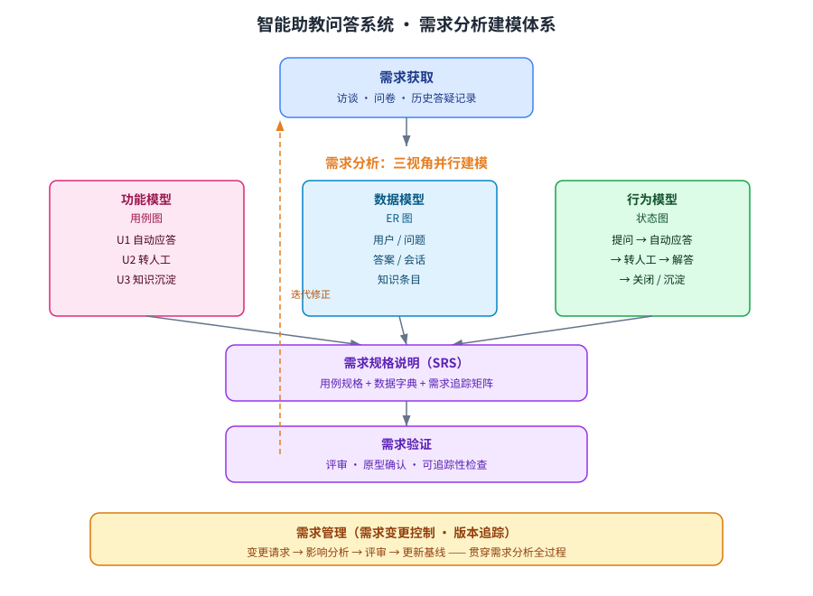

某高校拟建设「智能助教问答系统」，面向 5000 名在校师生提供课程答疑服务。系统需支持常见问题自动应答、疑难问题转人工教师、以及依据历史答疑记录持续沉淀与更新知识库；日请求量约 2 万次，高峰期并发 200。请为该系统设计一套需求分析方案：明确需求分析的目标与总体过程，建立系统的功能模型、数据模型与行为模型，并给出非功能需求与需求优先级划分。

---

答案：设计方案（需求分析的目标 → 分析过程结构图 → 功能/数据/行为三视角建模 → 非功能需求 → 关键设计决策 → 需求追踪接口）

一、设计目标

1. 从「系统要做什么」出发，将师生模糊的答疑诉求转化为明确、可验证的软件需求；
2. 通过功能、数据、行为三个视角建立一致的分析模型，消除歧义与遗漏；
3. 输出可追踪、可评审、可变更管理的需求基线，支撑后续设计、测试与验收。

二、需求分析总体过程（迭代式）



说明：以「需求获取 → 三视角建模 → 需求规格说明 → 需求验证」为一次迭代，需求管理贯穿全程；验证发现的问题回馈到建模与获取环节，直至需求基线稳定。

三、功能模型（用例图 + 用例表）

| 用例 | 参与者 | 前置条件 | 主流程（要点） |
|------|--------|----------|----------------|
| U1 常见问题自动应答 | 学生/教师 | 已登录、知识库非空 | 提交问题 → 语义检索 → 相似度 ≥ 0.8 直接返回；否则进入 U2 |
| U2 疑难问题转人工 | 学生/教师 | 自动应答未命中 | 生成工单 → 分派教师 → 解答 → 结果回填知识库 |
| U3 知识库沉淀与更新 | 教师/管理员 | 存在被采纳的解答 | 审核 → 写入知识库 → 重新索引 → 标记来源会话 |

四、数据模型（ER 概念）

| 实体 | 关键属性 | 关系 |
|------|----------|------|
| 用户（User） | 用户ID、角色、学院 | 1—n 提问 |
| 问题（Question） | 问题ID、内容、状态 | n—1 用户；1—1 答案 |
| 答案（Answer） | 答案ID、内容、采纳标记 | n—1 教师 |
| 会话（Session） | 会话ID、时间、来源 | n—n 问题 |
| 知识条目（KBItem） | 条目ID、主题、向量 | n—1 来源答案 |

五、行为模型（状态图要点）

- 会话状态流转：`提问 → 自动应答 →（命中）已解决 /（未命中）→ 转人工 → 解答中 → 已关闭`；关闭后可触发知识沉淀。
- 工单状态流转：`新建 → 已分派 → 处理中 → 已答复 → 已关闭 / 已回退`。

六、非功能需求

| 类别 | 需求描述 | 验收指标 |
|------|----------|----------|
| 性能 | 自动应答 P95 响应时间 | ≤ 2 秒 |
| 可用性 | 系统可用率 | ≥ 99.5% |
| 并发 | 高峰期并发 | ≥ 200（支持水平扩展） |
| 安全 | 师生数据访问控制与日志审计 | 角色权限隔离、全量审计 |
| 兼容 | 主流浏览器与移动端 | 全部通过 |

七、关键设计决策

1. 采用「用例驱动 + 数据建模 + 行为建模」结合的分析路线：用用例锁定功能边界，用 ER 图统一数据语义，用状态图刻画生命周期；
2. 需求优先级按 MoSCoW 划分：自动应答（Must）、转人工（Must）、知识沉淀（Should）、个性化推荐（Could/Won't），保证第一迭代只交付核心需求；
3. 建立需求追踪矩阵，每条系统需求均关联来源用例与非功能指标，验证阶段据此检查可追踪性。

八、需求追踪接口（规格模板）

每条用例按统一模板规格化：

```
用例ID: U1-自动应答
触发条件: 用户提交问题
前置条件: 知识库非空、用户已登录
基本流: 1) 语义检索候选条目  2) 相似度≥0.8 直接返回  3) 否则转 U2
扩展流: 3a) 相似度在 0.5~0.8 时附带「相关推荐」返回
非功能约束: P95≤2s；高峰并发 200
```

---

评分标准：（满分 10 分）
- 要点 1（1 分）：明确需求分析的目标（将模糊诉求转化为明确、可验证的软件需求）与总体过程（需求获取→三视角建模→规格说明→验证，需求管理贯穿、验证回馈迭代），给 1 分。
- 要点 2（2 分）：功能模型完整——用例表覆盖自动应答、疑难转人工、知识库沉淀，参与者、前置条件与主流程要点正确，每答对一个用例给约 0.7 分，合计 2 分。
- 要点 3（1 分）：数据模型给出核心实体、关键属性与关系（ER 概念），正确给 1 分。
- 要点 4（1 分）：行为模型给出会话与工单的状态流转要点，正确给 1 分。
- 要点 5（1 分）：非功能需求覆盖性能、可用性、并发、安全、兼容并给出验收指标，给 1 分。
- 要点 6（2 分）：关键设计决策合理——三视角建模结合、MoSCoW 优先级划分（Must/Should）、需求追踪矩阵，答对两项给 1 分、答全给 2 分。
- 要点 7（2 分）：给出需求追踪/规格化接口（用例模板含触发条件、前置条件、基本流、扩展流、非功能约束），完整规范给 2 分。

---

解析：本方案紧扣「需求分析」知识点——先定目标与过程，再用功能、数据、行为三视角建模消除需求歧义，最后以规格说明、追踪矩阵与优先级管理形成可验证的需求基线。迭代回馈与需求管理贯穿全程，确保需求变更可追溯、可控制，为后续架构设计与测试用例生成提供输入。
