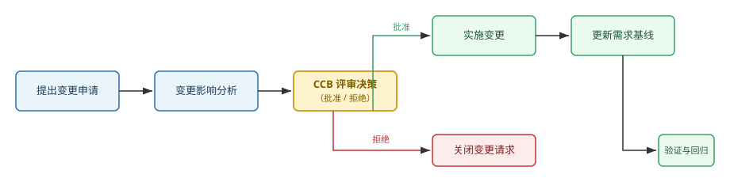

在需求变更控制流程中，变更控制委员会（CCB）的职责是评审并决策变更申请是否被批准，而不是亲自实施变更或修改需求文档。下图所示的需求变更控制流程中，CCB 处于影响分析之后的评审决策环节。

---

答案：正确

---

解析：需求变更控制的一般流程为：提出变更申请 → 变更影响分析 → CCB 评审决策 →（批准则）实施变更、更新需求基线、进行验证与回归测试（拒绝则）关闭变更请求。CCB 的职责是对拟变更的需求进行评审与决策（批准或拒绝），为评审决策提供依据的是影响分析结果，而实际实施变更、更新文档与基线的工作由相应的开发与需求人员完成，故该表述正确。
