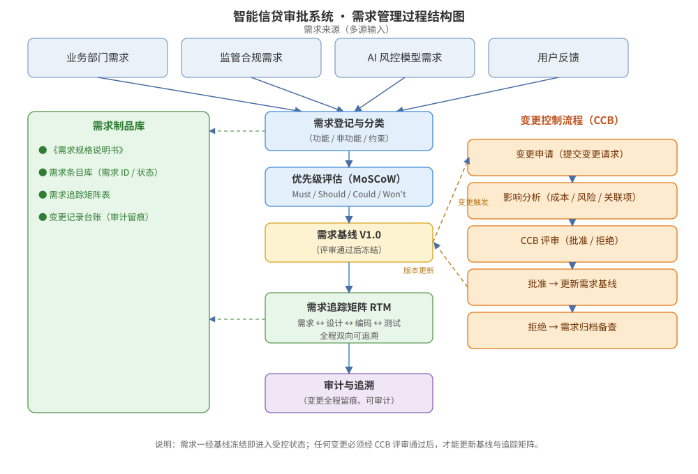

某商业银行拟建设新一代智能信贷审批系统，需求来源多元（业务部门、监管合规、AI 风控模型、用户反馈），需求规模约 300 条，需求变更频繁（月均约 15 次），且需满足监管审计与全程追溯要求。请为该项目的需求管理进行设计：需求登记与分类、优先级管理、基线与版本管理、需求追踪矩阵（RTM）、变更控制流程，给出需求管理过程结构图，并说明关键设计决策与需求条目接口。

---

答案：设计方案（设计目标 → 需求管理过程结构图 → 关键机制职责表 → 需求追踪矩阵 → 关键设计决策 → 需求条目接口）

一、设计目标

1. 建立多源需求统一入口，把业务、监管、AI 风控模型、用户反馈需求登记为标准化需求条目，去重并分类；
2. 以需求基线与版本管理控制变更，变更必须经 CCB 评审，全程留痕、可审计；
3. 通过需求追踪矩阵（RTM）实现需求 ↔ 设计 ↔ 编码 ↔ 测试的双向追溯，支撑变更影响评估与覆盖验证。

二、需求管理过程结构图



说明：多源需求经登记分类、优先级评估（MoSCoW）后形成需求基线；基线一旦冻结即进入受控状态，任何变更必须进入 CCB 变更控制流程，批准后更新基线与版本；RTM 贯穿需求→设计→编码→测试全链路，制品库与变更台账全程留痕，满足审计要求。

三、关键机制职责表

| 环节 | 输入 | 活动要点 | 产物/出口 |
|------|------|----------|-----------|
| 登记与分类 | 多源需求 | 统一登记、去重、标注类型（功能/非功能/约束） | 需求条目库 |
| 优先级评估 | 需求条目 | MoSCoW 定级（Must/Should/Could/Won't） | 优先级清单 |
| 基线管理 | 已批准需求 | 评审通过后冻结为 V1.0，变更受控 | 需求基线 |
| 变更控制 | 变更请求 | 影响分析 → CCB 评审 → 批准/拒绝 | 变更记录台账 |
| 追踪矩阵 | 需求/设计/编码/测试 | 建立并维护双向追踪关系 | RTM 表 |
| 审计追溯 | 全过程 | 记录变更与状态变迁，定期审计 | 审计报告 |

四、需求追踪矩阵设计

| 需求 ID | 来源 | 优先级 | 状态 | 关联设计单元 | 关联测试用例 |
|---------|------|--------|------|--------------|--------------|
| REQ-0001 | 监管合规 | Must | 已实现 | 风控引擎-授信模块 | TC-0101 / TC-0102 |
| REQ-0002 | 业务部门 | Must | 已验证 | 审批工作流 | TC-0205 |
| REQ-0003 | AI 风控模型 | Should | 已实现 | 模型服务-评分接口 | TC-0307 |
| REQ-0004 | 用户反馈 | Could | 草拟 | — | — |

五、关键设计决策

1. 需求一经基线冻结即受控，任何变更必须走 CCB 评审，批准后方可更新基线（V1.0→V1.1），杜绝随意变更；
2. 用 RTM 把需求与设计、测试双向关联，实现「变更影响面可评估、需求覆盖可验证」；
3. 多源需求统一登记去重，AI 风控模型产生的需求单列来源标签，便于监管审计；针对月均约 15 次的变更频率，CCB 采用快速评审通道控制管理开销。

六、需求条目接口定义

```
需求条目: REQ-0001
字段: 标题 / 描述 / 来源 / 类型(FR|NFR|约束) / 优先级(Must|Should|Could|Won't) / 状态 / 基线版本 / 追踪项
状态机: 草拟 → 评审中 → 已批准 → 已实现 → 已验证 → 已关闭
变更规则: 基线冻结后仅经 CCB 批准可变更，记录旧版本并输出影响分析
```

---

评分标准：（满分 10 分）
- 要点 1（1 分）：明确需求管理设计目标（多源统一入口、基线受控、RTM 双向追溯、审计留痕），给 1 分。
- 要点 2（3 分）：需求管理过程结构图完整——多源输入、登记分类、MoSCoW 优先级、基线冻结、CCB 变更控制闭环、RTM 与审计齐备且衔接清晰，给 3 分；缺一处扣 1 分。
- 要点 3（2 分）：关键机制职责表正确——登记/优先级/基线/变更/追踪/审计各环节的输入、活动与产物匹配，每答对 2 行约 0.7 分，合计 2 分。
- 要点 4（2 分）：RTM 与变更控制合理——需求与设计、测试双向关联且状态、优先级列齐备并给出示例行，给 1 分；变更控制流程（影响分析→CCB 评审→批准/拒绝→更新基线）完整再给 1 分。
- 要点 5（1 分）：关键设计决策合理——基线冻结受控、CCB 评审、RTM 支撑变更影响评估、多源需求来源可审计，给 1 分。
- 要点 6（1 分）：给出需求条目接口定义（字段与状态机、变更控制规则），给 1 分。

---

解析：本方案紧扣「需求管理」知识点——突出需求条目化、优先级评估（MoSCoW）、基线冻结与版本管理、需求追踪矩阵（RTM）以及基于 CCB 的变更控制流程五大核心机制，并通过结构图把「多源输入—登记分类—优先级—基线—RTM—审计」与「变更控制」闭环串联。方案同时考虑银行信贷系统需求变更频繁（月均约 15 次）且需审计追溯的实际约束，体现需求管理在控制变更、保障可追溯方面的作用。
