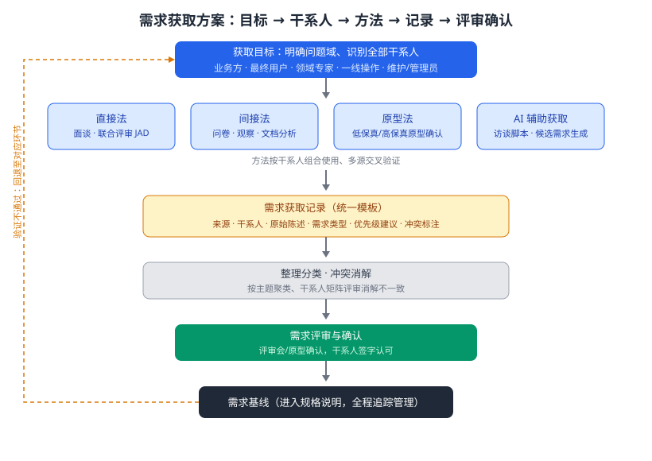

某物流企业计划建设「智能仓储调度系统」，需要在建设初期全面、准确地获取相关需求。系统覆盖入库、上架、拣选、出库与盘点业务，涉及仓储主管、库管员、叉车操作员、系统管理员等干系人；不同干系人的表述可能冲突或含糊，且部分业务流程无法仅凭访谈还原真实场景。请为该系统设计一套需求获取方案：明确获取目标、干系人与获取方法，给出获取过程结构图，建立需求获取记录与冲突消解机制，并说明如何借助原型与 AI 辅助手段提高获取质量。

---

答案：设计方案（获取目标 → 总体过程结构图 → 干系人与方法矩阵 → 记录与冲突消解 → 关键设计决策 → 获取记录模板接口）

一、设计目标

1. 全面识别干系人及其关注点，覆盖入库、上架、拣选、出库、盘点全流程；
2. 采用多源交叉验证消除单一口径偏差，将模糊业务描述转化为可验证的需求条目；
3. 产出统一、可追踪的需求获取记录，支撑后续需求规格说明与追踪管理。

二、总体过程结构图



说明：识别目标与干系人 → 组合使用获取方法 → 记录整理与冲突消解 → 评审确认 → 形成需求基线；验证不通过时回退至对应环节迭代，方法按干系人组合使用并多源交叉验证。

三、干系人与获取方法矩阵

| 干系人 | 关注点 | 推荐方法 | 获取安排 |
|--------|--------|----------|----------|
| 仓储主管 | 周转率、盘点准确率、成本 | 面谈、JAD 联合评审 | 每阶段一次 |
| 库管员 | 出入库操作流程、异常处理 | 面谈 + 现场观察 | 需求初期集中 |
| 叉车操作员 | 路径规划、任务分派顺序 | 观察、原型确认 | 随原型迭代 |
| 系统管理员 | 权限、监控、接口对接 | 文档分析、面谈 | 集中一次 |
| 客户/承运方 | 单据流转、时效信息 | 问卷调查、JAD | 问卷一次 |

四、获取记录模板与冲突消解

- 记录字段：来源、干系人、原始陈述、需求类型（功能/数据/非功能）、优先级建议、冲突标注、确认状态；
- 冲突消解：按「高频场景优先 + 管理目标对齐 + 原型演示裁决」三级处理，无法当场合的提交需求评审会表决，并在记录中保留冲突痕迹。

五、关键设计决策

1. 方法组合：直接法（面谈、JAD）获取高价值信息，间接法（问卷、观察、文档分析）扩大覆盖面，原型法验证界面与流程，三者交叉验证；
2. AI 辅助获取：用大语言模型生成访谈问题清单与候选需求初稿，经人工逐条筛选确认，提升效率但保持人工裁决权；
3. 统一记录模板与冲突标注机制，保证多源信息可合并、可追溯，避免信息丢失。

六、获取记录模板接口

```
记录ID: REQ-001
来源: 库管员面谈（2026-08-18）
干系人: 库管员
原始陈述: 叉车任务分派最好按货位远近排序
需求类型: 功能需求
优先级建议: Should
冲突标注: 与主管「按单据优先级分派」存在冲突
确认状态: 待评审
```

---

评分标准：（满分 10 分）
- 要点 1（1 分）：明确需求获取目标（全面识别干系人、多源交叉验证、产出可追踪记录），给 1 分。
- 要点 2（2 分）：给出获取过程结构图（目标/干系人识别 → 方法获取 → 记录 → 冲突消解 → 评审确认 → 需求基线，含回退迭代），结构完整给 2 分、缺回退给 1 分。
- 要点 3（2 分）：干系人与方法矩阵覆盖主要干系人且方法选择合理（直接/间接/原型组合），每答对 2 行给约 0.7 分，合计 2 分。
- 要点 4（1 分）：记录模板字段完整（来源、原始陈述、类型、优先级、冲突标注、状态）并给出冲突消解规则，给 1 分。
- 要点 5（2 分）：关键设计决策合理——方法组合交叉验证、AI 辅助且人工裁决、统一模板可追溯，答对两项给 1 分、答全给 2 分。
- 要点 6（2 分）：给出规格化的获取记录接口（模板含来源、干系人、原始陈述、类型、优先级、冲突标注、确认状态），完整规范给 2 分。

---

解析：本方案紧扣「需求获取」知识点——以明确的目标与干系人识别为起点，用直接、间接、原型与 AI 辅助方法多源组合获取，以统一记录模板承载信息、以冲突消解与评审确认收敛分歧，最终形成可追踪的需求基线。整个方案强调获取过程的完整闭环与回退迭代，可支撑后续需求分析、规格说明与验证，避免「想当然」的需求盲区。
