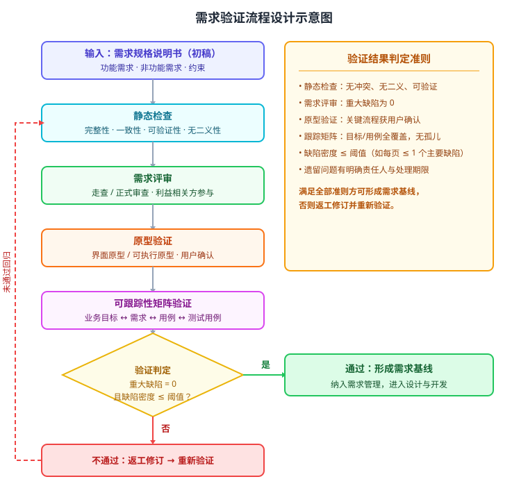

某高校教务中心拟建设「智能教学平台」，支持课程管理、在线作业、自动批改与学情分析。需求团队已完成《智能教学平台需求规格说明书（v0.9）》初稿，覆盖功能需求 42 条、非功能需求 9 条。为控制返工成本，须在设计开始前完成需求验证。请设计一套需求验证方案：给出验证流程总体结构、各项验证活动与判定准则、关键验证策略决策，以及验证通过/返工的判定逻辑（伪代码）。

---

答案：设计方案（设计目标 → 验证流程结构 svg → 验证活动与判定准则表 → 关键设计决策 → 验证判定伪代码）

一、设计目标

1. 在需求基线化之前系统排查缺陷（遗漏、冲突、二义、不可验证），把修复成本控制在设计开发之前；
2. 综合静态与动态手段，覆盖完整性、一致性、可验证性、可跟踪性四类质量属性；
3. 给出可量化、可复核的通过准则，使「验证通过/返工」判定客观、有据。

二、总体流程



说明：需求规格说明书初稿先做静态检查（完整性、一致性、可验证性、无二义性），再组织利益相关方需求评审（走查/正式审查），随后用界面原型做动态验证并由用户确认，最后用可跟踪性矩阵检查「业务目标—需求—用例—测试」的覆盖关系；全部活动完成后进入验证判定，满足准则则形成需求基线，否则返工修订并重新验证。

三、验证活动与判定准则

| 验证活动 | 验证对象 | 判定准则 | 参与方 |
|----------|----------|----------|--------|
| 静态检查 | 需求项全集 | 无冲突、无二义、可验证；每项可被单一来源追溯 | 需求工程师（工具辅助） |
| 需求评审 | 需求规格说明书 | 重大缺陷为 0；遗留问题有明确责任人与期限 | 用户代表、开发、测试、QA |
| 原型验证 | 界面原型/可执行原型 | 关键流程（选课、作业提交、自动批改）获用户确认 | 最终用户、业务专家 |
| 可跟踪性矩阵验证 | 目标-需求-用例-测试映射 | 42 条功能需求与 9 条非功能需求均被目标、用例与测试覆盖，无孤儿需求 | 需求工程师、测试设计 |

四、关键设计决策

1. 先静态后动态：先用低成本的自动检查消除机械性问题，再投入评审与原型等高成本活动，把人力集中在价值最高的缺陷类型上；
2. 评审与会分离：会前发放材料、独立预检，正式会议逐条确认并限定时长，提高缺陷检出率；
3. 原型驱动的动态验证：对交互复杂场景用可执行原型验证「需求可被满足且可被接受」，弥补纯文本规格的歧义；
4. 可跟踪性矩阵兜底：用矩阵检查需求「有源（业务目标/干系人）有去向（用例/测试）」，防止需求泄漏与孤儿需求；
5. 量化判定：以「重大缺陷为 0 且缺陷密度 ≤ 阈值」作为硬门槛，杜绝主观放行。

五、验证判定伪代码

```
function verifyRequirements(spec):
    issues = staticCheck(spec)          // 完整性 / 一致性 / 可验证性
    issues += reviewMeeting(spec)       // 走查 / 正式审查
    issues += prototypeCheck(spec)      // 原型验证（用户确认）
    issues += traceMatrixCheck(spec)    // 目标 ↔ 需求 ↔ 用例 ↔ 测试
    critical = count(isCritical(issues))
    density  = count(isMajor(issues)) / pages(spec)
    if critical == 0 and density <= THRESHOLD:
        baseline(spec)                  // 形成需求基线，进入设计
    else:
        backfill(spec, issues)          // 返工修订，重新验证
```

---

评分标准：（满分 10 分）
- 要点 1（1 分）：明确设计目标——在基线化前系统排查缺陷、覆盖四类质量属性、量化判定，给 1 分。
- 要点 2（2 分）：给出验证流程总体结构并配流程图，包含静态检查、需求评审、原型验证、可跟踪性矩阵、判定五个环节且流转正确，给 2 分；缺环节或流转错误酌情扣分。
- 要点 3（3 分）：验证活动与判定准则表覆盖验证对象、准则、参与方，准则可量化、可复核，给 3 分；缺行或准则主观含糊每处酌情扣 0.5 分。
- 要点 4（3 分）：关键设计决策有效回应验证目标——先静态后动态、评审与会分离、原型动态验证、矩阵兜底、量化判定，每答对一项给 0.6 分，合计 3 分。
- 要点 5（1 分）：给出验证通过/返工的判定伪代码，逻辑完整正确，给 1 分。

---

解析：需求验证是对需求规格说明书的系统化检查，目标是在设计开发前发现并排除缺陷。方案以「静态检查—评审—原型验证—可跟踪性矩阵」四类互补手段覆盖完整性、一致性、可验证性与可跟踪性，并以「重大缺陷为 0 + 缺陷密度阈值」量化通过准则，形成「验证→返工→再验证」的闭环，体现需求验证可审计、可量化、与需求管理衔接的工程方法。
